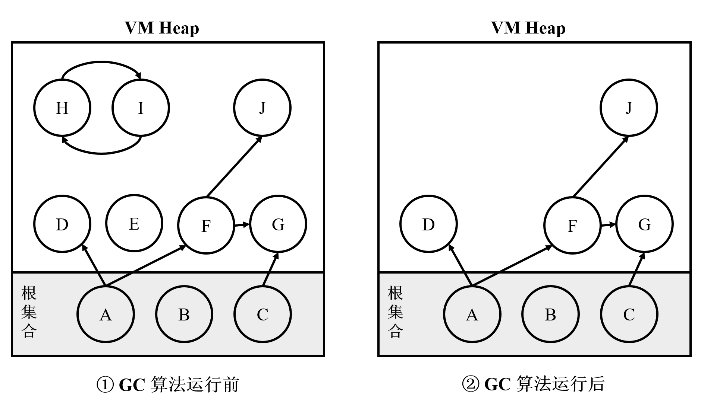
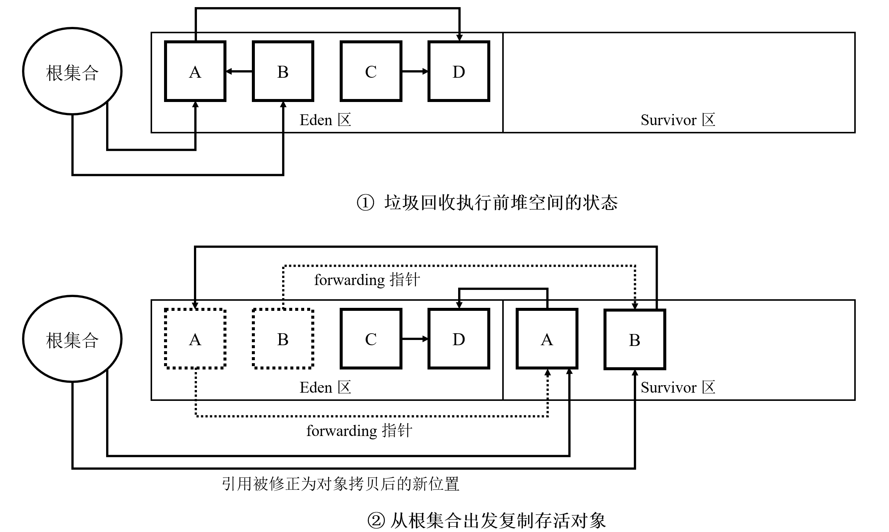
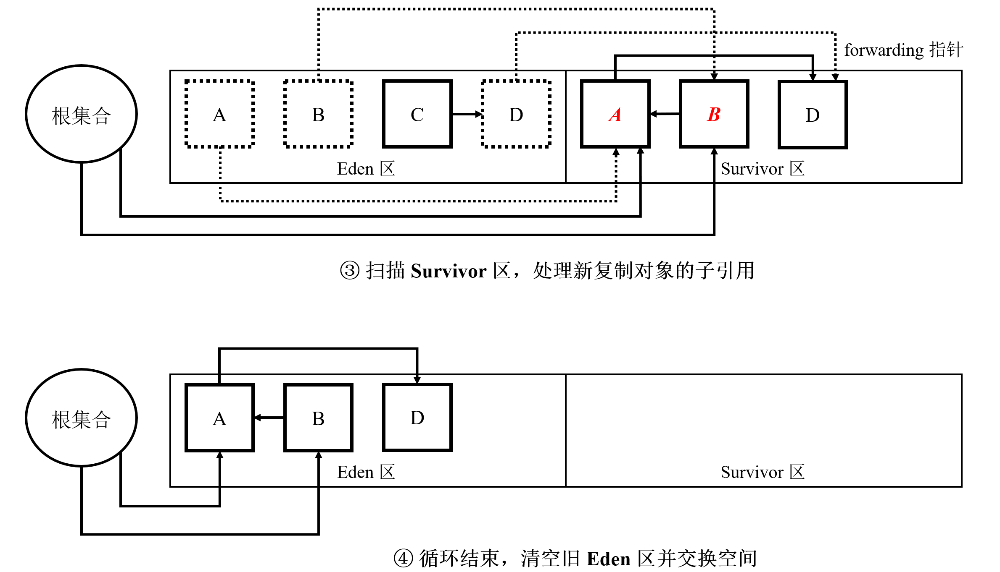
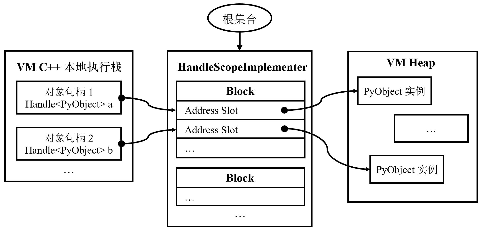
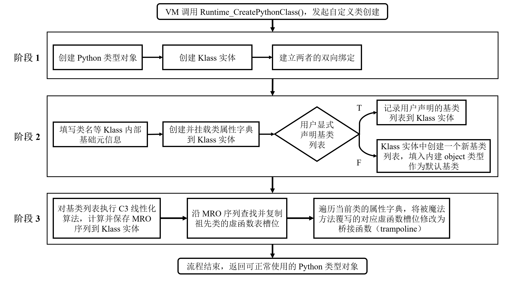
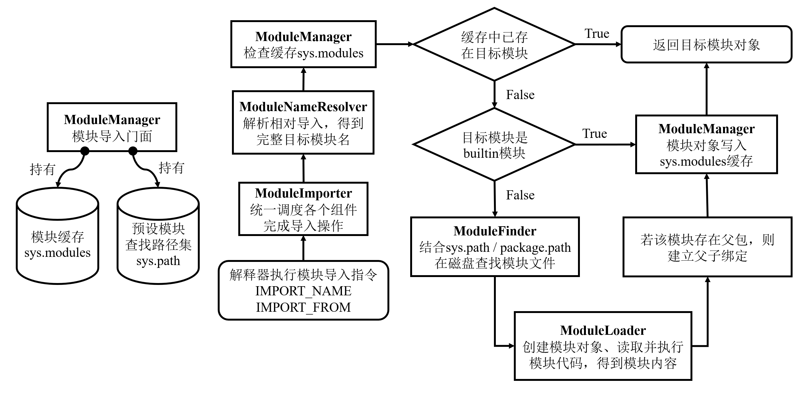
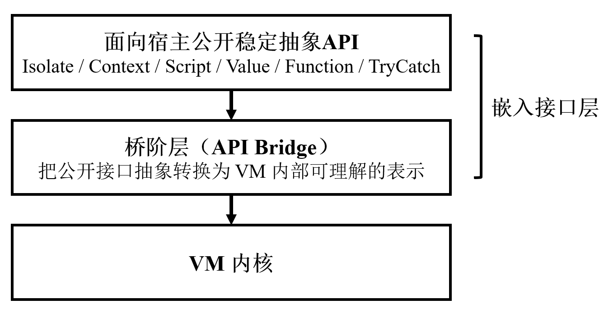

# 一个轻量级 Python 虚拟机的设计与实现

# 摘要

Python 语言因其语法简洁、生态丰富和开发效率高，被广泛应用于 Web 开发、数据分析、人工智能和自动化运维等多个领域。作为一种动态类型高级语言，Python 程序通常依赖 Python 虚拟机完成字节码解释执行、对象管理和运行时支持。尽管 CPython 已经形成了高度成熟的工业实现，但其代码体量和内部机制较为复杂，在教学演示和定制化开发场景下并不总是最合适的研究与工程对象。基于此，本文面向教学与定制化开发场景，设计并实现了一个名为 S.A.A.U.S.O VM 的轻量级 Python 虚拟机后端系统。

本文首先围绕 Python 虚拟机的执行模型、函数对象、栈帧、闭包、对象系统、异常机制和模块机制等核心问题，分析了一个兼容 CPython 3.12 核心字节码模型的轻量级虚拟机需要具备的关键能力。在此基础上，本文给出了 S.A.A.U.S.O VM 的总体架构设计，并进一步实现了虚拟机堆与 Scavenge GC 主路径、句柄机制、统一对象系统、分发表驱动的字节码解释器、异常状态管理与栈展开机制、模块导入基础设施以及面向宿主程序的嵌入接口。

为验证系统的正确性与可用性，本文基于 Google Test 构建了针对 VM 内核与嵌入接口的自动化测试集，围绕解释执行、对象系统、异常机制、模块系统、句柄与 GC 协同以及宿主互操作等方面进行了系统测试；同时，选取若干典型程序对系统性能进行了补充性对比观察，并从工程结构角度对系统的可读性与可维护性进行了定性分析。结果表明，现阶段 S.A.A.U.S.O VM 已通过 438 个自动化测试用例，具备较好的功能正确性与运行稳定性，并在轻量化、结构清晰和可嵌入性方面基本达成了课题预期目标。

尽管与成熟的工业级 Python 实现相比，S.A.A.U.S.O VM 在性能方面仍有一定差距，但本文工作仍然具有一定的实际价值。本文中围绕轻量化、可嵌入、结构清晰、便于教学演示和定制化开发的目标，建立了一个真实可运行、可测试、可扩展的 Python 虚拟机后端系统闭环，该工作不仅有助于说明编程语言虚拟机中核心机制的工程实现方式，还为定制化开发场景提供了一个轻量化的选择方案。本文所完成的系统基础，也为后续继续扩展 Python 语言语义、完善垃圾回收体系和增强嵌入式脚本引擎能力奠定了基础。

关键词：Python；Python 虚拟机；字节码解释器；对象系统；运行时系统；垃圾回收

# 第1章 绪论

## 1.1 课题背景

Python 语言凭借简洁的语法、较低的上手门槛以及丰富的第三方生态，已被广泛应用于 Web 开发、数据分析、人工智能、自动化运维等多个领域。作为一种动态类型高级语言，Python 程序通常并不直接运行在底层硬件之上，而是依赖 Python 虚拟机（Python virtual machine，PVM）完成编译、加载与执行。

虚拟机技术是现代高级编程语言的核心，它主要包括前端和后端两大部分。前端中由编译器（compiler）将高级语言程序的源代码（source code）翻译成中间字节码（bytecode）。后端中由解释器（interpreter）负责执行字节码。此外，后端还提供垃圾回收器（garbage collector，GC）和编程语言运行时（runtime）等核心模块。这种机制使得 Python 或其他运用该项技术的高级编程语言，可以在任何安装了相应虚拟机软件的计算机系统上运行，而在源代码层面几乎不需要进行任何修改。

目前，最主流、最成熟的 Python 实现是官方维护的由 C 语言实现的 CPython[1-3]。经过长期演进，CPython 在稳定性、执行性能和生态支持方面都已经非常成熟。但从教学演示、轻量嵌入和定制化开发的角度来看，直接研究或裁剪一个大规模工业实现，往往存在两个现实困难。

一方面，CPython 作为长期维护的工业项目，且受限于 C 语言自身的表达与抽象能力，代码体量大、内部机制多，理解和修改的门槛较高。对于希望聚焦编程语言运行时核心机制的教学或实验场景而言，这种复杂度并不总是必要的。另一方面，许多嵌入式脚本场景更关心虚拟机是否够用、易嵌入、便于裁剪或定制化开发，而不是完整覆盖全部 Python 生态。在这些场景中，一个结构清晰、目标聚焦的轻量级 PVM 后端实现，具有一定的研究与工程价值。

基于上述背景，本文提出使用现代 C++20 语言设计并实现一个轻量级 Python 虚拟机后端系统，取名为 S.A.A.U.S.O VM。该系统以教学与嵌入场景为主要目标，兼容 CPython 3.12 字节码模型，并支持 Python 语言的一个核心功能子集。本文中将重点讨论该系统中对象系统、解释器、异常机制、模块系统、内存管理以及嵌入接口等关键部分的设计思路与工程实现；相比直接讨论一个完整工业实现，围绕这些核心模块展开设计与实现，更有利于说明编程语言虚拟机的内部运行原理。

本文所实现的 S.A.A.U.S.O VM 已开源，相关链接见附录 A。

## 1.2 国内外研究现状

### 1.2.1 国外研究现状

在 Python 实现与编程语言虚拟机领域，国外已经积累了较为丰富的研究和工程成果，形成了多条有代表性的技术路线。

首先，在 Python 语言实现方面，CPython 仍然是事实上的标准实现，强调语言兼容性、稳定性和生态完整性。围绕 CPython 的替代或补充方案也持续出现。例如，PyPy 通过 JIT 技术提升运行效率，在动态语言性能优化方面具有代表性；MicroPython 面向资源受限设备，在体量和部署门槛方面具有明显优势；Codon 则尝试通过静态编译路径获得更高的执行效率[4-6]。这些方案分别在兼容性、轻量化、运行效率和适用场景之间作出了不同取舍。

其次，从更广泛的编程语言虚拟机技术研究领域来看，Strongtalk、HotSpot JVM 和 V8 JavaScript Engine 等工业级虚拟机的研究成果对后续语言运行时设计产生了深远影响。诸如对象模型分层、句柄系统、分代垃圾回收、内联缓存和运行时优化等思想，已经成为现代虚拟机设计中的重要参考。这些成果虽然并非直接面向 Python 语言，但它们在对象表示、执行模型和内存管理方面的设计经验，对构建新的 PVM 系统具有较强借鉴意义。

总体来看，国外相关研究已形成较为完整的生态：既有追求工业成熟度与语言完整性的实现，也有面向特定硬件平台或高性能需求的变体。这为本文选题提供了良好的比较对象和设计参考。

### 1.2.2 国内研究现状

相较于国外较成熟的虚拟机研究与开源生态，国内在 Python 语言实现和 PVM 方向上的公开研究相对较少，且整体更偏应用导向。

一类工作主要集中在 Python 的应用层使用，例如许多企业和高校会将 Python 用于 Web 服务、自动化脚本或数据处理任务，研究重点通常不在 PVM 本身。另一类工作则更多围绕 CPython 的扩展开发或源码剖析展开，这些工作对理解 Python 运行机制具有帮助，但通常并不以“从零设计并实现一个新的 PVM”为目标[2-3]。

在更广泛的编程语言虚拟机领域，国内部分互联网科技企业也会围绕具体业务场景定制专用虚拟机或运行时系统，例如字节跳动的 PrimJS[7]。不过整体而言，这类成果往往偏内部使用，公开资料有限。结构清晰、适合教学或定制化修改的开源实现并不多见。

总体而言，国内在“轻量级、可嵌入、便于教学与定制化修改的 Python 虚拟机后端”这一交叉方向上，公开可参考的系统性实践仍然较少，这也进一步说明了本文工作的实际意义。

## 1.3 课题研究的内容及意义

综合来看，现有 Python 实现方案往往各有侧重：有的强调完整兼容性，有的强调运行效率，有的强调在极小硬件上的可部署性，但在“轻量化、便于嵌入、结构清晰、相对易于教学演示和定制化开发”这几个维度上，同时兼顾的公开实现并不多见。

基于此，本文以教学与嵌入场景为主要目标，设计并实现一个名为 S.A.A.U.S.O 的轻量级 PVM 系统。该系统以兼容 CPython 3.12 字节码模型、支持 Python 语言的常用核心功能为目标，在保证核心功能可运行、可测试的前提下，尽量保持项目规模可控、模块边界清晰，并提供面向宿主程序的嵌入接口。

### 1.3.1 研究内容与目标

- 设计并实现一个基于 C++20 的轻量级 PVM，支持 Python 语言的核心功能子集，并兼容 CPython 3.12 字节码执行模型中的关键路径；
- 设计并实现对象系统、字节码解释器、异常机制、模块系统与内存管理等核心模块，使系统形成可运行的最小闭环；
- 提供面向宿主程序的嵌入接口（Embedder API），使该虚拟机能够作为脚本引擎嵌入 C++ 应用；
- 在保证功能正确性的前提下，尽量保持系统分层清晰、实现可读、工程规模可控，便于教学演示、后续定制化开发以及按需裁剪。

### 1.3.2 研究意义

需要说明的是，S.A.A.U.S.O VM 的目标并不是替代已经高度成熟的 CPython，而是针对教学演示和定制化修改场景，提供一个更轻量化、易理解的系统实现。从这个角度看，本文工作主要具有以下几方面意义。

#### （1）教育教学价值

相较于体量庞大的工业级 VM，一个结构更聚焦、体量更可控的 PVM 一般更适合作为教学材料。通过 S.A.A.U.S.O VM，可以更直观地展示对象系统、字节码解释执行、异常传播、模块加载和内存管理等核心机制，有助于辅助《编译原理》《操作系统》等计算机基础系统开发类课程的教学。

#### （2）工程与实际应用价值

S.A.A.U.S.O VM 采用现代 C++20 实现，并提供面向宿主程序的嵌入接口。对于不需要完整 Python 生态、但希望在自身应用中引入脚本能力的场景，该系统可以作为一种轻量级脚本引擎方案。同时，清晰的模块边界也有利于宿主方的开发者对其进行裁剪和修改定制。

#### （3）人才培养价值

从实现过程看，PVM 的设计与实现并不是单一模块开发，而是涉及编程语言原理、数据结构、面向对象设计、内存管理、软件工程和系统调试等多方面知识。完成这样一个系统，对于训练计算机专业本科毕业生的复杂系统设计能力、工程实现能力和问题定位能力都具有较强的综合价值。

## 1.4 本文主要内容与结构

本文共分为 6 章，各章主要内容如下：
- 第 1 章：给出研究背景、国内外研究现状、研究内容与意义，以及论文结构安排；
- 第 2 章：介绍与本文系统实现直接相关的 Python 虚拟机理论基础与关键技术；
- 第 3 章：阐述系统的设计目标与总体分层架构，以及各核心层的职责与设计要点；
- 第 4 章：分别说明系统中核心功能模块的工程实现；
- 第 5 章：从功能正确性、运行时稳定性、性能表现以及可读性与可维护性等方面，对系统进行验证与结果分析；
- 第 6 章：总结本文的主要工作与创新点，并说明当前系统的不足及未来改进方向。

---

# 第2章 PVM 理论基础与关键技术

本章围绕 S.A.A.U.S.O VM 的实现目标，概述设计并实现一个兼容 CPython 3.12 字节码模型的轻量级 PVM 所涉及的理论基础与关键技术。本章中不会完整复述 Python 语言的全部细节，而仅围绕本文系统实现直接相关的 Python 核心语言能力进行讨论，从而为第 3 章和第 4 章提供必要的理论基础。

## 2.1 PVM 执行原理概述

### 2.1.1 CPython 执行模型概述

Python 程序的执行通常分为两个阶段：前端将源代码以函数为单位（脚本中的顶层代码会被视作一个特殊的函数）翻译为代码对象（code object），其中包含字节码指令序列、常量表和符号名表等关键信息；后端虚拟机再对其中的字节码指令进行解释执行。本文主要关注后者[8-10]。

从指令的执行方式看，PVM 本质上是一种虚拟的栈机（stack machine）。它维护操作数栈，并按照“取指、译码、执行”的顺序逐条处理字节码指令。在 CPython 的执行模型中，每条字节码指令由操作码和操作参数组成，其职责覆盖常量加载、变量读写、运算、函数调用、属性访问和控制流跳转等核心语义。

例如对于代码 2-1 中给出的简单例子：

```python
x = 1
y = 2
z = 3
x + y * z
```
代码 2-1 简单表达式示例

编译器前端生成的字节码指令序列如代码 2-2 所示：
```
地址       操作码                  参数
  2      LOAD_CONST               0 (1)
  4      STORE_NAME               0 (x)

  6      LOAD_CONST               1 (2)
  8      STORE_NAME               1 (y)

 10      LOAD_CONST               2 (3)
 12      STORE_NAME               2 (z)

 14      LOAD_NAME                0 (x)
 16      LOAD_NAME                1 (y)
 18      LOAD_NAME                2 (z)
 20      BINARY_OP                5 (*)
 24      BINARY_OP                0 (+)
```
代码 2-2 简单表达式对应的字节码指令序列

PVM 执行这段代码时，会通过 `LOAD_CONST`、`STORE_NAME`、`LOAD_NAME` 和 `BINARY_OP` 等指令分别完成常量加载、存储变量、读取变量和二元表达式运算。这说明 PVM 并不直接“理解”高级语言语法，而是通过解释字节码间接实现语言语义。

但一个可运行的 PVM 也不只是维护操作数栈。为了支持函数、异常传播和模块加载，系统还必须维护栈帧（stack frame）、命名空间、异常状态以及运行时服务。后文会对这些概念展开探讨。

### 2.1.2 Python 中的命名空间与变量绑定机制概述

在 Python 中，变量更接近于“名称到对象的绑定关系”，而不是某个固定地址上的存储单元。也就是说，PVM 中需要维护命名空间用于保存这种绑定关系，而变量读写的本质是在某个命名空间中查找、建立或更新绑定。

从 PVM 的角度看，最常见的命名空间包括函数调用形成的局部命名空间、模块或脚本顶层对应的全局命名空间，以及提供内建函数的内建命名空间。闭包场景下还需要通过额外的单元对象维持自由变量的跨栈帧可见性。

例如，在代码 2-3 中，`add` 函数和变量 `c` 属于全局命名空间，`add` 函数中的形参 `a`、`b` 和局部变量 `result` 属于调用该函数而产生的局部命名空间，`print` 函数属于内建命名空间。

```python
def add(a, b):
  result = a + b
  return result

c = add(1, 2)
print(c)
```
代码 2-3 不同命名空间中的名称绑定示例

这意味着，PVM 中在读写变量时，必须结合局部、全局、内建和闭包环境完成名称解析。具体到 CPython 3.12，不同命名空间对应 `LOAD_NAME/STORE_NAME`、`LOAD_FAST/STORE_FAST`、`LOAD_GLOBAL/STORE_GLOBAL` 与 `LOAD_DEREF/STORE_DEREF` 等不同指令，它们的机制在 2.3.2 中会结合栈帧进一步展开。

## 2.2 Python 中基本的控制流

控制流的本质，是决定程序下一步执行哪一条指令。PVM 在解释执行过程中需要维护程序计数器，用于标识下一条待执行字节码的位置。顺序执行时，程序计数器按字节码顺序推进；而遇到条件分支、循环或异常等情况时，程序计数器则会被跳转相关的字节码显式修改。

因此，Python 中的 `if`、`while`、`break` 和 `continue` 等语句，在 PVM 内部最终都会落实为若干条件跳转与无条件跳转指令的组合。代码 2-4 中给出了一个基本的 `while` 循环例子。

```python
while condition:
    i += 1
print(i)
```
代码 2-4 `while` 循环示例

编译器前端生成的字节码指令序列，核心内容代码 2-5 所示：
```
地址       操作码                      参数
  2      LOAD_NAME                0 (condition)
  4      POP_JUMP_IF_FALSE        6 (to 18)

  6      LOAD_NAME                1 (i)
  8      LOAD_CONST               0 (1)
 10      BINARY_OP               13 (+=)
 14      STORE_NAME               1 (i)

 16      JUMP_BACKWARD            8 (to 2)

 18      后续代码略...
```
代码 2-5 `while` 循环核心字节码指令序列

分析编译结果可知，循环在 PVM 中并不是独立机制，而是“条件判断 + 跳转”的组合：前者依赖 `POP_JUMP_IF_FALSE` 等条件跳转指令，后者依赖 `JUMP_BACKWARD` 等无条件跳转指令。

与此同时，Python 的控制流判断还涉及真值语义（truthiness），即需要将 Python 程序中的具体对象动态地解释为真或假。因此，PVM 不仅需要支持跳转指令本身，还必须让这些指令与对象真值判定等运行时能力协同工作。

## 2.3 Python 中的函数

函数是 Python 程序中最重要的组织单位之一。对 PVM 而言，函数机制并不只是“执行一段可复用代码”这么简单，它还牵涉到代码对象创建、运行时函数对象构造、参数绑定、栈帧切换以及闭包变量访问等多个环节。

### 2.3.1 简单函数的创建

不同于 C/C++ 等静态语言，在 CPython 的执行模型中，函数的静态部分和动态部分是分开的：编译阶段先为函数体生成代码对象；运行阶段，当程序执行到函数定义语句时，解释器再通过 `MAKE_FUNCTION` 指令把代码对象包装为可调用函数对象，并通过 `STORE_NAME` 指令绑定到当前命名空间。

下面给出一个具体的函数创建例子来进一步说明，见代码 2-6。

```python
def add(a, b):
    return a + b
```
代码 2-6 简单函数创建示例

编译器前端生成的字节码指令序列中，创建 `add` 函数对象的过程如代码 2-7 所示。
```
地址       操作码                      参数
 2      LOAD_CONST               0 (<code object add at 0x5b596d3b75e0>)
 4      MAKE_FUNCTION            0
 6      STORE_NAME               0 (add)
```
代码 2-7 简单函数创建对应的核心字节码指令序列

从这段字节码可以看到，`add` 对应的代码对象先出现在外层代码对象的常量表中，随后由 `MAKE_FUNCTION` 在运行时构造出真正的函数对象。

为了说明动态创建函数这一机制的必要性，代码 2-8 中给出一个带默认参数函数的例子。
```python
default_k = 3
def linear_f(x, b, k = default_k):
    return k * x + b
```
代码 2-8 带默认参数的函数创建示例

这个过程是如何实现的呢？分析代码 2-9 中给出的编译器前端生成的字节码指令序列，不难找到答案。
```
地址       操作码                      参数
  6      LOAD_NAME                0 (default_k)
  8      BUILD_TUPLE              1
 10      LOAD_CONST               1 (<code object linear_f at 0x57ba48f76b90>)
 12      MAKE_FUNCTION            1 (defaults)
 14      STORE_NAME               1 (linear_f)
```
代码 2-9 默认参数函数创建的核心字节码指令序列

从这段指令中可以看到，创建带默认值参数的函数时，默认值元组是在运行时动态确定的，再由 `MAKE_FUNCTION` 与代码对象一起绑定进函数对象。因此，Python 函数不能被简单视为静态代码片段，而必须建模为运行阶段创建的对象，且具备绑定运行时产生的数据的能力。第 4 章中将会给出函数对象在本文系统中的实际实现。

### 2.3.2 栈帧与函数调用的原理

Python 中的函数调用通常通过 `CALL` 指令发起，函数返回通常通过 `RETURN_VALUE` 指令发起。如图 2.1 所示，每次调用发生时，PVM 都需要创建新的栈帧并压入 PVM 的调用堆栈，用于保存被调函数的程序计数器、操作数栈、局部变量环境等上下文信息；函数返回时，再从调用堆栈中弹出该栈帧并把控制权交还给调用方。


图 2.1 PVM 函数调用过程中调用堆栈与栈帧的变化

从实现角度看，若让所有局部变量都通过字典按名字查找，执行代价会过高。因此，PVM 通常会在栈帧中引入一个槽位区（定长数组）：编译阶段为局部变量分配槽位，运行阶段再通过 `LOAD/STORE` 指令参数中的槽位下标直接读写变量。

在 CPython 3.12 的执行模型中，对字典和槽位区两种方案进行了结合。首先，对于单个 Python 文件的顶层代码，也就是可视作“根函数”的那部分代码，因为其中的顶层变量可能会通过变量符号名被暴露给其他 Python 文件，因此栈帧通常会提供一个被称为 `locals` 的字典用于保存这些顶层变量。而要以变量符号名为键访问这些顶层变量，就需要通过 `LOAD_NAME` 和 `STORE_NAME` 等字节码指令实现。

这里进一步说明 `LOAD_NAME` 与 `STORE_NAME` 的语义差异。对于 `STORE_NAME` 而言，其语义是在当前按名字解析的局部命名空间中建立或更新绑定关系，因此它会直接把值写入当前栈帧的 `locals` 字典。然而，`LOAD_NAME` 的语义并不是“只查当前 `locals`”即可结束：当名称在当前栈帧的 `locals` 字典中不存在时，PVM 还需要继续在 `globals` 以及内建命名空间中进行查找。这样设计的原因在于，在 CPython 当前的执行模型中，可能会复用这条指令用于查找模块级全局变量或内建函数。

相对地，对于一般 Python 函数中的局部变量，则采用了上文介绍的槽位区方案。这个槽位区在 CPython 的源代码中被称为 `localsplus` 数组。另外，Python 函数中的形参以及闭包场景下出现的自由变量，同样会被安排在槽位区中进行维护。相应地，`LOAD_FAST`、`STORE_FAST`、`LOAD_DEREF`、`STORE_DEREF` 等字节码指令就是直接按槽位下标访问对应变量值的。需说明的是，关于闭包的实现原理，在 2.3.3 中会进一步讨论。

与此同时，栈帧中还会预留一个 `globals` 字段用于指向当前函数代码使用的全局命名空间字典。若函数内部需要读取其所在模块中的全局名称，则通过 `LOAD_GLOBAL` 指令，PVM 会先查该函数绑定的全局命名空间，再查内建命名空间作为兜底；若函数体显式对全局变量赋值，则 PVM 会通过 `STORE_GLOBAL` 指令落到该函数绑定的全局命名空间之中。

上文中说过，顶层代码中的变量会直接被放进根函数栈帧的 `locals` 字典中维护，那么为什么还需要引入 `globals` 的概念呢？这一点可以通过代码 2-10 中的一个简单例子更直观地解释。

```python
# mod_a.py
x = 10
def func():
    print(x)

# mod_b.py
from mod_a import func
x = 999
func()
```
代码 2-10 跨模块全局变量查找示例

在这个例子中，我们假设有两个模块 `mod_a.py` 和 `mod_b.py`。当 PVM 执行 `mod_a.py` 的顶层代码时，会为该模块准备一个模块级全局命名空间。在 CPython 3.12 的执行模型中，当前根函数对应栈帧中的 `locals` 与 `globals` 字段均直接指向这一个字典。当 `MAKE_FUNCTION` 创建 `func` 时，会把栈帧中 `globals` 字段所指向的该字典一并绑定进新生成的函数对象中。于是，当我们在 `mod_b.py` 中调用 `func` 时，PVM 首先会将当前栈帧中的 `globals` 字段指向与该函数绑定的全局命名空间。接下来，因为函数读取变量 `x` 的操作是通过 `LOAD_GLOBAL` 字节码指令完成的，所以 PVM 会在当前栈帧中 `globals` 所指向的全局命名空间中进行查找，从而得出的输出结果为 10 而非 999。

综上所述，本节已经给出了 PVM 栈帧中应当负责存储的函数执行上下文信息，尤其是 `locals`、`globals` 和 `localsplus` 三个变量环境相关的重要字段，图 2.2 中通过一个综合的例子，总结了上文中对它们职责以及具体指向的介绍。


图 2.2 栈帧中 locals、globals 与 localsplus 字段的职责与具体指向

### 2.3.3 函数闭包

不同于 C/C++，Python 中支持嵌套定义函数，因此进一步会延伸出闭包（closure）机制。闭包是 Python 词法作用域规则的重要体现。

首先通过代码 2-11 中的例子，简要说明 Python 语言中闭包的概念和特点。
```python
def outer():
    x = 10
    def inner():
        print(x)
    return inner
```
代码 2-11 闭包函数示例

在这段代码中，内部函数 `inner` 对外部函数 `outer` 中的局部变量 `x` 形成引用。因此 `inner` 被称为闭包函数（closure function）；变量 `x` 则被称为 `inner` 的自由变量（free variable）。

站在 PVM 的视角，要实现闭包机制，至少需要解决几个核心问题：
（1）PVM 需要能够区分普通的函数局部变量和自由变量；
（2）PVM 需要保证自由变量在外部函数返回后不会立即消失，而是继续随内部函数一起存活；
（3）PVM 需要保证闭包函数运行时，观察到的是自由变量的当前实际值，而非闭包函数创建时自由变量的副本值；
（4）PVM 需要保证外部函数和内部闭包函数均支持对自由变量进行读写。

下面为了进一步说明 CPython 3.12 执行模型中是如何解决这几个核心问题的，再给出代码 2-11 对应的删节字节码指令，见代码 2-12。

```
outer 函数的字节码指令序列：
地址       操作码                      参数
  0      MAKE_CELL                1 (x)
  4      LOAD_CONST               1 (10)
  6      STORE_DEREF              1 (x)
  8      LOAD_CLOSURE             1 (x)
 10      BUILD_TUPLE              1
 12      LOAD_CONST               2 (<code object inner>)
 14      MAKE_FUNCTION            8 (closure)
...

inner 函数的字节码指令序列：
地址       操作码                      参数
  0      COPY_FREE_VARS           1
...
 14      LOAD_DEREF               0 (x)
```
代码 2-12 闭包函数创建与访问相关的核心字节码指令序列

从这段代码中可以看出，闭包机制并不是依靠某一条孤立指令完成的，而是由多条字节码指令配合形成一条完整链路。首先，在外层函数 `outer` 中，`MAKE_CELL` 字节码指令会在变量 `x` 所对应的局部变量槽位中新创建一个单元对象（cell object）；随后，`STORE_DEREF` 字节码指令并不是把常量 `10` 直接写入 `x` 对应的槽位，而是写入该槽位的单元对象当中。这意味着从这一时刻开始，`x` 在运行时就已经不再以“普通局部变量值”的形态存在，而是变成了一个可被多个函数共享的间接引用单元。与此同时，这部分字节码指令表明，Python 代码中普通局部变量和自由变量是在编译阶段完成区分的，这就首先回答了问题（1）。

接下来，在内部函数 `inner` 被创建之前，`LOAD_CLOSURE` 指令会把 `x` 对应的单元对象压入操作数栈。随后，`BUILD_TUPLE` 字节码会将操作数栈顶的全体单元对象打包成一个 Python 元组。最后，被编译器前端添加特殊参数标记的 `MAKE_FUNCTION` 指令会在创建函数对象时，把这个装有单元对象的元组绑定进内部函数。如图 2.3 所示，内部函数拿到的并不是 `x` 当前变量值的一份副本，而是对同一个单元对象的引用；因此，当外层函数 `outer` 后续返回时，只要这个函数对象仍然存活，它就能够继续持有该单元对象，从而解决问题（2）。


图 2.3 单元对象在 outer 函数退出后保持存活的原理

如图 2.4 所示，当内部函数 `inner` 真正被调用时，`COPY_FREE_VARS` 指令又会把函数对象里保存的这些单元对象重新注入新建立栈帧中，使该栈帧的局部变量槽位区持有同一个单元对象。随后，`LOAD_DEREF` 才真正执行对自由变量的读取操作。换言之，内部函数运行时读取到的，并不是当初创建函数对象时复制下来的一份静态值，而是通过单元对象间接解析出来的“当前值”。因此，无论是外层函数还是内部函数，只要它们操作的是同一个单元对象，就都能够观察到对该变量所做的更新。这就解释了 PVM 是如何实现问题（3）与（4）的。


图 2.4 inner 函数访问单元对象的原理

综上所述，闭包是一套需要由编译器前端、单元对象间接层和专用字节码指令共同协作完成的完整机制。


### 2.3.4 内建函数

除了用户定义的函数之外，PVM 还要提供 `print`、`len`、`isinstance` 等内建函数。这些函数通常由 VM 的本地代码实现，并预先注册到内建命名空间中，是语言语义与虚拟机系统之间的重要桥梁。

对 PVM 来说，不仅需要使用本地代码实现内建函数，还需要把它们与普通 Python 函数统一建模为可调用对象。编译器前端只需生成通用的调用字节码，然后在运行阶段由 PVM 进行分流处理。这一点将在 4.5.5 中对应落地。

## 2.4 Python 中的面向对象机制

Python 是一门面向对象的动态语言。对象系统不仅影响类和实例本身，还会影响属性访问、方法调用、内建类型表示、继承与多态等一系列运行时行为。对于 PVM 实现来说，对象系统往往是贯穿解释器、运行时和内存管理的核心基础设施。

### 2.4.1 综述

在 Python 中，万物皆对象。数字、字符串、列表、函数、模块，都可以统一看作 Python 对象。特别地，不同于 C++，Python 中类（class）本身也是一种对象，即类型对象（type object）。“万物皆对象”的设计使得 Python 具有较强的灵活性，但也意味着 PVM 需要建立一套统一的对象表示机制，来同时描述“对象实例”和“对象类型”[11]。

因此对于 PVM 的设计与实现而言，必须保证对象模型并不只是语法层面的“类和对象”概念，而是整个服务于 VM 上层逻辑的统一数据组织方式。在 PVM 内部，解释器执行过程中操作的栈值、运行时中传递的函数对象、模块系统中维护的模块对象，最终都要落在统一的对象表示之上。

### 2.4.2 基本内建类型

一个最小可用的 PVM 后端，通常需要先支持若干基础内建类型，才能承载更高层语言语义。对 Python 而言，这些类型至少包括 `object`、`int`、`float`、`str`、`tuple`、`list`、`dict` 等。它们分别承担了不同角色：`object` 是一切 Python 类型的祖先类型；数值与字符串类型支撑最常见的数据表达；元组、列表和字典则是函数创建、函数调用和模块机制等虚拟机核心逻辑中频繁使用的基础容器。

这些内建类型并不是简单的数据结构集合。PVM 还应当为它们实现各自的运行时能力，例如通过下标访问列表元素、对整型或浮点型进行算术计算、获取字符串长度等。因此，在 PVM 中实现内建类型，既要设计合理的对象布局，也要实现这些内建类型的运行时能力。

### 2.4.3 类的封装

封装的核心含义，是将对象状态与围绕该状态运行的方法组织在一起。Python 同样支持这一基本思想：用户可以在类中定义属性和方法，再由实例对象持有具体状态，通过方法对外提供行为。

不过，Python 的封装方式与 C++、Java 等静态语言并不完全相同。首先，Python 并不提供严格的 `public`、`private` 等访问控制修饰符。其次，Python 中类对象本身在运行时具有高度动态性；例如，程序可以向一个类中动态添加新的方法，也可以将类中的某个方法替换为另一个函数。再次，Python 允许在程序运行过程中针对某个对象实例单独添加附加属性，因此实例状态与类行为通常需要被拆分到不同的属性容器中维护。

这意味着 PVM 在实现对象系统时，不能简单照搬静态语言中“字段偏移在编译阶段固定、方法入口在编译阶段预先绑定”的对象模型。首先，PVM 需要采用字典容器的方式分别存储对象实例属性和类属性。在 Python 语言中，前者和后者分别对应于 Python 对象自身和类对象持有的 `__dict__` 字典。其次，在属性读取时，PVM 需要按一定顺序进行解析：通常先查实例自身持有的属性，再查类型对象及其继承链上的类属性，必要时再进入补救机制。只有这样，PVM 才能正确支持 Python 运行时的动态封装语义。

此外，方法绑定也是 Python 动态封装行为的一部分。下面通过代码 2-13 中的例子进行说明。
```python
class MyClass:
  def __init__(self, value):
    self.value = value

  def foo(self):
    print("I can receive self argument")
    print(self.value)

def bar():
  print("I can't receive anything")

instance = MyClass(2026)
instance.bar = bar
instance.foo()
instance.bar()
```
代码 2-13 实例属性与方法绑定示例

在这个例子中，当虚拟机在查找 `instance` 对象的 `foo` 属性时，因为该属性来自实例的祖先类，且该属性的值为函数对象，因此 PVM 会在运行时把它与当前实例组合为“绑定方法”。当 Python 程序调用“绑定方法”时，PVM 会自动传入相应的对象实例作为方法函数的 `self` 参数。相反地，因为 `bar` 函数只是临时被写入实例自己的属性字典中，那么它会被 PVM 视作一个普通属性值，并不会生成“绑定方法”。

因此，PVM 中的对象系统不能只实现“属性查找”，还必须进一步区分实例属性、类属性与方法绑定这三类不同语义，否则就无法正确实现 Python 语言的动态封装行为。

### 2.4.4 类的继承

继承允许一个类在已有类的基础上扩展行为和结构，是 Python 面向对象机制中的重要组成部分。通过继承，子类可以复用父类的属性和方法，也可以重写父类方法形成新的行为。

除了单继承之外，Python 还支持多继承。同时，Python 引入了方法解析顺序（Method Resolution Order，MRO），用于描述当多个父类中存在同名属性或方法时，PVM 应当采取的查找顺序。MRO 序列由 Kim Barrett, Bob Cassels 等人提出的 C3 线性化算法进行生成[12]。

从 PVM 实现角度看，这意味着类型创建过程不能只完成“分配一个类型对象”这么简单，还需要在类的创建过程中正确计算并保存该类的 MRO 序列。与此同时，PVM 要让 MRO 序列直接参与 PVM 中类属性查找、方法解析等逻辑。

### 2.4.5 类的多态

传统意义上的多态指相同的调用接口在不同对象上表现出不同的行为。但不同于 C++ 和 Java 中基于接口类的多态，Python 中的多态除了来源于传统的继承和方法重写，也和该语言的鸭子类型特征密切相关。也就是说，在 Python 中允许调用方在静态编译阶段不限定和不知晓对象的静态类型，而仅在运行阶段尝试让目标对象响应某种操作或请求。

例如在代码 2-14 中，尽管 `do_say` 函数完全不了解传递进来的对象类型，但由于 `Cat` 类和 `Dog` 类都具备不需要传入任何参数的 `say` 方法，因此将两者的实例对象传入 `do_say` 函数，程序均能成功运行。

```python
def do_say(animal):
  animal.say()

class Cat:
  def say(self):
    print("meow")

class Dog:
  def say(self):
    print("woof")

cat_instance = Cat()
dog_instance = Dog()

do_say(cat_instance)
do_say(dog_instance)
```
代码 2-14 Python 多态示例

从这一意义上说，Python 中的多态本质上依赖于 2.4.3 中讨论的运行时阶段的属性查找与方法绑定。对于用户自定义类而言，对象实例属性、类属性以及继承链上的属性查找结果，会共同决定调用一个方法最终表现出的行为。因此，语言层面的多态并不要求 PVM 在编译阶段就把某个调用点与具体实现预先绑定，而是要求虚拟机在运行阶段保留足够的动态解析能力。

但对实际的 PVM 而言，仅仅保留语言层面的动态性还不够。若将所有对象行为都统一退化为字典查询与方法绑定，虽然能够较自然地贴近 Python 语义，但在 PVM 内部会带来较高的运行时开销。例如，假设每次执行整数加法运算时，PVM 都要在 `int` 类型中查找一次 `__add__` 方法，则这种性能开销显然是难以接受的。

基于此，在后续介绍本文所实现的 S.A.A.U.S.O VM 时，需要进一步区分“两层多态”。前一层是面向 Python 语言语义的动态属性查找与方法绑定，也就是用户在 Python 代码中直接观察到的多态行为；后一层则是面向 VM 内部执行效率的核心行为分派，也就是虚拟机在内部为了更高效地完成运算、比较、迭代等操作而采用的统一调度机制。如何在不破坏前者的前提下，引入后者作为更加高效的执行路径，将成为第 4 章对象系统实现部分需要回答的问题。

## 2.5 Python 中的异常机制

站在 PVM 的角度来看，异常机制本质上是一种特殊的控制流机制。与普通的顺序执行或条件跳转不同，异常会在运行时打断当前正常推进的解释器流程，并尝试将控制权转移到 Python 代码中距离异常发生点最近的异常处理器（exception handler）处。因此，对 PVM 而言，异常机制并不是附属功能，而是解释器主执行逻辑的组成部分。

Python 的异常处理以异常对象（如 `RuntimeError`、`TypeError` 等）为中心。当程序执行过程中虚拟机内部抛出异常，或用户显式执行 `raise` 语句时，PVM 会创建一个异常对象，并作为虚拟机内部的异常状态记录下来。

之后，PVM 需要查找并将控制流转向 Python 程序中与异常发生点相匹配的异常处理器。这个过程是 PVM 通过栈展开（stack unwinding）完成的。栈展开的过程可以用代码 2-15 中的伪代码进行描述。

```python
while 虚拟机调用堆栈非空:
  if 当前栈帧对应的函数中存在可匹配的 `except` 或 `finally` 处理器:
    将解释器控制流转入该处理器执行
    break
  将当前栈帧从虚拟机调用堆栈中弹出
```
代码 2-15 异常栈展开过程伪代码

那么，PVM 应当如何查找有效的异常处理器呢？自 CPython 3.11 起，引入了函数级异常表（exception table）的概念。也就是说，在异常发生后，由 PVM 依据触发异常的字节码指令地址，通过当前栈帧对应函数的异常表查询是否存在可匹配的处理器。这种方式使得正常执行路径几乎不需要为异常处理付出额外开销，同时也让 PVM 内部异常控制流与普通控制流之间的边界更加清晰。需要进一步指出的是，在真实的 PVM 系统中，异常表查询结果除了 Python 代码中异常处理器的入口地址外，通常还应包括解释器为清理异常现场而需要恢复的操作数栈深度等控制流信息。

与此相对应，虚拟机内部记录的异常状态也不能只保存“当前异常对象”本身。对 PVM 而言，异常状态通常还需要额外保存异常发生时的控制流信息，例如触发异常的指令地址等。

综上所述，对一个兼容 CPython 3.12 字节码模型的 PVM 而言，为了实现异常机制，至少要解决两大问题：其一，如何记录异常状态；其二，如何进行异常表查找与栈展开。在上述理论基础之上，本文所实现的 S.A.A.U.S.O VM 的异常系统正是围绕这两个问题展开设计的。

## 2.6 Python 中的模块机制

模块（module）机制是实际 Python 项目中组织代码和复用功能的重要方式。对用户而言，`import` 语句看起来很简单。但对 PVM 来说，模块导入相关的核心指令主要包括 `IMPORT_NAME` 和 `IMPORT_FROM` 等，而在这些字节码背后，完整的导入操作涉及名称解析、模块查找、代码加载、模块体执行、导入缓存以及父子模块绑定等多个环节，是一个典型的系统级功能。

具体来说，对于一次典型的导入操作，PVM 通常需要先判断目标模块是否已存在于缓存中；若不存在，则按照搜索路径（如 `sys.path`）查找模块文件或包入口，创建模块对象，并执行模块体初始化其命名空间。执行完成后，该模块会被登记到 `sys.modules`，供后续重复导入时复用。而对于包（package）来说，模块机制还需要额外处理父子层级关系、相对导入级别（level）以及 `from ... import ...` 的绑定语义[13]。

## 2.7 本章小结

本章围绕执行模型、函数与栈帧、对象系统、异常机制和模块机制，概述了一个轻量级 PVM 后端所涉及到的理论基础与关键技术。概括而言，PVM 采用前后端分离的执行结构：前端负责生成字节码表示，后端负责字节码装载、调度、执行以及运行时语义支撑。本章的分析为第 3 章的总体设计与第 4 章的工程实现提供了理论基础。

# 第3章 S.A.A.U.S.O VM 系统总体设计与技术路线

第 2 章概述了轻量级 PVM 后端所涉及的理论基础与关键技术，从理论上回答了一个兼容 CPython 3.12 核心执行模型的 PVM 需要解决哪些关键问题。在此基础上，本章将视角从“理论分析”转向“工程设计”，全面阐述 S.A.A.U.S.O VM 的系统总体设计与技术路线。

本章将重点回答四个关键工程问题：系统整体架构如何划分以提供较好的可读性与可维护性，如何通过运行时容器统一管理各核心模块的状态，整个系统按照何种顺序进行搭建开发，以及系统中各核心模块采用何种技术路线。

本章中给出的总体设计方案与技术路线，将为第 4 章的系统具体实现提供蓝图。

## 3.1 设计目标与总体思路

S.A.A.U.S.O VM 的总体设计主要围绕以下几个目标展开。

首先，系统需要兼容 CPython 3.12 字节码模型中的核心执行路径，使常见的 Python 核心功能能够被正确解释执行。这里的“兼容”并不意味着逐项复刻完整的 CPython 实现，而是以教学和定制裁剪场景为目标，优先支持最有代表性的语言语义和运行时机制。

其次，系统需要保持良好的可嵌入性。也就是说，S.A.A.U.S.O VM 不仅要能够作为独立解释执行系统运行脚本，还应当能够通过清晰的对外接口嵌入到宿主 C++ 程序中作为脚本引擎使用。基于这一考虑，系统设计应当预留专门的嵌入接口，并且能够将宿主程序与 VM 内部逻辑隔离开来。

最后，系统需要具备较好的可读性和工程可维护性。对于一个轻量级 PVM 后端而言，真正困难的部分往往不在于单个子系统能否运行，而在于多个子系统之间能否形成稳定、清晰、可解释的协作方式。因此，系统设计应当尽量避免将 VM 中的能力集中耦合到解释器内部，而是尝试把对象系统、执行系统、运行时语义、模块系统和内存管理做成相对独立又彼此配合的层次结构。

基于上述目标，S.A.A.U.S.O VM 的总体设计思路可概括为：内核与嵌入接口解耦、子系统间低耦合高内聚、系统各层次间依赖关系明确。3.2 中给出的系统总体架构设计，正是按照这一思路进行组织的。

## 3.2 系统总体分层架构

如图 3.1 所示，S.A.A.U.S.O VM 的整体架构可以从两个层面来理解。首先，从整体结构上看，本文系统可以分为 VM 内核层与嵌入接口层两大层。其中，PVM 的基础设施与核心能力均封装在 VM 内核当中，而嵌入接口则负责把这些能力以相对稳定、易用的形式暴露给宿主应用。其次，如果进一步按职责细分，并按照自底向上的单向依赖方向观察，VM 内核可以进一步概括为如下几层：
- 工具基础层（Utils）：提供与虚拟机业务无关的通用工具与基础设施；
- 虚拟机堆（Heap）：提供虚拟机内部使用的堆空间及其内存分配接口，并负责承担垃圾回收等自动化内存管理任务；
- 句柄机制层（Handles）：提供对象句柄（object handle）机制，用于在垃圾回收场景下安全持有对象引用；
- 对象系统（Objects）：定义 Python 对象的统一表示方式，以及类型元信息、对象布局和核心对象模型；
- 执行层（Execution）：封装 Python 语言运行时能力的实际实现，以及 Python 脚本的实际解释执行能力。


图 3.1 S.A.A.U.S.O VM 系统总体架构图

与此同时，实际的 VM 系统也需要按照该分层架构逐层进行开发。开发者首先需要建立内存管理、引用安全和对象表示等底层基础设施，之后才能在此基础上继续实现运行时语义、模块系统与字节码解释器等上层执行系统；而最外侧的嵌入接口，则需要在整个 VM 内核已经具备独立解释执行脚本的能力后才能搭建。换言之，系统中的高层功能必须建立在先前各层提供的基础之上。第 4 章也将按这一开发顺序逐层展开实现。

## 3.3 核心运行时容器设计

在 3.2 中已经介绍了如何通过分层架构组织一个实际可用的 VM 系统。但与此同时，在真实的 PVM 系统中，还需要有效管理虚拟机中来自各个分层子系统的运行时状态，例如虚拟机堆的内存分配状态、脚本执行状态、运行时状态等。为了解决这个问题，在 S.A.A.U.S.O VM 中设计并引入了运行时容器 `Isolate`。

本文系统中的 `Isolate` 并不等同于某个单一功能模块，而是应当理解为一个完整的 Python 运行时上下文容器，或者一个独立的虚拟机实例。如图 3.2 所示，系统中的虚拟机堆、字节码解释器、模块系统、异常状态等子系统及其运行时状态，还有运行时环境等上下文信息，都会被统一收敛到单个 `Isolate` 之中管理。也就是说，当 3.2 中所描述的各层能力真正开始落地时，它们并不是彼此孤立地存在，而是共同挂接到同一个运行时上下文之中。


图 3.2 S.A.A.U.S.O VM 核心运行时容器 `Isolate`

引入 `Isolate` 的好处在于，它将 VM 的运行时状态收敛到一个统一容器中进行管理，使得系统中各个分层的工作可以围绕同一个运行时上下文展开，减少全局状态分散带来的管理复杂度。

## 3.4 核心层的职责与技术路线

在前文 3.2 中，给出了 S.A.A.U.S.O VM 的总体分层架构；在 3.3 中，说明了核心层的状态最终如何被统一收敛到 `Isolate` 之中进行集中管理。本节将进一步明确各核心层承担的系统职责，并重点阐述其具体的技术路线选择。这些路线选择是第 4 章具体实现落地的前置依据。

### 3.4.1 虚拟机堆

在整个 VM 的开发过程中，最先必须建立的是虚拟机堆。虚拟机堆负责承担对象分配、空间组织与垃圾回收等内存管理职责，从而为后续对象系统、解释器、模块系统和异常状态管理提供统一的托管内存环境，是整个 VM 系统得以成立的基础。

设计并实现虚拟机堆，首先需要考虑如何对堆空间进行划分。根据 David Ungar 提出的分代假说，编程语言 VM 中的对象具有不同的生命周期，其中大部分对象会在创建后快速死亡[14]。因此，为了更方便地管理不同生命周期的对象，HotSpot、V8 等工业级 VM 普遍选择将虚拟机堆划分为多个堆空间。S.A.A.U.S.O VM 在总体设计上同样借鉴了这一思路。

在堆空间划分的总体设计上，S.A.A.U.S.O VM 中主要包括新生代空间（new space）、元数据空间（meta space）以及预留的老生代空间（old space）。其中，新生代空间负责承载大量短生命周期的普通运行时对象；元数据空间负责承载类型元信息、VM 内部字符串常量等持久存在的对象。VM 内部默认会在新生代空间中创建新对象，如果后续系统认为某个对象具有较长的寿命（例如系统发现某些对象在经历若干轮 GC 后仍然存活），那么它们就会被晋升（promotion）至老生代空间单独进行维护。

其次，还需要考虑针对虚拟机堆所采用的 GC 策略。在 GC 策略的总体选择上，S.A.A.U.S.O VM 当前并没有采用类似于 CPython 中以引用计数为主路径的对象生命周期管理方式。原因在于，若以引用计数作为主路径，还需要额外处理计数维护、循环引用检测等问题，这将会大幅增加本文系统的设计与实现难度，与轻量级、易理解的开发目标相悖。

基于上述考虑，S.A.A.U.S.O VM 在技术路线上选择了追踪式 GC（tracing GC）方案。追踪式 GC 是一大类 GC 算法的统称，这类算法的基本思想是：将虚拟机堆视作一张有向图，将其中的对象视作图的节点，将单个对象对其他对象的引用分别视作一条有向边。当 GC 算法执行时，首先从一组显式可枚举的存活起点对象（即根集合，roots）出发，沿着对象之间的引用关系遍历整张对象图，并将遍历过程中可达（reachable）的对象视为存活对象予以保留，未被遍历到的对象则被视为垃圾进行销毁。

例如图 3.3 中给出了一个具体的例子。在 GC 算法执行时，由于节点 E、H 和 I 对象既不属于根集合，同时从根集合出发亦不能遍历到它们，因此它们是不可达的垃圾对象，会被销毁。


图 3.3 追踪式 GC 中对象可达性判定示例

在追踪式 GC 算法的技术路线框架下，实现可实际使用的 GC 机制的重点在于如何选取具体的 GC 算法、如何组织根集合以及如何实现遍历对象图[15]。在 4.1 中将会回答这几个问题在本文系统的实际实现中是如何解决的。

### 3.4.2 句柄机制层

在建立起虚拟机堆与 GC 机制之后，系统随即需要解决第二个基础性问题：VM 内部的本地 C++ 代码如何安全地持有堆上对象引用。首先，在 Python 程序运行过程中，除了 Python 代码层面对堆上对象形成的引用，VM 内部的本地 C++ 代码（如各种内建能力以及解释器内部实现）同样会持有对堆上对象的引用。因此 GC 算法需要明确知道这些本地引用的存在，才能避免被本地代码持有的仍然存活的对象被误当成垃圾回收。其次，GC 算法在运行过程中，可能会移动存活对象在内存空间中的位置，因此 VM 中需要一种手段，能够保证本地 C++ 代码中对堆上对象的引用（即指向堆上的裸指针）能够被正确且及时地更新，避免出现悬垂指针（dangling pointer）。

为了解决这些问题，S.A.A.U.S.O VM 引入了对象句柄这一中间结构，用于代替裸指针（raw pointer）在本地 C++ 代码中持有和代理访问堆上对象。由于对象句柄属于 VM 自身提供和管理的基础设施，围绕它建立的句柄机制层便可以很方便地与 GC 机制协同，统一感知并维护本地代码所持有的对象引用。换句话说，句柄机制是本文系统中位于更加上层的后续对象系统、解释器与各类本地能力得以在 GC 存在的情况下安全工作的前提。

在技术路线上，S.A.A.U.S.O VM 中句柄机制的设计主要借鉴自 V8，即不让高层本地 C++ 代码直接长期持有裸对象地址，而是引入一个由 VM 统一管理的中间引用结构[16]。不过本文系统并未直接照搬 V8 中高度复杂的工业级实现，而是围绕轻量级 PVM 的功能目标与实际需要，对其设计思想进行了简化、迁移与适配。后文 4.2 中将对句柄机制的具体落地实现进行介绍。

### 3.4.3 对象系统

在堆与句柄机制已经建立之后，系统接下来需要解决“对象在 VM 内部如何被统一表示”这一问题。因此在 S.A.A.U.S.O VM 中引入了专门的对象系统层，负责给出系统中 Python 对象的表示方式、内存布局、对象行为分派机制，并支撑 Python 作为面向对象语言应有的封装、继承与多态能力。

在对象模型的总体技术路线上，S.A.A.U.S.O VM 采用“对象实例数据与类型行为分离”的思路。具体来说，对象实例主要负责保存实例数据，而与类型相关的名称、继承关系、核心行为等元信息，则交由被称为 `Klass` 的独立类型描述结构承担。这样做的目的在于能够把“对象持有什么数据”和“对象是什么类型、如何执行核心行为”区分开来，并且为 VM 中建立统一对象核心行为分派机制创造基础。例如，字符串对象与列表对象在内存布局上显然不同，但它们各自关联的 `Klass` 中分别描述了属于该类型的对象应如何响应属性访问、运算或遍历等核心行为，据此便可建立统一的对象核心行为分派调用入口，以提供给 VM 执行层使用。

此外，为了回应 2.4.5 中关于 Python 鸭子类型带来的性能挑战，本文系统在技术路线上引入了“双层多态”的架构设计。第一层多态由暴露给 Python 语义的属性查找与方法绑定机制（即实例与类的属性字典查找）承担，以保障语言的绝对动态性；第二层多态则由 `Klass` 内部的虚函数表（virtual function table）机制承担，用于在 VM 内部提供快速的 C++ 本地函数分派入口。系统通过一套桥接机制将这两层多态无缝衔接：优先尝试高效的虚函数表调用，仅当检测到用户动态覆写了魔法方法时，才退化回慢速的属性字典查找。

需要说明的是，这种“对象实例数据与类型行为分离”以及“引入虚函数表加速”的总体思路，灵感主要来源于 HotSpot JVM 中针对 Java 这种静态语言所设计的 Oop-Klass 模型[17]。但本文系统并未照搬其具体实现，而是结合 Python 语言的动态性特征和自定义内建类型的实际需要，对该思路进行了重新组织与落地实现。也正因如此，本文系统中的对象模型，既保留了工业级 VM 在对象表示层面的结构优势，又通过双层多态机制支撑了 Python 语言的动态语义。后文 4.3 将具体介绍对象系统及其双层多态分派机制在本文系统中的实际实现。

### 3.4.4 执行层

在虚拟机堆、句柄和对象系统均开发完成之后，接下来便可以搭建真正具备驱动 Python 程序执行的执行层。执行层是最贴近 Python 程序实际运行过程的一层，负责提供真正的 Python 程序执行能力。如前文图 3.2 所示，这一层并非单一系统，而是由多个相互配合的子系统共同构成。

- 运行时语义子系统（Runtime）：负责承载跨对象、跨场景复用的高层语义逻辑；
- 内建能力子系统（Builtins）：负责提供内建函数、基础类型名和最小异常类型等语言运行环境；
- 模块子系统（Modules）：负责处理 Python 模块的导入操作，包括解析、查找、加载与缓存；
- 代码装载前端（Code）：负责把 Python 源码或 `.pyc` 输入转换为 VM 内部可执行表示；
- 字节码解释器（Interpreter）：Python 程序字节码指令序列真正的执行引擎，负责字节码分派、栈帧推进、函数调用和栈展开等核心执行任务。

在执行层的技术路线上，S.A.A.U.S.O VM 选择将执行层细分多个子系统，而不是把全部功能都耦合入解释器。这种设计避免了解释器独自承担全部执行职责，使其能专注于逐条解释执行字节码指令。因此，在实际开发中，需要优先实现 `Runtime`、`Builtins`、`Modules` 与 `Code` 这些基础设施子系统，把支撑 Python 程序运行所需的前提能力先组织好；再在它们的基础上搭建 `Interpreter` 以真正驱动程序执行。这种高内聚低耦合的工程形态，保证了执行层系统可维护性与可拓展性。后文 4.4 和 4.5 中将分别说明这些基础设施和解释器是如何落地实现的。

### 3.4.5 嵌入接口层

在完成前述各层的开发与组合后，VM 内核已经可以作为独立的脚本执行系统运行。在此基础上，S.A.A.U.S.O VM 在最外层设计了面向宿主方的嵌入接口层，为宿主 C++ 程序提供清晰且便于接入的脚本引擎抽象。

在技术路线上，S.A.A.U.S.O VM 嵌入接口层的整体架构组织主要参考了 V8 的设计思路。系统在该层对外暴露宿主可直接理解的高级抽象概念；对内则连接 VM 内核当中的执行层和对象系统[16]。这种设计思路的好处在于，系统可以彻底向宿主方隐藏了内部复杂的对象布局、GC 状态与解释器细节，既便于降低宿主方开发者的理解与心智负担，又可以保护 VM 内核中的运行时状态不会被宿主方逻辑意外修改或破坏。

需要说明的是，本文系统并未直接照搬 V8 庞大且复杂的接口体系，而是围绕轻量级 PVM 的功能目标，对其设计思想进行了大刀阔斧的简化与迁移，形成了一套轻量、易用且贴合 Python 语义的 API 集合。后文 4.6 将进一步说明这些对外抽象是如何基于前述 VM 内核能力具体落地的。

## 3.5 本章小结

本章在第 2 章理论基础的前提下，从工程设计的角度给出了 S.A.A.U.S.O VM 的系统总体设计架构与各核心层的技术路线。与第 2 章重点回答“轻量级 PVM 需要解决哪些核心问题”不同，本章进一步回答了“这些机制将按照什么技术路线、以何种组织架构被集成到一个完整的工程系统中”。

在总体设计层面，S.A.A.U.S.O VM 确立了自底向上、单向依赖的分层架构模型，并将错综复杂的运行时状态统一收敛至 `Isolate` 容器中进行集中管理。在技术路线层面，本章规划了具体的逐层开发路径：首先构建虚拟机堆与追踪式 GC 机制，为系统提供统一的托管内存基础；其次引入中间句柄机制，解决本地 C++ 代码安全持有堆上引用的基础性问题；随后构建对象系统，统一组织 Python 对象的内存状态表示与核心行为分派；接着，执行层再进一步搭建运行时语义、内建环境、模块导入等基础设施，并最终实现字节码解释器驱动程序的实际执行；待上述 VM 内核开发完毕后，再在最顶层封装出供宿主程序调用的嵌入接口。

这一技术路线不仅明确了各个子系统的职责边界，更提供了一套切实可行的自底向上的系统开发方案。第 4 章将按照本章所规划的开发顺序与技术路线，逐一介绍 S.A.A.U.S.O VM 中的关键模块是如何具体落地实现的。

# 第4章 S.A.A.U.S.O VM 关键模块的实现

第 3 章已经给出了 S.A.A.U.S.O VM 的层次划分、核心运行时容器以及核心层的总体设计与技术路线，并说明了具体的系统开发顺序。本章按照第 3 章给出的开发顺序与技术路线，进一步说明系统中的核心机制是如何通过具体的 C++ 结构、程序流程和算法被一步步构建出来的。

## 4.1 虚拟机堆的实现

在第 3 章所给出的开发顺序中，首先需要落地的是虚拟机堆与 GC 机制。如果没有这一层，后续对象系统、解释器和运行时子系统都无从建立。在 3.4.1 中，已经论述了虚拟机堆与 GC 机制的总体设计思路，本节将介绍其在 S.A.A.U.S.O VM 中的实际工程实现。

### 4.1.1 对象引用表示与 `Tagged<T>`

在讨论虚拟机堆之前，需要先说明后文频繁出现的 `Tagged<T>`。在 S.A.A.U.S.O VM 中，它用于统一表示运行时对象引用。之所以不直接使用 `PyObject*` 等裸指针，是因为本文系统采用了标记指针（tagged pointer）思想，复用同一套内存位宽同时容纳堆对象引用和整型立即数。

若直接把这种混合表示塞入裸指针，会破坏 C++ 编译器对指针对齐和值语义的要求，从而引入未定义行为。为此，本文系统借鉴 V8 等工业级 VM 的做法，引入 `Tagged<T>` 作为统一封装。后文出现的 `Tagged<PyObject>`、`Tagged<Klass>` 等，均应理解为受 VM 管理的运行时对象引用。

### 4.1.2 堆空间的实现

在实际实现中，S.A.A.U.S.O VM 的新生代空间、元数据空间等堆空间并不是一段简单的连续内存，而是由若干内存页（page）以链表的形式所构成。每个内存页都具有相同的大小与内存布局，总体上可以划分为页头（page header）和数据区（data area）两大部分。在页头中，会记录页面所属堆空间、数据区收尾地址与分配进度、链表指针等元信息；而虚拟机对象则被分配在数据区。

这种页式空间的设计价值主要有三点。首先，系统可通过页头直接记录所属空间和分配进度。其次，可根据对象地址快速定位页面头部并读取页头元信息，进而判断空间类别。最后，页式空间的链表设计也便于未来在系统中实现更加复杂的空间动态扩容或缩容策略。另外需要说明的是，虽然因为开发时间的限制，现阶段系统尚未实现完整的老生代空间与分代式 GC，但具备上述优点的页化空间已经为这一未来演进打下了扎实的结构基础。

### 4.1.3 根集合与 GC 访问器的实现

在 3.4.1 中，已经论述了追踪式 GC 的总体技术路线，并引出了根集合与可达性的概念。在实现层面，S.A.A.U.S.O VM 的根集合并不单一，它主要由 `Isolate` 所持有的关键运行时子系统与运行时状态当中的对象引用所组成，例如解释器函数调用堆栈、句柄机制、模块缓存和异常状态等。因此，垃圾回收不是虚拟机堆子系统的局部逻辑，而是整个 VM 的协作过程。只有把全体运行时子系统和运行时状态都显式暴露给 GC 机制，它才能正确遍历全部存活对象。

为了在工程上实现对不同根集合成员的统一遍历，S.A.A.U.S.O VM 引入了 GC 访问器（在系统代码中被称为 `ObjectVisitor`）模式。GC 访问器本质上是一个包含回调逻辑的独立组件，它知道“遇到对象引用时该怎么处理”（例如在 Scavenge 算法中执行复制）。而 VM 中的各个子系统（如解释器、句柄机制等）只需实现一个统一的 `Iterate(ObjectVisitor* v)` 遍历接口，其职责仅仅是“把本模块持有的所有对象引用逐个交给传入的访问器”。通过这种设计，对象图的遍历逻辑与具体的 GC 算法逻辑被成功解耦。

在本文系统中，由 `Heap::IterateRoots()` 函数负责把 VM 中若干关键子系统和运行时状态的遍历接口统一暴露给 GC 访问器，从而构成追踪式 GC 算法执行遍历时的根集合。代码 4-1 给出了该函数的删节实现。

```cpp
void Heap::IterateRoots(ObjectVisitor* v) {
  isolate_->handle_scope_implementer()->Iterate(v);
  isolate_->interpreter()->Iterate(v);
  isolate_->module_manager()->Iterate(v);
  isolate_->exception_state()->Iterate(v);
  ...
}
```
代码 4-1 `Heap::IterateRoots()` 的根集合遍历接口

在这段代码中可以看到，句柄机制是组成根集合的重要部分。它的内部实现会在 4.2 中进一步展开。

### 4.1.4 具体的垃圾回收算法与实现

在现阶段的 S.A.A.U.S.O VM 中，主要实装的是 Cheney 算法，这是由 C. J. Cheney 提出的一种追踪式 GC 算法[18]。在 HotSpot、V8 等工业级 VM 的实现中，它主要被用作针对新生代空间的 GC 算法，亦被称为 Scavenge 算法[17]；在 S.A.A.U.S.O VM 的代码实现中，同样沿用了这一称呼。

在介绍 Scavenge 算法之前，这里首先需要说明现阶段选择该算法的原因。在工业级 VM 中，常用的追踪式 GC 算法还包括标记-清除（mark-sweep）和标记-整理（mark-compact）算法。但本文系统并未将它们作为第一阶段方案。前者虽然概念直接，但需要处理空闲块管理与内存碎片问题；后者虽然能进一步改善碎片，却会引入复杂的对象位置调整与引用更新流程[15]。相比之下，Cheney 算法的实现相对简单，且不会引入外部内存碎片，更适合当前阶段 VM 系统先形成基础可用的垃圾回收能力，未来再逐步演进的目标。

Scavenge 算法的基本步骤是：
（1）将堆空间进一步划分为 Eden 区与 Survivor 区，新分配对象首先进入 Eden 区。
（2）当 GC 启动时，系统从根集合出发找到仍然存活的对象，将它们复制到 Survivor 区，并同步修正根集合对它们的引用。为防止某个对象因被多处引用而导致重复复制，系统会在 Eden 区原对象的位置写入一个转发指针（forwarding pointer），指向其在 Survivor 区的新地址。
（3）扫描这些新被复制到 Survivor 区的存活对象，进一步逐个找出它们所持有的、仍在 Eden 区的子对象。对单个子对象，若其所在位置已被写入转发指针，则直接修正引用；否则，将其复制到 Survivor 区，同时修正持有方对它的引用，并在 Eden 区的原位置写入转发指针。
（4）循环往复第（3）步，直至所有存活对象都被复制至 Survivor 区。
（5）最后交换半空间的角色，将原先的 Survivor 区作为 Eden 区、原先的 Eden 区作为 Survivor 区，以便下一轮 GC 时可以重复上述操作。

为了进一步说明算法的执行过程，图 4.1 给出了一个包含多处引用场景的具体例子。




图 4.1 Scavenge 算法执行示例

在图 4.1 给出的例子中，整个回收过程可以分为四个阶段：
- 阶段 ①（初始状态）：在 GC 执行之前，根集合直接引用了 Eden 区的对象 A 和 B，而 A 和 B 又分别引用了内部对象 D 和 A，因此对象 A 是被多处同时引用的。另外，因为对象 C 没有被任何对象引用，所以在 GC 结束后它应该会被释放。
- 阶段 ②（复制根可达对象）：对应算法步骤（2）。算法首先从根集合出发，将对象 A 和 B 复制到 Survivor 区，并将根集合中的引用修正为指向新位置。同时，Eden 区中原 A 和 B 对象的位置被就地写入指向新位置的转发指针（即图中的虚线箭头）
- 阶段 ③（处理子引用）：对应算法步骤（3）和（4）。算法开始扫描刚被复制到 Survivor 区的对象 A 和 B。首先，扫描对象 A 时，发现它引用了 D，于是将 D 复制过去并在原位置写入转发指针。接下来，扫描对象 B 时，发现它引用了 A 对象在 Eden 区中的原位置（图中的虚线框 A），而该位置已经被写入了转发指针；因此，算法不会重复复制 A，而是直接将 B 中的引用修正为指向 Survivor 区中已存在的对象 A（图中的斜体加粗节点 A）。
- 阶段 ④（空间翻转）：对应算法步骤（5）。所有可达对象均已完成复制和引用修正。此时旧的 Eden 区（包含原有存活对象 A、B、D 的残骸和未被引用的垃圾对象 C）被整体清空，两块内存空间互换角色，GC 算法结束。

为了在工程代码层面实现上述 Scavenge 算法，S.A.A.U.S.O VM 结合 4.1.3 中介绍的 GC 访问器模式，设计并实现了 `ScavengerCollector` 与 `ScavengeVisitor` 两个关键组件。前者负责驱动算法的主流程；后者作为 Scavenge 算法专用的 GC 访问器，负责接收被扫描到的引用、拷贝对象、写入转发指针与修正持有方的引用指向。代码 4-2 给出了这两个组件核心逻辑的删节实现。

```cpp
class ScavengeVisitor : public ObjectVisitor { ...};

void ScavengerCollector::CollectGarbage() {
  ScavengeVisitor visitor(heap_);

  // 对应步骤 (2)：从根集合出发，触发 GC 访问器 执行存活对象的首次复制
  heap_->IterateRoots(&visitor);

  // 对应步骤 (3) & (4)：将 Survivor 区视作隐式 BFS 队列，按线性扫描方式处理子引用
  while (scan_page != nullptr) {
    Tagged<PyObject> object(scan_ptr);
    size_t instance_size = PyObject::GetInstanceSize(object);
    // 遍历当前对象内部的所有的子引用，交由 GC 访问器进一步处理
    PyObject::Iterate(object, &visitor);
    scan_ptr += instance_size;
  }

  // 对应步骤 (5)：扫描结束，清空原 Eden 区并完成空间角色互换
  heap_->new_space()->Flip();
}

void ScavengeVisitor::EvacuateObject(Tagged<PyObject>* slot_ptr) {
  // 若该对象原位置已被写入转发指针，则说明已被复制过。
  // 此时直接读取转发指针并修正当前槽位引用。
  if (mark_word.IsForwardingAddress()) {
    *slot_ptr = mark_word.ToForwardingAddress();
    return;
  }

  // 否则在 Survivor 区分配新空间，并拷贝对象数据本体
  size_t size = PyObject::GetInstanceSize(object);
  Address target_addr = AllocateInSurvivorSpace(size);
  CopyObjectData(target_addr, object.ptr(), size);

  // 在 Eden 区的原对象位置写入指向新地址的转发指针。
  // 并更新持有方的引用，使之指向对象在 Survivor 区中的新位置。
  PyObject::SetMapWordForwarded(object, Tagged<PyObject>(target_addr));
  *slot_ptr = Tagged<PyObject>(target_addr);
}
```
代码 4-2 `ScavengerCollector` 与 `ScavengeVisitor` 的核心逻辑

从代码 4-2 的实现骨架中可以提炼出当前本文系统中 Cheney 算法在工程实现层面的三个要点，它们也直接呼应了前文的算法思想：
（1）与根集合的对接：`ScavengerCollector` 首先调用了 4.1.3 中介绍的 `Heap::IterateRoots()` 接口，将散落在 VM 各个角落的根引用统一收集，作为算法遍历并复制存活对象的起点。
（2）免递归的、免额外开辟新空间的广度优先（BFS）图遍历：为了避免递归过深而导致 C++ 栈溢出，`ScavengerCollector` 在遍历对象图时并未采用递归式的深度优先搜索（DFS）。相反，它利用 Survivor 空间中由刚被复制但尚未被扫描对象所组成的区间作为一个隐式的广度优先搜索（BFS）队列，直接进行线性扫描。这种做法既彻底避免了 C++ 栈溢出的风险，又无需开辟额外的队列内存空间。
（3）转发指针的实现：在 GC 过程中，`ScavengeVisitor` 中会直接复用对象头部的 MarkWord 字段（后文 4.3.1 中会介绍）空间用于保存转发指针，因此无需在对象内存布局中引入额外的专门字段用于保存转发指针。

### 4.1.5 工厂函数与对象的初始化

在建立虚拟机堆之后，就可以在其上分配内存并创建对象了。S.A.A.U.S.O VM 通过统一工厂函数（factory function）收敛对象创建与初始化过程，上层逻辑通常只需调用这些工厂函数便可得到已经初始化完毕的可用 Python 对象。

引入统一工厂函数的主要目的，在于收敛分配与初始化逻辑、封装堆分配细节，并避免初始化顺序不当而破坏 GC 安全性。对于可能因分配而触发 GC 的系统而言，若新创建对象的指针字段尚未初始化完成便被扫描，GC 机制就可能意外访问到悬垂指针。因此，本文系统中的工厂函数均按“先完成基础字段初始化、将指针字段置空，再执行后续依赖堆分配步骤”的顺序实现。

至此，S.A.A.U.S.O VM 已经具备了最小可用的能够安全分配对象的虚拟机堆，以及正确清理垃圾对象的 GC 机制。下一节将继续解决 GC 存在时本地 C++ 代码如何安全持有堆上对象的问题。

## 4.2 句柄机制实现

在建立了虚拟机堆与 GC 机制之后，系统随即需要实现句柄机制。在 3.4.2 中，已经从总体设计角度论述了引入句柄机制的背景与技术路线。本节将进一步说明句柄在 S.A.A.U.S.O VM 中的工程实现及其与 GC 机制的协同。

### 4.2.1 VM 代码中的句柄使用方式

在实际开发中，高层逻辑通常不会直接使用 4.1.1 中介绍的 `Tagged<T>` 传递堆对象引用，而是优先使用 `Handle<T>`。这样，本地 C++ 代码中的临时对象引用就能够被 GC 机制统一感知和更新。与此同时，当一段逻辑会临时创建一批新的对象句柄时，还需要建立相应的句柄作用域，即 `HandleScope`。关于 `HandleScope` 的职责，会在 4.2.3 中说明。

### 4.2.2 对象句柄与槽位模型

S.A.A.U.S.O VM 中句柄机制层的核心组件为挂载在 `Isolate` 实例上的 `HandleScopeImplementer`。该组件会负责管理一批内存块（block）。每个内存块会被视作一个提供若干地址槽位（address slot）的定长数组。

如图 4.2 所示，从实现本质上看，对象句柄 `Handle<T>` 当中并没有直接保存对象地址，而是保存了指向某个地址槽位的指针；而地址槽位中保存了指向堆上真实对象的内存地址。换言之，本地 C++ 代码并不直接引用“对象本体”，而是先引用一个由 VM 统一管理的中间槽位。因此，当 VM 通过对象句柄访问对象时，实际上存在两次解引用：第一次对指向槽位的地址解引用，取出槽位中保存的对象地址；第二次再根据该地址访问位于虚拟机堆上对象的内容。


图 4.2 对象句柄内部实现原理

与此同时，在实际使用时，除直接拷贝对象句柄外，开发者往往还需要在拿到对象的真实地址（即 `Tagged<T>`）后手工构造对象句柄。因此，`HandleScopeImplementer` 需要开放申请地址槽位的能力，以便对象句柄在构造时获得一个有效的地址槽位并写入对象的真实地址。

上述机制的删节实现见代码 4-3。从这段代码中可知，在构造对象句柄时会调用 `HandleScopeImplementer::CreateHandle()` 完成“申请槽位并写入对象地址”的过程。同时，`HandleScopeImplementer` 内部会持有用于分配槽位的内存块。

```cpp
template <typename T>
class Handle {
 public:
  // 构造时：申请槽位，并将对象地址写入该槽位
  Handle(Tagged<T> object, Isolate* isolate) {
    location_ = HandleScopeImplementer::CreateHandle(isolate, object.ptr());
  }
  // 访问时：两次解引用以获取真实对象
  T* operator->() const { return Tagged<T>(*location()).operator->(); }
 private:
  Address* location_{nullptr}; // 仅保存指向槽位的指针
};

class HandleScopeImplementer {
 public:
  static Address* CreateHandle(Isolate* isolate, Address ptr);
 private:
  Vector<Address*> blocks_; // 管理槽位内存块
};
```
代码 4-3 句柄槽位创建与访问机制

本节所介绍的槽位模型是解决 3.4.2 中所提出问题的关键。在 4.2.4 中会进一步说明它是如何与 GC 机制协同，以解决这一问题的。

### 4.2.3 HandleScope 释放句柄槽位的原理

在 4.2.2 中提到，创建对象句柄时需要向 `HandleScopeImplementer` 申请地址槽位。那么反过来，本文系统中也需要一种机制，能够在对象句柄失效时及时释放其占用的地址槽位。这样，才能建立地址槽位的完整生命周期闭环，避免地址槽位一旦被分配出去后就无法收回。

针对这个问题，S.A.A.U.S.O VM 引入了句柄作用域 `HandleScope` 用于统一管理 C++ 代码局部作用域中对象句柄所申请的地址槽位的生命周期。其实现思路为：在进入局部作用域时借助 `HandleScope` 的 C++ 构造函数记录当前 `HandleScopeImplementer` 中槽位的分配状态，在退出局部作用域时借助 `HandleScope` 的 C++ 析构函数使其分配状态恢复。于是，该局部作用域内 `HandleScopeImplementer` 分配出去的槽位，在 C++ 程序退出作用域后就可以被统一视作“无效并可复用”。这种批量回退的策略，相较于逐个对象句柄单独释放所申请的槽位，更适合 VM 这类对性能敏感的系统。

### 4.2.4 槽位模型与 GC 机制的协同

在建立槽位模型及其生命周期管理之后，下一步就是实现它与 GC 机制的协同。

正如 4.1.3 所述以及图 4.2 顶部所示，`HandleScopeImplementer` 作为根集合的一部分，会在 GC 发生时被访问器逐个遍历其当前有效的地址槽位，从而回收这些槽位所指向的存活对象。若对象在回收过程中被移动（例如被 Scavenge 算法的访问器复制到 Survivor 区），访问器就直接把槽位内容改写为新地址。这样，GC 机制一方面能够找到本地 C++ 代码持有的存活对象，另一方面也能保证后续 C++ 代码通过对象句柄访问到的始终是对象的最新地址。

概括而言，S.A.A.U.S.O VM 把“维护散落在本地代码执行栈中的零碎堆对象引用”转化为“集中维护一组连续的已知槽位”，从而解决了 3.4.2 中提出的“C++ 本地代码安全持有堆上对象引用”的问题。

至此，S.A.A.U.S.O VM 已经建立起句柄机制，作为系统更上层 C++ 代码的引用安全守门员。在此基础上，下一节将讨论如何搭建对象系统，实现统一的对象模型，并组织对象状态与类型行为。

## 4.3 对象系统实现

在堆与句柄机制都已经具备之后，系统才能进一步建立统一对象系统，使后续解释器与运行时语义拥有一致的对象行为入口。在 3.4.3 中，本文已经从总体设计角度说明了对象系统的职责与技术路线，本节将在此基础上讨论对象系统在 S.A.A.U.S.O VM 中的具体落地。

### 4.3.1 `PyObject` 与 `Klass` 的分工

在 3.4.3 中，已经提出了“对象实例数据与类型行为分离”的对象模型设计思路。在具体实现上，S.A.A.U.S.O VM 中所有 Python 对象实例都统一纳入 `PyObject` 体系，而类型元信息则由 `Klass` 体系统一描述。`PyObject` 实例负责保存 Python 对象实例数据，`Klass` 实体负责描述名称、继承关系、核心行为等元信息；系统会为每一种 Python 类型创建并维护唯一的 `Klass` 实体。

在进一步介绍对象系统的工程实现之前，首先需要回答一个问题：`PyObject` 实例是如何与 `Klass` 实体建立关联的呢？

如图 4.3 所示，假设存在一个名为 `Example` 的 Python 类型，其对象实例会在对象头部保留一个被称为 `MarkWord` 的字段，用于在正常运行期间记录所属 `Klass` 实体的地址，这样就在对象实体与类型元信息之间建立起了直接关联。与此同时，因为 `Klass` 实体仅供 VM 内部使用，Python 程序只能直接观察到 Example 类型所对应的类型对象（在系统代码中类型对象被称为 `PyTypeObject`）；所以为了打通二者，本文系统又在 `Klass` 实体与 `PyTypeObject` 实例之间建立了双向绑定；运行时可由类型对象快速定位到 `Klass` 实体，反之亦然。


图 4.3 `PyObject`、`Klass` 与 `PyTypeObject` 的关系示意图

此外，正如 2.4.1 所述，类型对象本身也是一种特殊的 Python 对象，因此它的 `MarkWord` 字段也会指向其所属类型的 `Klass` 实体，即图中的 `PyTypeObjectKlass`。这体现了本文系统中对象模型的统一性。

### 4.3.2 实例属性、类属性与方法绑定

S.A.A.U.S.O VM 并没有把 Python 对象实例的所有属性都简单地堆入同一个容器中，而是将实例属性与类属性分开组织，这与 2.4.3 中关于“字典化封装”问题的分析结论是一致的。在实际系统中，实例对象负责持有自身的属性字典，对应类型的 `Klass` 实体负责持有类属性字典。这样一来，“对象当前持有的具体状态”和“类型为所有实例共享的属性与方法”就在结构上被分开表示了，而后续解释器在执行属性访问相关字节码时也就有了统一查找路径。

为了清晰地展示 S.A.A.U.S.O VM 内部这一统一查找路径是如何运行的，图 4.4 给出了其核心执行逻辑。


图 4.4 属性查找与方法绑定路径图

从图中可知，S.A.A.U.S.O VM 中属性查找与方法绑定的主流程与 2.4.3 和 2.4.4 的理论分析是一致的：系统首先在 `self` 的实例字典中查找；若未命中，则沿 MRO 序列遍历各基类的类字典；如果在类字典中找到了属性且其值为函数对象，VM 会在运行时将其与 `self` 组合为绑定方法（Method Object）返回；若整条 MRO 链均未命中，系统会尝试调用兜底的 `__getattr__` 方法；若仍失败，则最终抛出 `AttributeError` 异常。

### 4.3.3 基于 `Klass/KlassVtable` 的对象核心行为分派机制

在 3.4.3 中，已经描述了建立基于“对象实例数据与类型行为分离”以及“双层多态”架构设计的对象系统技术路线。在实际的工程实现中，本文系统基于 `Klass` 引入了虚函数表机制 `KlassVtable`，作为承担双层多态中第二层快速分派的核心组件。系统在调用对象的核心操作时，将首先查询到对象所绑定的 `Klass` 实体，再进一步通过其持有的 `KlassVtable` 虚函数表直接找到并调用相应的内部 C++ 实现，而无需每次都执行开销昂贵的属性查找与方法绑定操作。

图 4.5 给出了这种“优先走虚函数表，必要时退化为字典查找”的双层多态分派机制在本文系统中的具体运作原理。


图 4.5 对象核心行为的双层多态分派机制示意图

如图 4.5 所示，当 VM 内部调用对象的核心行为时，系统将依据虚函数表槽位的状态，进入快路径（fast path）或慢路径（slow path）执行：
（1）快路径：如果用户未覆写该类中核心行为所对应的魔法方法（例如 __eq__），虚函数表中的槽位将直接指向 C++ 本地函数（如 `PyObject::Virtual_Equal`），从而在调用时实现快速执行。
（2）慢路径（slow path）：如果 VM 检测到用户在 Python 层面重载了该类中核心行为所对应的魔法方法，就会把该虚函数槽位的指针改写为指向一个桥接函数。当调用发生时，桥接函数会退化执行类属性查找，最终调用到用户定义的 Python 函数。在本文系统的代码中，此类桥接函数被统称为 trampoline。

系统代码中上述底层入口与桥接逻辑的删节骨架见代码 4-4。

```cpp
// 对象的统一加法入口：直接通过虚函数表分派
Handle<PyObject> PyObject::Add(Isolate* isolate, Handle<PyObject> self, Handle<PyObject> other) {
  Tagged<Klass> klass = ResolveObjectKlass(self, isolate);
  return klass->vtable().add_(isolate, self, other);
}

// 桥接函数：退化为字典查找与动态调用
Handle<PyObject> KlassVtableTrampolines::Add(...) {
  // 内部回退调用 并执行 Python 函数
  return Runtime_InvokeMagicOperationMethod(isolate, self, args, kwargs, "__add__");
}
```
代码 4-4 对象核心行为的虚表分派与桥接逻辑

### 4.3.4 用户自定义类的创建过程

对本文系统来说，创建用户自定义类，本质上是同时完成 Python 语义层可见的类型对象建立，以及 `Klass` 中元信息、继承关系和虚函数表的初始化。其中，`Klass` 的初始化尤为关键，因为它是 4.3.2 中属性查找与 4.3.3 中核心行为分派得以正确工作的基础。

在 S.A.A.U.S.O VM 中，用户程序中创建自定义类的操作最终会被解释器转发到 `Runtime_CreatePythonClass()` 函数中完成。图 4.6 给出了该函数的内部处理流程。


图 4.6 用户自定义类的创建过程

从图中可见，整个类的创建过程由三个阶段分步完成：
（1）实体创建与双向绑定：系统首先在虚拟机堆内存中分别分配暴露给 Python 层的 Python 类型对象（在系统代码中被称为 `PyTypeObject`）和供 VM 内部使用的 `Klass` 实体，并建立两者的双向绑定。
（2）基本元信息填写：系统将类型名称（class_name）、类属性字典（class_properties）、基类列表（supers）等数据写入 `Klass` 实体。特别地，若用户没有显式声明父类，系统需要自动补入内建的 `object` 类型作为默认基类，以保证对象模型的统一。
（3）MRO 序列与虚函数表初始化：这是最关键的阶段。系统首先对基类列表执行 C3 线性化算法计算出 MRO 序列，并存入 `Klass` 实体；随后遍历 MRO 序列查找并复制祖先类的有效虚函数表槽位；最后，检查当前类的属性字典，若发现用户重写了某魔法方法，则将对应虚表槽位改写为 4.3.3 中描述的桥接函数（Trampoline）。

通过上述三个阶段的初始化流程，用户自定义类既能继承父类的高效 C++ 核心行为，又能兼容 Python 语义所允许的动态覆写能力。最终，`Runtime_CreatePythonClass()` 函数会向解释器返回一个状态完整、可正常使用的类型对象。

### 4.3.5 内建类型的实现原理及初始化自举

在 2.4.2 中已经指出，一个最小可用的 PVM 必须先提供若干基础内建类型。与 4.3.4 中在运行时动态创建的自定义类不同，内建类型（如 `int`、`list`、`dict` 等）由 VM 在 C++ 侧预先定义，并在 VM 启动时完成创建与初始化。

在实现机制上，内建类型同样遵循“对象实例数据与类型行为分离”的对象模型。落地到具体的工程实现中，S.A.A.U.S.O VM 内部由 `PyObject` 的特定派生类（如 `PyList`、`PyDict`）负责承载内建类型实例的数据，由对应的 `Klass` 派生类（如 `PyListKlass`、`PyDictKlass`）实例承载核心行为入口与实现。其初始化流程也与图 4.4 高度一致，均需要经历实体创建与双向绑定、基本元信息填写和 MRO 序列与虚函数表初始化等关键步骤。

然而，内建 Python 类型的初始化还会面临一个特有的工程问题，即内建类型的循环依赖（cyclic dependency）。例如，`dict` 类型的父类是 `object`，因此在初始化 `dict` 类型时要求 `object` 类型先完成初始化；而 `object` 自身的类属性字典又是一个 `dict` 实例，因此在初始化 `dict` 类型时反而又要求 `object` 类型先完成初始化。从这个例子中可见，如果采用与自定义类相同的单阶段顺序初始化来初始化内建类型，系统将非常容易陷入“先有鸡还是先有蛋”的难题。

为了解决这一问题，S.A.A.U.S.O VM 针对内建类型设计了两阶段初始化机制：
（1）最小可用阶段初始化：该阶段在系统代码中被称为 `PreInitialize`。各内建类型首先统一执行无外部依赖的基础初始化，仅完成 `Klass` 实体的创建与基础元信息填入，以及将内建类型核心行为对应的本地 C++ 函数指针注册到虚函数表槽位。在这个阶段，为了避免陷入循环依赖，绝不能引入可能依赖其他内建类型的操作。
（2）语义补齐阶段：该阶段在系统代码中被称为 `Initialize`，即最为正式的初始化阶段。在所有基础类型均达到最小可用状态后，系统再统一调度执行第二阶段。在此阶段，系统安全地进行创建 Python 类型对象、挂载类型字典和计算 MRO 序列等需要依赖其他内建类型的初始化步骤，最终彻底补齐内建类型的 Python 面向对象语义。

## 4.4 执行层基础设施的实现

在完成虚拟机堆、句柄机制和对象系统之后，S.A.A.U.S.O VM 才具备“让 Python 程序运行起来”的基础。但推动字节码指令逐条执行的解释器并不是执行层的全部；在此之前，首先需要完成统一执行入口、运行时语义能力、内建能力、模块子系统以及代码装载等基础设施的开发。换言之，本节解决的并不是“如何逐条执行字节码指令”，而是“在解释器真正启动之前，必须先把哪些基础设施前提搭好”。字节码解释器则放到下一节集中讨论。

### 4.4.1 统一执行入口与运行时语义

S.A.A.U.S.O VM 并没有把脚本执行直接暴露为解释器底层接口，而是通过统一执行入口对主脚本执行、模块执行和函数调用进行封装。这样既避免其他模块直接耦合解释器内部实现，也便于统一其他模块发起执行操作时的接口约定。

与此同时，一部分不适合直接写入解释器主循环的高层语义逻辑，例如类属性查找和用户自定义类型创建等，则由统一运行时语义子系统负责承担，并对外暴露为 `Runtime_` 接口。这样，解释器可以更专注于字节码调度、栈帧切换和异常控制流等底层执行逻辑。

### 4.4.2 内建能力实现

如 2.3.4 所述，一个 PVM 即使已经拥有对象系统和解释器，如果没有基本的内建运行环境，仍然无法真正“可用”。因此，S.A.A.U.S.O VM 在执行层中专门组织了内建能力子系统，用于承载内建能力的具体实现。在现阶段的系统中，`Isolate` 容器会持有一个 `builtins` 字典用于表示内建命名空间。全体内建函数的 C++ 实现，会在 `Isolate` 容器初始化时被包装成 Python 函数对象并注入进 `builtins` 字典。在后文 4.5.3 中将会进一步说明，当用户 Python 代码需要调用内建函数时，解释器最终就会访问这个字典并凭目标内建函数的名称进行查询。

此外，正如 2.3.4 中所讨论的，对于用户程序而言，`print`、`len` 等内建函数与普通 Python 函数都表现为“可调用对象”。因此，首先系统内部需要支持将本地的 C++ 函数包装为 Python 函数对象；其次，在用户代码发起函数调用时，系统需要能够区分调用目标应该走普通 Python 函数的调用路径，还是直接调用本地 C++ 逻辑。这两个问题会在后文 4.5.1 和 4.5.5 中分别讨论。

### 4.4.3 模块系统实现

正如 2.6 所讨论的，模块导入虽然由解释器通过相关字节码指令触发，但其背后是一套完整的系统逻辑。因此，S.A.A.U.S.O VM 将模块系统设计为执行层中的相对独立子系统，而不是把名称解析、模块定位、模块加载和缓存维护等逻辑耦合进解释器主循环。换言之，只有首先正确实现模块子系统，后续解释器才能实现对 IMPORT_NAME、IMPORT_FROM 等模块导入字节码指令的正确执行。

如图 4.7 所示，模块导入主链路可以概括为导入请求触发、名称解析、缓存检查、模块定位与装载、模块缓存回写、父子模块绑定和返回目标模块对象几个步骤。从图中可知，解释器只需要在执行相关字节码指令时把导入请求转交给模块子系统，而不必直接承担复杂的名称解析和文件装载逻辑。


图 4.7 S.A.A.U.S.O VM 模块查找与导入主链路示意图

模块子系统的设计与实现主要遵循单一职责原则（Single Responsibility Principle，SRP）。其中，模块管理器 `ModuleManager` 统一持有模块缓存和导入路径，对应于 Python 语言层面的 `sys.modules` 与 `sys.path`；`ModuleImporter` 负责统一调度导入流程；`ModuleNameResolver` 负责解析相对导入并得到完整模块名；`ModuleFinder` 负责结合导入路径定位目标模块；`ModuleLoader` 则负责创建模块对象、读取并执行模块代码。这样，各组件的职责边界就被明确拆开了。

在实际导入过程中，`ModuleImporter` 会先调用 `ModuleNameResolver` 解析相对导入符号，再按照完整模块名进行分段导入。例如，若完整模块名为 `a.b.c`，则系统需要依次导入包 `a`、子包 `b` 和模块 `c`。分段导入时，系统会先通过 `ModuleManager` 检查缓存。若目标模块已存在，则直接复用，否则再进入 `ModuleFinder` 与 `ModuleLoader` 的执行路径完成查找和装载。若目标模块存在父包，系统还会进一步建立父子模块绑定关系。至此，解释器在执行模块导入相关字节码时所需的外部装载前提也就准备完毕了。

### 4.4.4 代码装载前端实现

对本文课题而言，重点研究对象是 PVM 后端，因此 S.A.A.U.S.O VM 在源码编译能力上直接封装了 CPython 的编译前端。关闭该复用后，PVM 后端仍可独立运行，但部分依赖源码编译前端的功能会受到限制。与此同时，系统也支持直接装载 CPython 编译器前端生成的 `.pyc` 代码对象二进制文件，从而为脚本执行提供源码与字节码两类输入入口。

## 4.5 字节码解释器与异常处理的实现

在建立起执行入口、运行时语义、内建能力、模块系统和代码装载前端等基础设施后，方能正式搭建字节码解释器与配套的异常处理机制，从而真正把整个 VM 的执行主链路闭环起来。受限于论文篇幅，本节不逐条罗列全部字节码指令，而是按照函数对象、栈帧、变量环境、闭包、函数调用、字节码调度与异常处理的顺序，选取第 2 章讨论过的几类核心机制进行说明。

### 4.5.1 Python 函数对象与可调用对象表示

在 2.3.1 中已经指出，Python 函数的本质是运行阶段由 PVM 动态创建的可调用对象。在现阶段 S.A.A.U.S.O VM 的实现中，普通 Python 函数与本地函数统一由派生自 `PyObject` 的 `PyFunction` 对象类型表示，只是在其内部保存的元数据和实际调用路径上有所区别。

在实际实现中，`PyFunction` 主要包括四个关键字段。其中，（1）（2）（3）服务于普通 Python 函数，（4）预留给本地函数使用：
（1）`func_code` 对应函数的静态代码对象；
（2）`func_globals` 对应函数创建时绑定的全局命名空间；
（3）`default_args` 与 `closures` 分别对应全体默认参数和全体被该函数捕获的自由变量；
（4）`native_func` 对应本地函数的 C++ 函数指针。

与此同时，`MAKE_FUNCTION` 指令的实现也与 2.3.1 中的理论分析相呼应：解释器根据代码对象动态创建 `PyFunction`，再把当前栈帧中的全局变量表、默认参数和自由变量元组写入其中。代码 4-5 给出了这一路径的删节实现。

```cpp
INTERPRETER_HANDLER_DISPATCH(MakeFunction {
  auto code_object = POP(); // 弹出操作数栈顶的代码对象
  auto func = isolate_->factory()->NewPyFunction(code_object);
  
  // 绑定当前作用域的全局命名空间
  func->set_func_globals(current_frame_->globals());

  // 按需装配闭包变量与默认参数
  if (HasClosure(op_arg)) {
    func->set_closures(POP()); // 绑定装有 Cell 对象的元组
  }
  if (HasDefaults(op_arg)) {
    func->set_default_args(POP());
  }
  
  PUSH(func); // 将生成的函数对象压入操作数栈
})
```
代码 4-5 `MAKE_FUNCTION` 对应的函数对象创建逻辑

### 4.5.2 栈帧数据结构与局部执行现场

在 S.A.A.U.S.O VM 中，栈帧的实体为 `FrameObject` 类。除了 2.3.2 中给出的操作数栈、程序计数器以及 `locals`、`globals` 与 `localsplus` 三类环境外，它还显式保存当前函数对象、代码对象和调用者的栈帧指针 `caller`。这意味着本文系统中的 Python 函数栈帧与调用堆栈并非隐含在 C++ 调用栈中，而是由 PVM 自行维护的数据结构。

下面进一步说明这些变量环境如何被装配进栈帧。在现阶段的 S.A.A.U.S.O VM 中，当解释器发起 Python 函数调用时，栈帧的初始化及装配由 `FrameObjectBuilder` 承担。代码 4-6 给出了这部分逻辑的删节实现。

```cpp
FrameObject* FrameObjectBuilder::Build(Handle<PyFunction> func, Handle<PyDict> locals, ...) {
  auto code_object = func->func_code();

  // 根据代码对象中预先计算的槽位数，分配独立内存
  auto localsplus = isolate->factory()->NewFixedArray(code_object->nlocalsplus());
  auto stack = isolate->factory()->NewFixedArray(code_object->stack_size());
  ...
  // 组合代码对象、所属函数、局部/全局变量环境、操作数栈，得到可使用的栈帧
  return FrameObject::Create(
      code, func, locals, func->func_globals(), 
      localsplus, eval_stack);
}
```
代码 4-6 `FrameObjectBuilder` 构建栈帧的核心逻辑

从这段实现可以看到，栈帧的装配紧密围绕被调函数及其对应的代码对象展开，并且与 2.3.2 中的理论分析相呼应。例如，采用与函数对象相绑定的全局命名空间作为当前栈帧的全局变量环境；根据编译器前端预先计算并记入代码对象的大小，分配局部变量槽位和操作数栈；允许自由传入 `locals` 环境则兼顾了顶层代码根栈帧与普通函数栈帧的需求。

### 4.5.3 局部变量、全局变量与名称查找

在建立栈帧数据结构后，下一步就可以实现变量读写相关的字节码指令了。代码 4-7 给出了 `LOAD_NAME` 字节码指令的删节实现。

```cpp
INTERPRETER_HANDLER_DISPATCH(LoadName, {
  auto key = current_frame_->GetSymbolName(op_arg);
  
  //（1）查找局部命名空间 (locals)
  auto value = PyDict::Get(current_frame_->locals(), key);
  if (value) { PUSH(value); break; }

  //（2）查找全局命名空间 (globals)
  value = PyDict::Get(current_frame_->globals(), key);
  if (value) { PUSH(value); break; }

  //（3）回退查找内建命名空间 (builtins)
  value = PyDict::Get(isolate_->builtins(), key);
  if (value) { PUSH(value); break; }

  // 若均未命中，则抛出 NameError 异常
  Runtime_ThrowErrorf(isolate_, ExceptionType::kNameError, ...);
})
```
代码 4-7 `LOAD_NAME` 字节码指令的名称查找逻辑

从这段代码中可知，对于 `LOAD_NAME` 指令，若目标变量名称在 `locals` 环境未命中，则继续向 `globals` 和内建命名空间回退查找；这与 2.3.2 中给出的名称查找规则一致。与之相对的 `STORE_NAME` 只需把写入操作落到 `locals` 环境上即可，这里不再给出具体代码。

与此相对应，`STORE_GLOBAL/LOAD_GLOBAL` 和 `STORE_FAST/LOAD_FAST` 则分别针对栈帧所绑定的全局命名空间与 `localsplus` 槽位数组完成读写，其实现与 2.3.2 中的理论分析基本一致，因此不再逐一展开。

### 4.5.4 函数闭包的实现

在 2.3.3 中已经分析了 CPython 3.12 执行模型中函数闭包机制的实现原理。本节中选取 `MAKE_CELL`、`COPY_FREE_VARS` 与 `LOAD_DEREF` 三个关键指令，说明 S.A.A.U.S.O VM 中闭包机制的工程实现。相关删节代码见代码 4-8。

```cpp
INTERPRETER_HANDLER_DISPATCH(MAKE_CELL, {
  // 包装阶段：将栈帧中的普通局部变量包装为可被共享的单元对象
  auto cell = isolate_->factory()->NewCell();
  cell->set_value(current_frame_->localsplus()->Get(op_arg));
  current_frame_->localsplus()->Set(op_arg, cell);
})

INTERPRETER_HANDLER_DISPATCH(CopyFreeVars, {
  // 注入阶段：内部函数执行时，将其绑定的自由变量注入当前栈帧槽位
  auto closures = current_frame_->func()->closures();
  for (int i = 0; i < closures->length(); ++i) {
     current_frame_->localsplus()->Set(free_var_index + i, closures->Get(i));
  }
})

INTERPRETER_HANDLER_DISPATCH(LoadDeref, {
  // 访问阶段：内部函数访问自由变量时，通过单元对象进行间接读取
  auto cell = current_frame_->localsplus()->Get(op_arg);
  PUSH(cell->value());
})
```
代码 4-8 闭包相关字节码指令的核心逻辑

从这段代码看，闭包机制的具体实现与 2.3.3 中给出的理论分析是一致的。首先，`MAKE_CELL` 指令把自由变量从普通槽位改为由单元对象间接持有。其次，函数创建阶段再把相关单元对象绑定进内部函数（见前文代码 4-5）。最后，`COPY_FREE_VARS` 与 `LOAD_DEREF` 指令则保证新栈帧能够继续访问同一组被捕获变量。在此基础上，`LOAD_CLOSURE` 和 `STORE_DEREF` 指令的实现逻辑可同理推知，故不再逐一展开。

### 4.5.5 函数调用主路径与调用栈管理

在函数对象、栈帧结构与关键字节码指令都已明确之后，系统才真正具备组织一次完整函数调用的能力基础。对于 S.A.A.U.S.O VM 而言，这一过程既包括普通 Python 函数的建帧与解释执行，也包括本地函数的直接调用路径，以及 Python 调用堆栈本身的创建、维护和回退。

在具体的工程实现中，当解释器执行到 `CALL` 指令而发起函数调用后，系统实际会进入到统一的底层调用入口 `CallPythonImpl()`。代码 4-9 给出了该函数的删节实现。

```cpp
Handle<PyObject> Interpreter::CallPythonImpl(Handle<PyObject> callable,
                                             Handle<PyTuple> pos_args,
                                             Handle<PyDict> kw_args) {
  ...
  Handle<PyObject> result;
  if (IsNormalPyFunction(callable)) {
    FrameObject* frame =
        FrameObjectBuilder::Build(isolate_, callable, pos_args, kw_args);
    ...
    EnterFrame(frame);
    EvalCurrentFrame();

    result = ReleaseReturnValue();
    DestroyCurrentFrame();
    ...
  }
  result = CallNonNormalFunction(callable, pos_args, kw_args);
  ...
}
```
代码 4-9 `CallPythonImpl()` 的统一函数调用入口

这段代码说明了普通 Python 函数调用的关键步骤：解释器先判断调用目标是否属于普通 Python 函数；若是，则构造新栈帧并完成参数绑定，将其加入 PVM 函数调用堆栈，随后调用 `EvalCurrentFrame()` 逐条解释执行该函数内的字节码指令，最后提取返回值并恢复上一层栈帧。若不是普通 Python 函数（例如本地函数或者其他可调用对象），则进入 `CallNonNormalFunction()` 进行特化处理。这种设计的好处在于，对 VM 上层代码而言，系统始终通过同一个调用入口接收可调用对象、位置参数和关键字参数，而无需关心可调用对象的具体类型。

### 4.5.6 基于调度表的字节码分派

在函数调用的机制已经建立之后，就可以搭建解释器“逐条调度执行字节码指令”的主执行链路，把前文介绍的一系列 VM 基础能力串联起来了。代码 4-10 给出了 S.A.A.U.S.O VM 中解释器进行字节码指令调度和控制流相关逻辑的删节实现。

```cpp
void Interpreter::EvalCurrentFrame() {
  uint8_t op_code = 0;
  int op_arg = 0;

#define DISPATCH()                                    \
  if (isolate_->HasPendingException()) [[unlikely]] { \
    goto pending_exception_unwind;                    \
  }                                                   \
  op_code = current_frame_->GetOpCode();              \
  op_arg = current_frame_->GetOpArg();                \
  goto* dispatch_table_[op_code];                     

#define INTERPRETER_HANDLER_DISPATCH(bytecode, ...) \
  执行 bytecode 对应的 handler...                     \
  DISPATCH();

INTERPRETER_HANDLER_DISPATCH(PopJumpIfFalse, {
  auto condition = POP();
  if (!Runtime_PyObjectIsTrue(isolate_, condition)) {
    current_frame_->set_pc(current_frame_->pc() + op_arg);
  }
})

其他字节码指令的实现略...
}
```
代码 4-10 基于分发表的字节码调度主循环

从这段代码可以看出，本文系统并非通过巨大的 `switch` 语句分发字节码指令，而是通过分发表（dispatch table）直接跳转到对应指令的处理逻辑（在系统代码中被称为 handler）。每条指令执行完后，`DISPATCH()` 宏统一负责检查待传播异常并决定正常执行下一条字节码指令或跳转到异常处理路径流，从而把“正常继续执行”与“转入异常路径”收束到同一处控制流入口。

与此同时，这段代码中给出 `POP_JUMP_IF_FALSE` 指令实现例子也直接回应了 2.2 的理论分析：跳转指令通过修改程序计数器改变控制流，而条件判断则依赖运行时语义子系统提供的对象真值语义接口 `Runtime_PyObjectIsTrue()`。

### 4.5.7 异常机制的实现

在解释器具备统一调度主循环、能够驱动基本的 Python 程序执行之后，便可以进一步在其执行主路径中引入异常机制的处理路径。在 2.5 中已经指出，异常机制本质上是解释器主路径中的一种特殊控制流，而不是附加在解释器之外的一段错误处理逻辑。要实现一个实际可用的异常机制，PVM 至少需要解决异常状态记录、异常表查找与栈展开两大关键问题。

这里首先讨论异常状态记录的实现。在本文系统中，异常状态由挂接在 `Isolate` 容器上的 `ExceptionState` 组件统一管理，其主要负责保存待处理异常对象，以及发生异常的字节码指令地址。依靠 `ExceptionState` 作为统一的上下文状态容器，运行时语义、内建能力和解释器等子系统都可以通过同一接口向 VM 抛出异常或查询异常状态，而不必各自维护一套异常表示。

接下来再讨论异常表查找与栈展开的实现。在 4.5.6 中已经提到，当解释器在 `DISPATCH()` 中检测到 VM 存在待处理的异常状态时，会立即跳入 `pending_exception_unwind` 以处理异常。代码 4-11 给出了这部分逻辑的删节实现。

```cpp
void Interpreter::EvalCurrentFrame() {
  正常字节码处理 handler ...

pending_exception_unwind: 
  // （1） 记录当前触发异常的指令位置
  ExceptionState* state = isolate_->exception_state();
  int exception_pc = current_frame_->pc() - kBytecodeSizeInBytes;
  state->set_pending_exception_pc(exception_pc);

  // （2）在当前栈帧对应代码对象的异常表中查找匹配的处理器
  ExceptionHandlerInfo handler;
  bool found = ExceptionTable::LookupHandler(
                   current_frame_->code_object(), exception_pc, handler);

  if (found) {
    // （3a）命中处理器：恢复操作数栈深，压入异常对象，并跳转到处理器入口
    current_frame_->set_stack_top(handler.stack_depth);
    PUSH(state->pending_exception());
    state->Clear();
    
    current_frame_->set_pc(handler.handler_pc);
    DISPATCH(); // 跳转至异常处理器继续执行
  } else {
    // （3b）未命中处理器：回溯当前栈帧，退回到上一层栈帧
    UnwindCurrentFrame();
    DISPATCH(); // 在上一层栈帧中再次触发异常处理流程
  }
}
```
代码 4-11 异常表查找与栈展开主路径

从这段代码中可以看到，`pending_exception_unwind` 主要承担异常表查找与调整 Python 程序控制流的职责。具体来说，解释器首先在 `ExceptionState` 组件中记录触发异常的字节码指令地址，再调用 `ExceptionTable::LookupHandler()` 查询当前代码对象的异常表中是否存在覆盖该位置的处理器。若存在有效处理器，解释器就恢复目标操作数栈深、压入异常对象，并把程序计数器跳转到处理器入口；若不存在匹配处理器，则转而调用 `UnwindCurrentFrame()` 回溯当前栈帧，并把异常发生地址回溯为上一层栈帧中的调用点，以便继续在外层帧中查询异常表。如此循环，直至找到有效处理器，或回溯到根栈帧并停止整个 Python 程序的执行。

若把解释器主循环与异常处理路径放在同一张全局流程图中观察，则可得到图 4.8。可以看到，普通字节码 handler 的执行、`DISPATCH()` 宏的统一收口，以及异常发生后经由 `pending_exception_unwind` 进入异常表查找与栈展开路径，共同构成了解释器的执行主链路。换言之，异常并不是解释器之外的补丁逻辑，而是解释器内部的一条分支路径。


图 4.8 解释器主循环与异常处理流程图

至此，在完成解释器执行主链路的建立之后，VM 内核已经可以作为独立的脚本执行系统单独运行了。下一节将进一步探讨面向宿主程序的嵌入接口实现。

## 4.6 嵌入接口层的实现

当前由虚拟机堆、句柄机制、对象系统以及执行层等核心层组成的 VM 内核已经收敛为相对稳定的边界之后，最终可以完成面向宿主程序的嵌入接口层的搭建。在 3.4.5 中已经给出了该层的总体技术路线，本节中将对该层的实际落地作进一步介绍。

如图 4.9 所示，S.A.A.U.S.O VM 的嵌入接口层内部采用三层隔离式架构。最外层是面向宿主公开的稳定抽象 API（如 `Isolate`、`Context` 等），宿主程序仅需依赖这些公共抽象 API 的头文件进行开发；中间层是 API 桥接层，负责将公开接口的抽象操作翻译并路由为 VM 内部可理解的表示；最内层即前文介绍的完整 VM 内核。


图 4.9 嵌入接口层内部三层架构示意图

在本文系统的这套接口体系中，首先复用 `Isolate` 容器作为独立的 VM 实例对外暴露，再引入 `Context` 容器表示脚本运行所依赖的上下文环境，而 `Script`、`Value`、`Function` 与 `TryCatch` 等高级抽象则分别负责向宿主提供脚本装载、值表示、回调函数表示和异常观测等功能。宿主程序通常先主动创建 `Isolate` 虚拟机实例，再在其内部建立 `Context` 容器，随后即可完成脚本编译与执行。概括而言，宿主方通常只需围绕这几个核心概念组织业务流程，无须直接触碰 VM 的内部实现细节。

此外，S.A.A.U.S.O VM 的嵌入接口并不局限于“宿主单向驱动脚本执行”，还支持宿主与脚本环境之间的双向互操作。一方面，宿主程序可以创建函数对象并注入脚本上下文，使 Python 脚本能直接调用 C++ 回调；另一方面，宿主程序也可以从脚本上下文中取回 Python 函数对象，并在 C++ 侧发起调用。

这些功能均是建立在 API 桥阶层对前文所构建的对象系统、函数调用机制、解释器主路径的良好抽象与封装的基础之上的。

## 4.7 本章小结

本章严格按照第 3 章给出的系统蓝图，对 S.A.A.U.S.O VM 的关键模块进行了自底向上的落地。首先建立虚拟机堆与 GC 主路径，为全部对象提供统一托管内存；随后通过句柄机制解决 GC 与本地 C++ 引用之间的协同问题；再在其上建立统一对象系统，把 Python 对象状态、类型关系与核心行为分派收敛到同一套表示框架之中。

在此基础上，系统进一步组织执行层基础设施，先准备运行入口、内建环境、模块能力与代码装载前端等运行前提，再由解释器与异常处理把“函数对象 -> 栈帧 -> 变量环境 -> 闭包 -> 调用 -> 调度 -> 异常”的执行主链路真正闭环起来；当这些内核能力已经形成相对稳定的边界后，系统才进一步向宿主暴露嵌入接口。由此，第 3 章给出的总体设计不再停留在结构划分层面，而是在本章中转化为可执行、可验证、可嵌入的工程实现。

更重要的是，第 2 章提出的核心理论问题也在本章获得了明确落地：命名空间与变量绑定对应栈帧及相关字节码指令，函数对象、函数调用与闭包对应 `PyFunction`、`FrameObject` 和相关调用链路，异常机制对应 `ExceptionState`、异常表查询和栈展开主路径。换言之，第 2 章回答了“要解决什么问题”，第 3 章回答了“这些问题如何被组织进同一个系统”，而本章则回答了“这些设计如何按顺序真正实现”。

基于现阶段 S.A.A.U.S.O 的实现基础，下一章将从功能正确性、运行时稳定性、性能表现以及工程可读性与可维护性等方面，对系统进行综合验证与结果分析。

# 第5章 S.A.A.U.S.O VM 系统验证与结果分析

本章围绕功能正确性、运行时稳定性、性能表现以及可读性与可维护性四个方面，对现阶段 S.A.A.U.S.O VM 进行系统验证与结果分析。其中，功能与稳定性验证用于说明系统是否已经形成可运行、可测试的最小闭环，支持 Python 语言的一个核心功能子集；性能部分通过若干典型程序以直观说明当前系统的执行效率；可读性与可维护性分析则用于说明当前系统是否已经达成了第 1 章与第 3 章中所提出的工程目标。

## 5.1 验证内容与目标综述

结合第 1 章中提出的课题目标，以及第 2 章至第 4 章中给出的理论分析与工程实现，本文将现阶段 S.A.A.U.S.O VM 的验证内容归纳为以下四个方面。

第一，验证系统所实现的 Python 功能的正确性。具体包括控制流、变量读写、函数调用、闭包、对象行为、异常传播和模块导入等 Python 语言核心功能，确保它们在当前系统中能够被正确执行。

第二，验证运行时基础设施的稳定性。具体包括句柄机制与 GC 机制的协同、在 GC 压力下对象引用是否能够被正确维护、异常系统是否能够跨栈帧正确展开，以及在复杂语义组合场景中系统是否仍能保持一致行为。

第三，补充观察系统当前的性能表现。由于本课题的研究主线是“设计并实现一个轻量级 PVM”，而不是“构建高性能工业级虚拟机”，因此本文并未建立大规模、规范化的性能测试体系。本章仅选取几类具有代表性的程序，与不同版本的 CPython 做小规模补充对比，以直观说明当前系统所处的性能位置。

第四，从工程角度分析系统的可读性与可维护性。该部分将围绕模块分层、职责边界、测试支撑和修改影响范围等维度进行定性讨论，分析当前系统是否已经基本达成了第 1 章和第 3 章中提出的轻量化、结构清晰、便于教学演示和定制化开发等设计目标。

## 5.2 系统功能及稳定性测试与结论

### 5.2.1 测试内容

考虑到 CPython 官方测试集中包含大量超出课题研究范围的高阶语言功能，现阶段 S.A.A.U.S.O VM 基于 Google Test 自动化测试框架自行维护了两套更贴合课题目标的单元测试集。

第一套为针对 VM 内核的单元测试集，位于项目 `test/unittests/` 目录下。这部分测试直接覆盖虚拟机堆、对象系统、句柄机制、字节码解释器、异常系统、模块系统、编译前端和若干工具组件，是验证本文系统正确性的主要依据。第二套为针对嵌入接口的单元测试集合，位于项目 `test/embedder/` 目录下。这部分测试从宿主程序视角验证公开嵌入接口，包括 `Isolate` 生命周期、上下文管理、脚本执行、宿主与脚本的双向互操作等内容。表 5-1 给出了这两套测试集的量化统计情况。

|测试集|测试源文件个数|测试用例数|
|-----|-------------|---------|
|针对 VM 核心| 62 个 | 392 个 |
|针对嵌入接口| 7 个 | 46 个 |

表 5-1 自动化测试集规模统计

从表 5-1 可以看出，现阶段 S.A.A.U.S.O VM 已具备较为系统化的自动化回归基础。

具体而言，针对 VM 内核的功能性测试主要覆盖以下几类内容。
（1）在字节码解释执行方面，现阶段测试已覆盖变量读写、条件分支、循环跳转等基础路径。相关源文件包括 `interpreter-smoke-unittest.cc` 和 `interpreter-controlflow-unittest.cc`。
（2）在函数调用与闭包方面，当前测试覆盖了位置参数、关键字参数、默认参数、`*args/**kwargs` 展开、参数错误、方法调用时 `self` 注入、递归调用以及闭包等场景。相关源文件主要包括 `interpreter-functions-args-binding-unittest.cc`、`interpreter-functions-call-errors-unittest.cc`、`interpreter-functions-call-unpack-unittest.cc`、`interpreter-functions-recursion-unittest.cc`、`interpreter-functions-varargs-def-unittest.cc` 和 `interpreter-closure-unittest.cc`。
（3）在对象系统与运行时行为方面，现阶段测试已覆盖对象属性、实例属性与类属性查找、方法绑定、自定义类构造、MRO、多态行为以及内建类型构造与核心行为分派等内容。相关源文件主要包括 `interpreter-attribute-constraints-unittest.cc`、`interpreter-builtins-constructor-unittest.cc`、`interpreter-builtins-method-dispatch-unittest.cc`、`interpreter-custom-class-core-unittest.cc`、`interpreter-custom-class-construct-unittest.cc`、`interpreter-custom-class-dunder-unittest.cc` 和 `interpreter-custom-class-mro-unittest.cc`。
（4）在异常机制方面，现阶段测试已覆盖自定义 `try/except/finally` 异常处理器、通过 `raise` 主动抛出异常、异常匹配、跨函数栈展开以及 `StopIteration` 与迭代器语义协同等内容。相关源文件主要包括 `interpreter-exceptions-format-unittest.cc`、`interpreter-exceptions-iteration-unittest.cc`、`interpreter-exceptions-trycatch-unittest.cc` 和 `interpreter-exceptions-unwind-unittest.cc`；
（5）在模块系统方面，现阶段测试已覆盖了模块缓存、包导入、相对导入和全量导入等内容，相关源文件主要包括 `interpreter-import-unittest.cc`。

而在针对 VM 内核的稳定性测试方面，本文系统将重点验证句柄系统与 GC 的协同是否可靠。为此，当前测试集中编写了针对局部句柄、长期句柄、跨线程边界、GC 根遍历、移动后引用更新以及 GC 压力场景的测试。例如，在 `gc-unittest.cc`、`gc-interpreter-stress-unittest.cc`、`global-handle-unittest.cc`、`handle-unittest.cc` 等源文件中，重点验证了对象在经历 Scavenge GC 后引用仍然可达、句柄槽位能够随对象移动而被更新，以及 VM 在 GC 压力条件下不会错误丢失存活对象；此外，还引入了解释器层测试以确认内建对象在显式 GC 压力下仍能保持功能正常。

除了 VM 内核本身，嵌入接口的功能正确性也是本文的重要验证对象。当前 `test/embedder/` 共包含 7 个测试源文件、46 个测试用例，覆盖 `Isolate` 创建与销毁、`Context` 创建与使用、脚本编译与执行、宿主与脚本的双向互操作、`TryCatch` 异常捕获等内容，同时也验证了接口在错误使用时能否及时拦截，例如在未正确创建 `Isolate` 或跨线程非法访问时，Debug 版本会立即触发断言。

### 5.2.2 测试过程

现阶段 S.A.A.U.S.O VM 已将 Google Test 框架与全部单元测试集成到项目中。执行测试时，先在项目根目录下执行命令 `./build.sh ut` 构建 VM 内核与测试程序；再分别运行构建所得的 `ut`（用于执行针对 VM 内核的单元测试） 和 `embedder_ut`（用于执行针对嵌入接口的单元测试）可执行文件，来批量执行测试用例并获取结果。

在本次论文撰写阶段的完整测试中，所使用的操作系统环境包括 Windows 10 21H2 和 Ubuntu 20（Linux 5.15），硬件环境为 13th Gen Intel(R) Core(TM) i5-13500H 2.60 GHz。在本次测试过程中，首先分别在 Windows 和 Linux 环境下成功构建 VM 内核与嵌入接口单元测试执行程序，随后分别运行两者，结果如表 5-2 所示。

| 测试目标 | 测试用例数 | 结果（Windows） | 结果（Linux） |
| --- |  --- | --- | --- |
| 核心 VM 测试 `ut` | 392 | 全部通过 | 全部通过 |
| 嵌入接口测试 `embedder_ut` | 46 | 全部通过 | 全部通过 |
| 合计 | 438 | 全部通过 | 全部通过 |

表 5-2 功能与稳定性测试结果

从表 5-2 可以看到，现阶段 S.A.A.U.S.O VM 在一次完整回归中通过了全部 438 个自动化测试用例。

### 5.2.3 测试结论

结合 5.2.1 的覆盖情况与表 5-2 的测试结果，可以从三个层面理解现阶段系统的验证结论。

第一，从功能正确性看，当前系统已经通过了控制流、函数调用、闭包、对象系统、内建类型、异常机制和导入系统等 Python 语言核心功能的测试验证。这表明第 4 章给出的实现已经能够支撑 Python 核心功能子集，本文系统已初步具备处理真实 Python 程序关键语义的能力。

第二，从运行稳定性看，压力测试结果表明，现阶段解释器、GC 与对象句柄机制等核心设施是稳定可控的。这意味着系统不仅能够“在理想情况下运行”，也能够在对象移动、栈帧切换和异常展开等更容易出现问题的路径上保持一致行为。

第三，从嵌入接口可用性看，测试结果表明本文系统已经具备了最小可用的嵌入接口实现。宿主程序已经能够围绕 `Isolate`、`Context`、`Script`、`Function` 和 `TryCatch` 等抽象组织基本的脚本装载、执行和异常观测流程。

## 5.3 系统性能表现的补充测试与结论

### 5.3.1 测试内容与边界综述

首先需要说明的是，本文的研究主线是设计并实现一个轻量级 PVM 后端系统，而不是构建高性能虚拟机。因此，受课题研究范围和系统开发时间的限制，当前项目尚未建立包含多类基准程序、重复测量、统计分析和硬件环境控制的规范化性能测试框架，系统本身也尚未针对虚拟机性能进行深入优化。本节的目的不是给出严格意义上的基准结论，而是选取几类较为典型、实现成本可控且能够反映不同执行路径特征的 Python 程序，与 CPython 3.5、CPython 3.8 和 CPython 3.12 这些成熟的工业级 PVM 实现进行小规模补充对比，以更直观地说明现阶段 S.A.A.U.S.O VM 大致所处的性能位置，以及未来的性能优化大致应当优先关注哪些方向。

本节选取的四类程序代码均在附录 B 中提供，它们分别对应不同关注点。冒泡排序主要反映解释器在大量基础控制流和容器操作下的表现；递归斐波那契数主要反映函数调用、栈帧切换与递归控制流开销；高频创建海量自定义对象主要反映对象分配、初始化与 GC 压力下的开销；高频调用自定义对象方法主要反映属性查找、方法绑定与调用链路的成本。这四类程序虽然不能覆盖 Python 程序的全部执行特征，但足以初步说明当前系统的性能表现。为降低偶然波动的影响，后文各组性能数据均由同一测试程序连续运行 5 次后取算术平均值得到。

由于 Windows 平台的 CPython 各版本可执行程序可以直接从 Python 官方网站（https://www.python.org/）下载获取，且 Windows 环境作为主流平台，其测试结果已经足以说明问题，因此本节中的测试均在 Windows 平台展开，具体软硬件环境同 5.2.2。

### 5.3.2 核心控制流测试

本组测试以对 1 万个整数执行冒泡排序为例，主要观察解释器在循环、条件分支、列表读写以及基础内建调用共同作用下的运行表现。

在测试方法上，程序首先生成 1 万个降序排列的整数，再对其执行冒泡排序使之按升序排列，并借助脚本内部的 `time.perf_counter()` 内建函数统计排序阶段耗时。该测试旨在借助一个结构简单、控制流密集的典型程序，观察解释器主路径在高频循环与容器访问场景下的实际表现。

本组核心控制流测试结果如表 5-3 所示。

| 虚拟机 | 结果 |
| --- | --- |
| S.A.A.U.S.O VM | 16.867 秒 |
| CPython 3.5 | 12.952 秒 |
| CPython 3.8 | 7.051 秒 |
| CPython 3.12 | 5.556 秒 |

表 5-3 核心控制流性能测试结果

从这一类测试可以直观反映出，在大量基础控制流、解释器调度和容器操作叠加的场景下，现阶段 S.A.A.U.S.O VM 与成熟工业级实现之间仍存在明显差距。与 CPython 3.12 相比，当前系统在该测试中的平均耗时约为其 3 倍；即便与较早版本的 CPython 3.5 相比，也仍然偏慢。当前本文系统尚未引入更深入的热路径优化、对象访问缓存和专门的性能工程手段，因此这个结果是符合预期的。

### 5.3.3 递归控制流测试

本组测试以递归方式计算斐波那契数为例，重点观察系统在高频函数调用、栈帧切换与递归返回路径上的表现。相较于 5.3.2 中的循环密集型程序，该测试更能体现解释器在函数调用主链路上的运行代价。

测试程序采用朴素递归实现，在给定输入规模下反复触发函数调用、参数绑定、返回值传递以及递归回溯。由于该程序具有较高的调用深度和调用次数，因此可用于补充观察第 4 章中函数对象、栈帧和调用路径实现的运行成本。

本组递归控制流测试结果如表 5-4 所示。

| 虚拟机 | 结果 |
| --- | --- |
| S.A.A.U.S.O VM | 1.93 秒 |
| CPython 3.5 | 0.62 秒 |
| CPython 3.8 | 0.33 秒 |
| CPython 3.12 | 0.22 秒 |

表 5-4 递归控制流性能测试结果

从表 5-4 可以看到，递归型程序中的相对差距进一步扩大。与 `CPython 3.12` 相比，当前系统平均耗时约为其 8.8 倍；与 `CPython 3.8` 和 `CPython 3.5` 相比也有较明显差距。这说明现阶段系统在函数调用链路、栈帧分配与递归控制流处理方面仍存在较大的优化空间，函数调用主路径很可能是比简单循环更敏感的性能瓶颈。

### 5.3.4 高频创建海量自定义对象的测试

本组测试以在循环中高频创建大量自定义对象为例，重点观察对象分配、属性初始化在高对象密度场景下的表现。相比前两组以控制流为主的程序，该测试更直接对应第 4 章中对象系统与内存管理主路径的运行开销。

测试程序中预先定义了一个仅包含两个字段的 `Point` 类，并在循环中连续创建 20 万个对象实例，从而持续触发对象分配与初始化行为。该测试并不试图模拟复杂业务场景，而是用于突出“对象创建成本”这一单一因素，以补充观察对象系统主路径在高频创建场景下的执行开销。

本组高频对象创建测试结果如表 5-5 所示。

| 虚拟机 | 结果 |
| --- | --- |
| S.A.A.U.S.O VM | 0.12 秒 |
| CPython 3.5 | 0.072 秒 |
| CPython 3.8 | 0.032 秒 |
| CPython 3.12 | 0.026 秒 |

表 5-5 高频创建对象性能测试结果

从表 5-5 可以看到，在对象创建密集型场景下，S.A.A.U.S.O VM 与 CPython 3.12 的平均耗时差距约为 4.6 倍，与 CPython 3.8 的差距约为 3.8 倍。相较于 5.3.3 中的递归测试，该组结果的相对差距虽然仍然明显，但没有进一步扩大。这表明现阶段对象创建链路和内存管理机制确实存在优化空间，不过其与成熟工业级 PVM 实现的差距尚未像高频函数调用路径那样突出。

### 5.3.5 高频调用自定义对象方法的测试

本组测试以高频调用自定义对象方法为例，重点观察属性查找、方法绑定和调用路径在面向对象语义场景下的表现。该测试能够补充说明第 4 章中对象系统、属性访问与调用链路设计在动态语义下的运行代价。

测试程序中定义了一个仅包含单个字段和简单实例方法的 `Counter` 类，先批量创建对象集合，再在双重循环中反复调用对象方法并累积结果。这样可以在保持程序逻辑简单的前提下，把主要开销集中到方法查找、绑定和调用本身。

本组高频对象方法调用测试结果如表 5-6 所示。

| 虚拟机 | 结果 |
| --- | --- |
| S.A.A.U.S.O VM | 0.13 秒 |
| CPython 3.5 | 0.042 秒 |
| CPython 3.8 | 0.023 秒 |
| CPython 3.12 | 0.016 秒 |

表 5-6 高频对象方法调用性能测试结果

从表 5-6 可以看到，在高频对象方法调用场景下，S.A.A.U.S.O VM 与 `CPython 3.12` 的平均耗时差距约为 8 倍，与 `CPython 3.8` 的差距约为 5.7 倍。这一结果明显高于表 5-5 中的对象创建测试，说明相较于单纯的对象分配，属性查找、方法绑定和调用分发链路更可能是当前对象语义路径中的主要性能瓶颈。

### 5.3.6 测试结论

从本轮补充性的小规模测试结果看，相较于成熟工业级 PVM 实现，本文系统在递归调用路径和对象方法调用路径的性能差距较大，而对象创建路径的差距相对较小。这说明当前系统的性能瓶颈更可能集中在函数调用、栈帧切换、动态分派和方法绑定等高层执行链路上，而不仅仅是对象分配本身。从本文的课题定位看，这样的结果是符合预期、可以接受的。

## 5.4 系统可读性与可维护性分析

需要说明的是，“可读性”和“可维护性”本身具有一定主观性，因此本文不尝试给出绝对化的量化评分，而是结合系统的工程组织方式和课题定位，从若干常见的软件工程维度出发进行定性分析[19]。

首先，从整体分层结构看，S.A.A.U.S.O VM 已经形成了较为清晰的模块边界。第 3 章中，本文将系统明确划分为虚拟机堆、句柄机制、对象系统、执行层和嵌入接口等层次，并强调其自底向上的依赖关系。这种组织方式避免了将内存管理、对象表示、运行时语义与解释器逻辑全部耦合到单一模块中，使系统整体结构更易于理解，也便于开发者按照依赖顺序阅读与修改系统代码。

其次，从运行时状态组织方式看，系统以 `Isolate` 作为统一运行时容器，对虚拟机堆、对象句柄、模块环境、异常状态等关键状态进行集中管理。这种设计避免了多个全局上下文容器并存所带来的状态分散问题，使对象分配、脚本执行、异常传播与宿主调用能够围绕同一虚拟机实例展开，有利于降低理解和维护成本。

再次，从职责边界看，S.A.A.U.S.O VM 在工程实现上保持了较明显的分工关系。例如，对象系统负责统一对象表示与行为组织，执行层基础设施负责为解释器运行提供前提能力，解释器则专注于字节码指令调度与控制流推进，嵌入接口负责向宿主暴露相对稳定的使用边界。这样的分工使后续修改某一部分功能时，影响范围相对更容易被定位和控制，也使系统更接近“可以分模块阅读和演进”的工程形态。

此外，自动化测试也为系统可维护性提供了现实支撑。如 5.2.1 所述，当前系统已经具备 62 个 VM 核心测试源文件、392 个 VM 测试用例，以及 7 个嵌入接口测试源文件、46 个用例，共计 438 个自动化测试用例。这意味着在修改解释器、对象系统、GC 机制或嵌入接口时，开发者可以通过已有的回归测试较快地发现兼容性回退和功能破坏问题，而不是完全依赖人工排查。

最后，从课题定位看，针对本系统的“可读性”和“可维护性”目标并不是抽象的，而是与其轻量化、便于教学演示和定制化的项目定位直接相关。一方面，相比体量更大的工业级实现，截至本文定稿时，本系统中 VM 内核相关 C++ 源码（不含测试、样例与文档）的规模约为 32000 行，因此其整体规模仍处于较易理解和控制的范围内，更适合作为教学演示和实验对象；另一方面，清晰的模块边界与相对独立的层次划分，也更有利于宿主方开发者或编程语言虚拟机技术学习者根据自身需求进行裁剪、扩展和局部替换。

综上所述，从工程结构角度看，现阶段系统已经在较大程度上实现了第 1 章和第 3 章中提出的系统设计与开发目标。

## 5.5 本章小结

本章从功能正确性、运行时稳定性、性能表现以及可读性与可维护性四个方面，对现阶段 S.A.A.U.S.O VM 进行了系统验证与结果分析。结果表明，当前系统已经通过 438 个自动化测试用例，具备较好的功能正确性、运行稳定性与嵌入接口可用性，因而在支持 Python 语言核心功能子集方面达成了课题目标。同时，通过若干典型程序的补充性性能测试，较为直观地说明了系统当前的性能表现大致所处的位置。最后，从工程结构角度看，系统也已经在轻量化、清晰分层和便于教学演示与定制化开发等方面基本达成了课题目标。

# 第6章 总结与展望

## 6.1 工作总结

本文围绕“一个轻量级 Python 虚拟机的设计与实现”这一课题，面向教学演示和定制化开发场景，设计并实现了一个名为 S.A.A.U.S.O VM 的轻量级 PVM 后端系统。全文从 PVM 执行模型出发，围绕函数对象、栈帧、闭包、对象系统、异常机制和模块机制等核心问题展开理论分析，并进一步完成了总体架构设计、关键模块实现与测试验证，最终建立起一个兼容 CPython 3.12 核心字节码模型的最小功能闭环。测试结果表明，现阶段系统已经通过 438 个自动化测试用例，具备较好的功能正确性、运行稳定性与工程一致性，基本达成了第 1 章中提出的研究目标。

从本文完成的主要工作来看，S.A.A.U.S.O VM 已经围绕轻量级 PVM 的关键问题形成了较完整的系统实现。在总体结构上，以 `Isolate` 为核心运行时容器，统一组织虚拟机堆、句柄机制、对象表示层、执行层与嵌入接口层。在执行与运行时方面，实现了分发表驱动的字节码解释器、显式维护的 Python 栈帧、函数调用与参数绑定主路径、闭包支持、异常状态管理与栈展开机制，以及模块导入与代码装载相关基础设施。在对象与内存管理方面，实现了基于 `PyObject` 与 `Klass` 分工的统一对象系统、核心行为分派机制，以及基于 Scavenge 算法的 GC 主路径。在系统对外能力方面，还实现了面向宿主 C++ 程序的最小可用的嵌入接口，使该虚拟机具备作为轻量级脚本引擎嵌入其他应用的基本能力。

## 6.2 创新点总结

本文的创新性主要体现为围绕特定目标完成系统级组织、关键机制取舍和真实工程落地，而非提出全新的编程语言理论或工业级虚拟机优化算法。具体而言，本文的工作与创新点主要体现在以下几个方面。

（1）面向教学与嵌入场景，设计并实现了一个结构清晰、规模可控的轻量级 PVM 后端系统，在不追求完整 Python 语言功能覆盖的前提下，围绕 Python 核心功能子集建立了可运行、可验证、便于阅读与修改的最小系统闭环。

（2）围绕 CPython 3.12 核心字节码模型，建立了一套从理论分析到工程实现相互对应的解释执行框架，使系统不仅能够处理基本控制流，还能够支持闭包、异常表驱动的异常展开以及模块导入等更具代表性的 Python 核心语义。

（3）针对 Python 动态语言特征，设计并实现了统一对象系统与核心行为分派机制。通过 `PyObject`、`Klass` 与 `KlassVtable` 的分工组织，在保持语言动态性的同时，为属性查找、方法绑定和运行时核心操作提供了较稳定的内部实现路径。

（4）在轻量级 PVM 的实现中，引入了句柄机制与追踪式 GC 相配合的内存管理方案，有效解决了“GC 机制感知被本地代码持有的对象”以及“保证 GC 后本地代码的对象引用仍然正确”两个重要问题。

（5）实现了一套最小可用的面向宿主程序的嵌入接口，从而增强了本文工作的系统完整性与现实应用价值。

## 6.3 当前不足与未来的工作展望

尽管本文已经完成了 S.A.A.U.S.O VM 的核心功能闭环，并通过系统测试验证了其正确性与稳定性，但需要承认的是，编程语言虚拟机的设计与实现本身是一项高度复杂的工程。受课题目标、时间安排和工程规模控制等因素限制，现阶段系统仍然存在若干边界与不足，这些内容也构成了后续进一步完善的主要方向。

首先，在 Python 语言功能覆盖方面，虽然当前系统已经能够支持控制流、函数调用、闭包、对象系统、异常机制和模块导入等核心能力，但距离完整覆盖现代 Python 语言特性仍有明显差距。例如，描述符、格式化字符串、生成器、协程以及更多内建类型和标准库模块等功能，当前仍未在本系统中予以支持。未来可以在当前系统已有的基础上，逐步扩展 Python 语言语义覆盖范围，并进一步提高与 CPython 的兼容程度。

其次，在内存管理方面，当前系统以支撑轻量级 PVM 系统的最小可用闭环为目的，已经实装基于 Scavenge 算法的 GC 主路径，但尚未具备类似于工业级 VM 的基于多线程与分代技术的垃圾回收机制体系。未来可以在现有基础上，使系统的内存管理方案逐步向成熟的工业级 VM 设计靠拢。

再次，在执行效率方面，尽管受课题限制，现阶段系统并未建立包含多类基准程序、重复测量、统计分析与统一环境控制的规范化性能测试流程，但 5.3 中基于若干典型 Python 程序的测试结论初步表明，当前系统与 CPython 等经过长期演进的工业级实现相比仍存在明显性能差距。未来需要建立更系统和规范的基准测试体系，得出更加严谨和全面的性能测试结论，并在此基础上围绕解释器热路径、对象操作分派、内建能力调用链路和内存管理策略持续推进性能分析与优化工作。

最后，在工程产品化方面，当前系统已经具备较清晰的面向宿主方的嵌入接口，但距离工业级脚本引擎产品仍有差距。例如，二进制产物的 ABI 兼容策略、版本分发方式与流程等内容，目前尚未进行体系化建设。未来可以在现有嵌入接口的基础上进一步明确这些工程问题，并逐步形成可对外发布的轻量级脚本引擎 SDK 产品。

# 参考文献

[1] Python Software Foundation. CPython 3.12 Source Code[EB/OL]. (2025)[2026-04-24]. https://github.com/python/cpython/tree/3.12.
[2] Shaw A. CPython设计与实现[M]. 史海, 赵羽, 陈啸, 等,译. 北京: 人民邮电出版社, 2024.
[3] 陈儒. Python源码剖析[M]. 北京: 电子工业出版社, 2008.
[4] PyPy Documentation [EB/OL]. (2025-10-13)[2026-04-24]. https://doc.pypy.org/.
[5] MicroPython Documentation [EB/OL]. (2025-12-19)[2026-04-24]. https://docs.micropython.org/en/latest/.
[6] Codon Documentation [EB/OL]. (2025-12-19)[2026-04-24]. https://docs.exaloop.io/.
[7] ByteDance Lynx Team. PrimJS JavaScript Engine[EB/OL]. (2025)[2026-04-24]. https://github.com/lynx-family/primjs.
[8] Python Software Foundation. The Python 3.12 Language Reference: Execution model[EB/OL]. (2025)[2026-04-24]. https://docs.python.org/3.12/reference/executionmodel.html.
[9] Python Software Foundation. The Python 3.12 Standard Library: dis - Disassembler for Python bytecode[EB/OL]. (2025)[2026-04-24]. https://docs.python.org/3.12/library/dis.html.
[10] Nystrom R. Crafting Interpreters[M]. USA: Genever Benning, 2021.
[11] Python Software Foundation. The Python 3.12 Language Reference: Data model[EB/OL]. (2025)[2026-04-24]. https://docs.python.org/3.12/reference/datamodel.html.
[12] Barrett K, Cassels B, Haahr P, Moon D A, Playford K, Withington P T. A monotonic superclass linearization for Dylan[C]//OOPSLA '96: Proceedings of the 11th ACM SIGPLAN Conference on Object-Oriented Programming, Systems, Languages, and Applications. 1996: 69-82.
[13] Python Software Foundation. The Python 3.12 Language Reference: The import system[EB/OL]. (2025)[2026-04-24]. https://docs.python.org/3.12/reference/import.html.
[14] Ungar D. Generation Scavenging: A non-disruptive high performance storage reclamation algorithm[C]//SDE 1: Proceedings of the First ACM SIGSOFT/SIGPLAN Software Engineering Symposium on Practical Software Development Environments. 1984: 157-167.
[15] 中村成洋, 相川光. 垃圾回收的算法与实现[M]. 汪引,译. 北京: 人民邮电出版社, 2016: 22-37, 66-83.
[16] Google V8 Team. Guide to embed V8[EB/OL]. (2025-03-26)[2026-04-24]. https://v8.dev/docs/embed.
[17] 李博. 深入浅出Java虚拟机：JVM原理与实战[M]. 北京: 北京大学出版社, 2023.
[18] Cheney C J. A nonrecursive list compacting algorithm[J]. Communications of the ACM, 1970, 13(11): 677-678.
[19] Lakos J. 大规模C++软件开发 卷1：过程与架构[M]. 魏文崟,译. 北京: 人民邮电出版社, 2023.


# 附录A S.A.A.U.S.O VM 的完整系统源码及开发文档

本文所实现的 S.A.A.U.S.O VM 系统的完整源代码、单元测试及相关开发文档已公开发布于 GitHub 平台，访问地址如下：
https://github.com/WU-SUNFLOWER/S.A.A.U.S.O

# 附录 B S.A.A.U.S.O VM 系统性能表现补充测试用例

## (1) 核心控制流测试

```python
import time

def generate_data(n):
    i = n
    data = []
    while i > 0:
        data.append(i)
        i -= 1
    return data

def bubble_sort(arr):
    n = len(arr)
    i = 0
    while i < n - 1:
        swapped = False
        j = 0
        while j < n - i - 1:
            if arr[j] > arr[j + 1]:
                arr[j], arr[j + 1] = arr[j + 1], arr[j]
                swapped = True
            j += 1
        if not swapped:
            break
        i += 1
    return arr

def main():
    data = generate_data(10000)

    start_time = time.perf_counter()
    sorted_data = bubble_sort(data)
    end_time = time.perf_counter()

    elapsed = end_time - start_time
    print(elapsed)

main()
```

## (2) 递归控制流测试

```python
import time

def fib(n):
    if n < 2:
        return n
    return fib(n - 1) + fib(n - 2)

def main():
    start_time = time.perf_counter()
    result = fib(32)
    end_time = time.perf_counter()
    elapsed = end_time - start_time
    print(result)
    print(elapsed)

main()
```

## (3) 高频创建海量自定义对象的测试

```python
import time

class Point:
    def __init__(self, x, y):
        self.x = x
        self.y = y

def main():
    i = 0
    start_time = time.perf_counter()
    while i < 200000:
        point = Point(i, i + 1)
        i += 1
    end_time = time.perf_counter()
    elapsed = end_time - start_time
    print(elapsed)

main()
```

## (4) 高频调用自定义对象方法的测试

```python
import time

class Counter:
    def __init__(self, base):
        self.base = base

    def step(self, value):
        return self.base + value

def build_objects():
    i = 0
    result = []
    while i < 1000:
        result.append(Counter(i))
        i += 1
    return result

def main():
    objects = build_objects()
    outer = 0
    total = 0
    start_time = time.perf_counter()
    while outer < 200:
        inner = 0
        while inner < len(objects):
            total = total + objects[inner].step(inner)
            inner += 1
        outer += 1
    end_time = time.perf_counter()
    elapsed = end_time - start_time
    print(total)
    print(elapsed)

main()
```
