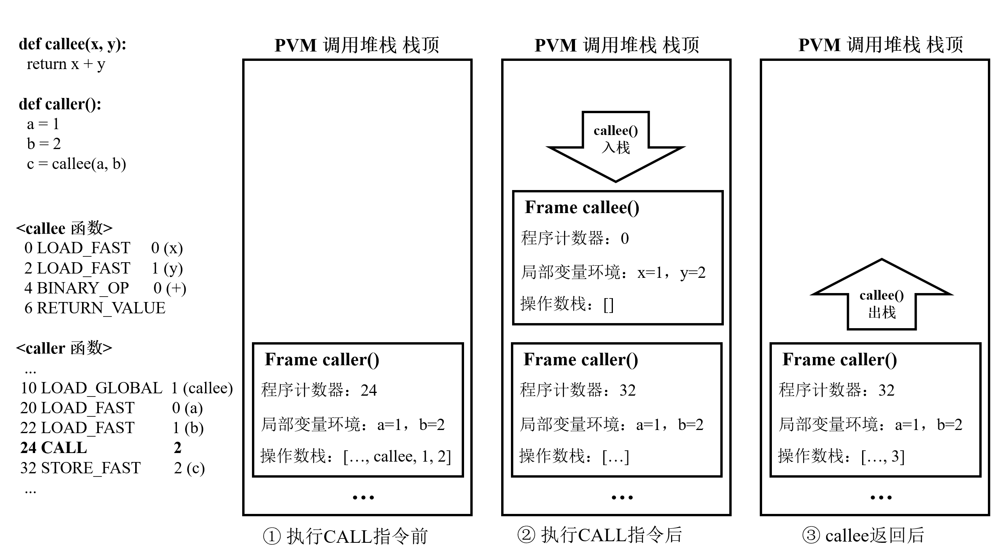
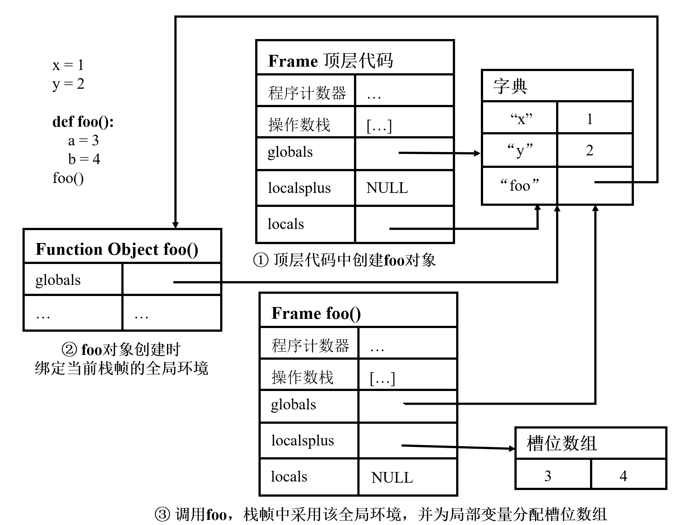
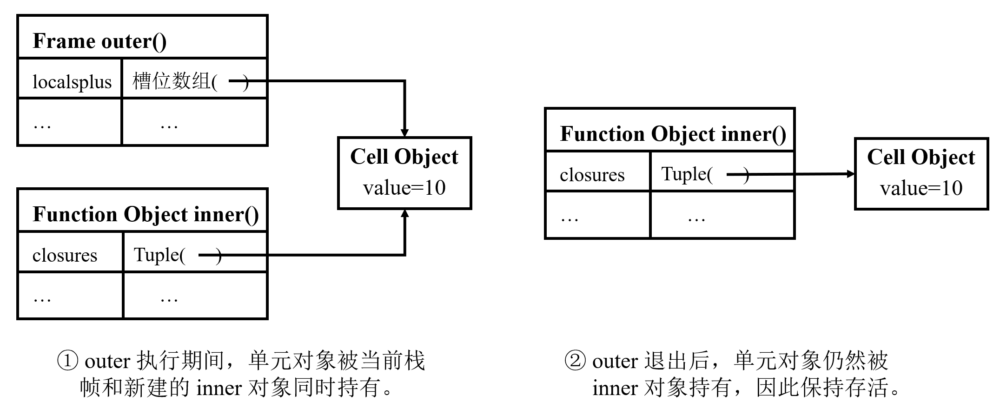
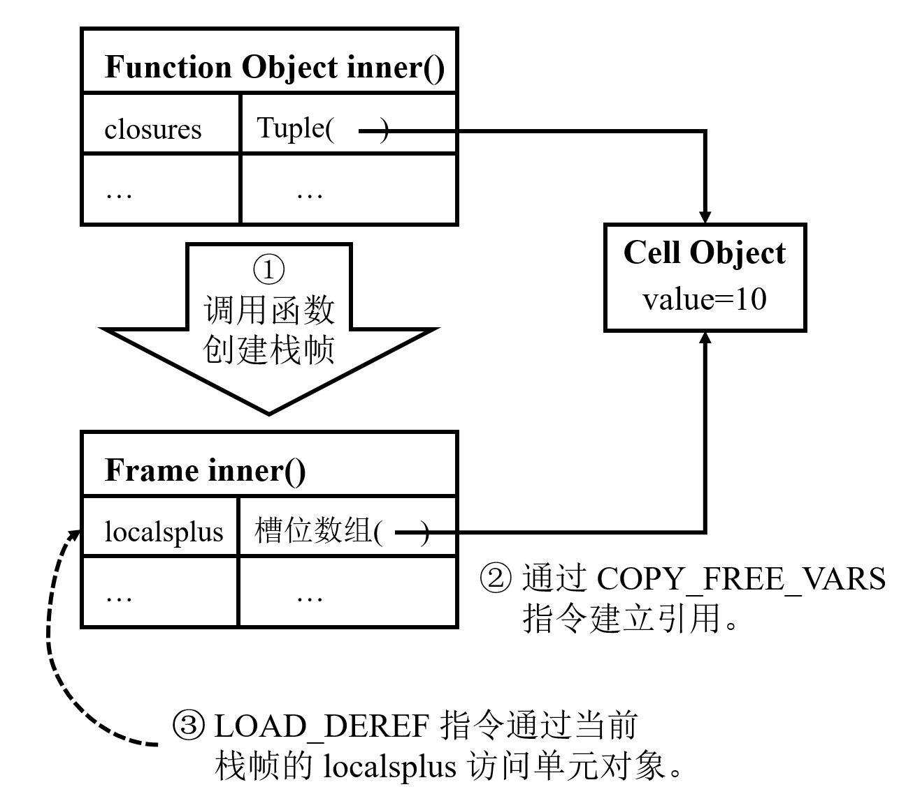
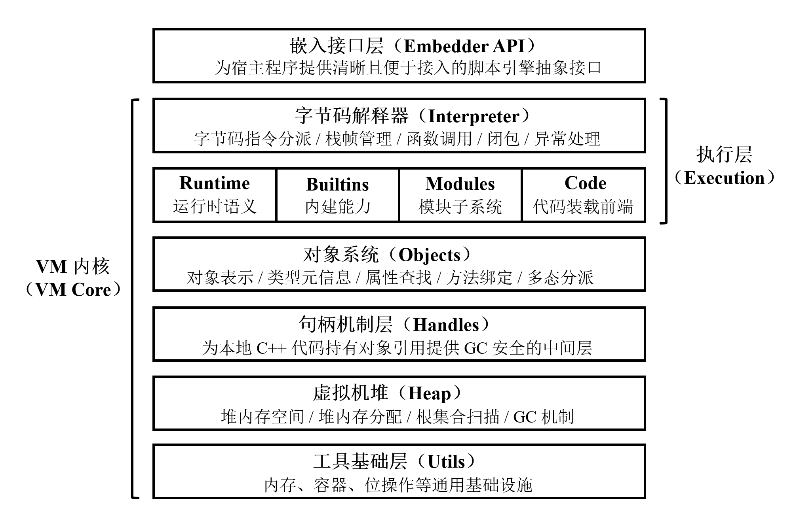
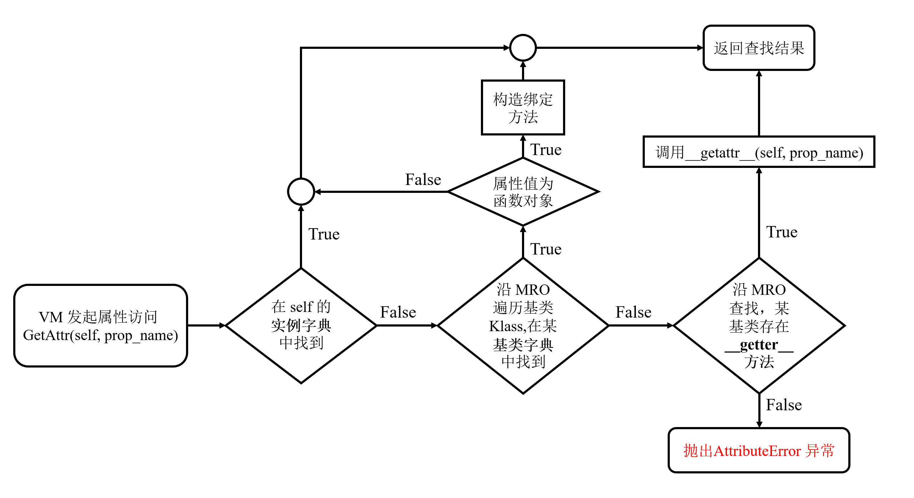
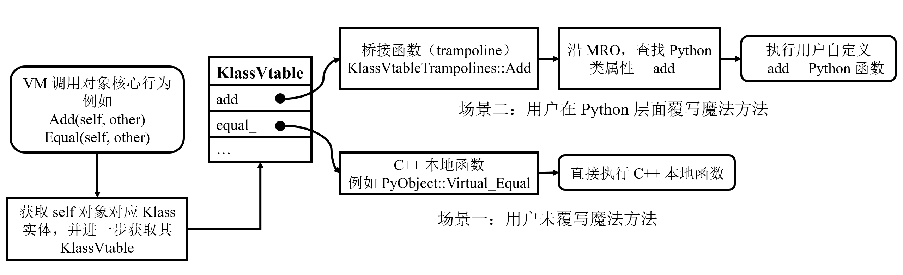
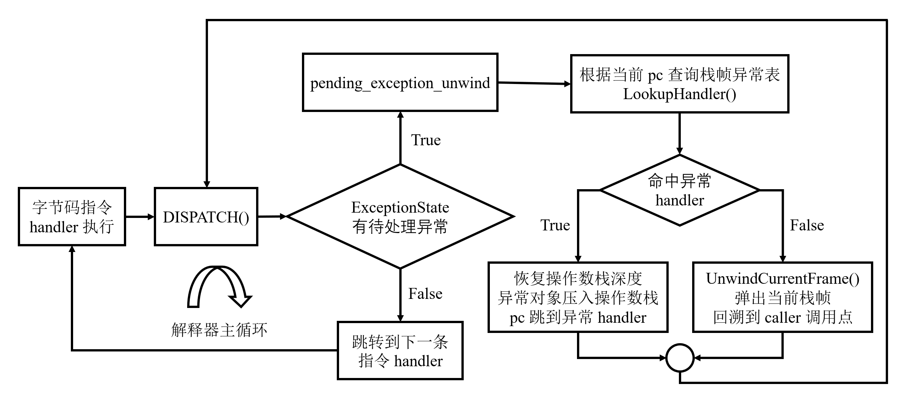

# 一个轻量级 Python 虚拟机的设计与实现

# 摘要

Python 语言因其语法简洁、生态丰富和开发效率高，被广泛应用于 Web 开发、数据分析、人工智能和自动化运维等多个领域。作为一种动态类型高级语言，Python 程序通常依赖 Python 虚拟机完成字节码解释执行、对象管理和运行时支持。尽管 CPython 已经形成了高度成熟的工业实现，但其代码体量和内部机制较为复杂，在教学演示和定制化开发场景下并不总是最合适的研究与工程对象。基于此，本文面向教学与定制化开发场景，设计并实现了一个名为 S.A.A.U.S.O VM 的轻量级 Python 虚拟机后端系统。

本文首先围绕 Python 虚拟机的执行模型、函数对象、栈帧、闭包、对象系统、异常机制和模块机制等核心问题，分析了一个兼容 CPython 3.12 核心字节码模型的轻量级虚拟机需要具备的关键能力。在此基础上，本文给出了 S.A.A.U.S.O VM 的总体架构设计，并进一步实现了虚拟机堆与 Scavenge GC 主路径、句柄机制、统一对象系统、分发表驱动的字节码解释器、异常状态管理与栈展开机制、模块导入基础设施以及面向宿主程序的嵌入接口。为验证系统的正确性与可用性，本文基于 Google Test 构建了针对 VM 内核与嵌入接口的自动化测试集，围绕解释执行、对象系统、异常机制、模块系统、句柄与 GC 协同以及宿主互操作等方面进行了系统测试。测试结果表明，现阶段 S.A.A.U.S.O VM 已通过 438 个自动化测试用例，具备较好的功能正确性与运行稳定性。

本文工作的主要价值在于：围绕轻量化、可嵌入、结构清晰、便于教学演示和定制化开发的目标，建立了一个真实可运行、可测试、可扩展的 Python 虚拟机后端系统闭环。该工作不仅有助于说明编程语言虚拟机中核心机制的工程实现方式，还为定制化开发场景提供了一个轻量化的选择方案。本文所完成的系统基础，也为后续继续扩展 Python 语言语义、完善垃圾回收体系和增强嵌入式脚本引擎能力奠定了基础。

关键词：Python；Python 虚拟机；字节码解释器；对象系统；运行时系统；垃圾回收

# 第1章 绪论

## 1.1 课题背景

Python 语言凭借简洁的语法、较低的上手门槛以及丰富的第三方生态，已被广泛应用于 Web 开发、数据分析、人工智能、自动化运维等多个领域。作为一种动态类型高级语言，Python 程序通常并不直接运行在底层硬件之上，而是依赖 Python 虚拟机（Python virtual machine，PVM）完成编译、加载与执行。

虚拟机技术是现代高级编程语言的核心，它主要包括前端和后端两大部分。前端中由编译器（compiler）将高级语言程序的源代码（source code）翻译成中间字节码（bytecode）。后端中由解释器（interpreter）负责执行字节码。此外，后端还提供垃圾回收器（garbage collector，GC）和编程语言运行时（runtime）等核心模块。这种机制使得 Python 或其他运用该项技术的高级编程语言，可以在任何安装了相应虚拟机软件的计算机系统上运行，而在源代码层面几乎不需要进行任何修改。

目前，最主流、最成熟的 Python 实现是官方维护的由 C 语言实现的 CPython[1-3]。经过长期演进，CPython 在稳定性、执行性能和生态支持方面都已经非常成熟。但从教学演示、轻量嵌入和定制化开发的角度来看，直接研究或裁剪一个大规模工业实现，往往存在两个现实困难。

一方面，CPython 作为长期维护的工业项目，且受限于 C 语言自身的表达与抽象能力，代码体量大、内部机制多，理解和修改的门槛较高。对于希望聚焦编程语言运行时核心机制的教学或实验场景而言，这种复杂度并不总是必要的。另一方面，许多嵌入式脚本场景更关心虚拟机是否够用、易嵌入、便于裁剪或定制化开发，而不是完整覆盖全部 Python 生态。在这些场景中，一个结构清晰、目标聚焦的轻量级 PVM 后端实现，具有一定的研究与工程价值。

基于上述背景，本文提出使用现代 C++20 语言设计并实现一个轻量级 Python 虚拟机后端系统，即 S.A.A.U.S.O VM。该系统以教学与嵌入场景为主要目标，兼容 CPython 3.12 字节码模型，并支持 Python 语言的一个核心功能子集。本文中将重点讨论该系统中对象系统、解释器、异常机制、模块系统、内存管理以及嵌入接口等关键部分的设计思路与工程实现；相比直接讨论一个完整工业实现，围绕这些核心模块展开设计与实现，更有利于说明编程语言虚拟机的内部运行原理。

本文所实现的 S.A.A.U.S.O VM 已开源，相关链接见附录 A。

## 1.2 国内外研究现状

### 1.2.1 国外研究现状

在 Python 实现与编程语言虚拟机领域，国外已经积累了较为丰富的研究和工程成果，形成了多条有代表性的技术路线。

首先，在 Python 语言实现方面，CPython 仍然是事实上的标准实现，强调语言兼容性、稳定性和生态完整性。围绕 CPython 的替代或补充方案也持续出现。例如，PyPy 通过 JIT 技术提升运行效率，在动态语言性能优化方面具有代表性；MicroPython 面向资源受限设备，在体量和部署门槛方面具有明显优势；Codon 则尝试通过静态编译路径获得更高的执行效率[4-6]。这些方案分别在兼容性、轻量化、运行效率和适用场景之间作出了不同取舍。

其次，从更广泛的编程语言虚拟机技术研究领域来看，Strongtalk、HotSpot JVM 和 V8 JavaScript Engine 等工业级虚拟机的研究成果对后续语言运行时设计产生了深远影响。诸如对象模型分层、句柄系统、分代垃圾回收、内联缓存和运行时优化等思想，已经成为现代虚拟机设计中的重要参考。这些成果虽然并非直接面向 Python 语言，但它们在对象表示、执行模型和内存管理方面的设计经验，对构建新的 PVM 系统具有较强借鉴意义。

总体来看，国外相关研究已形成较为完整的生态：既有追求工业成熟度与语言完整性的实现，也有面向特定硬件平台或高性能需求的变体。这为本文选题提供了良好的比较对象和设计参考。

### 1.2.2 国内研究现状

相较于国外较成熟的虚拟机研究与开源生态，国内在 Python 语言实现和 PVM 方向上的公开研究相对较少，且整体更偏应用导向。

一类工作主要集中在 Python 的应用层使用，例如许多企业和高校会将 Python 用于 Web 服务、自动化脚本或数据处理任务，研究重点通常不在 PVM 本身。另一类工作则更多围绕 CPython 的扩展开发或源码剖析展开，这些工作对理解 Python 运行机制具有帮助，但通常并不以“从零设计并实现一个新的 PVM”为目标[2-3]。

在更广泛的编程语言虚拟机领域，国内部分互联网科技企业也会围绕具体业务场景定制专用虚拟机或运行时系统，例如字节跳动的 PrimJS[7]。不过整体而言，这类成果往往偏内部使用，公开资料有限。结构清晰、适合教学或定制化修改的开源实现并不多见。

总体而言，国内在“轻量级、可嵌入、便于教学与定制化修改的 Python 虚拟机后端”这一交叉方向上，公开可参考的系统性实践仍然较少，这也进一步说明了本文工作的实际意义。

## 1.3 课题研究的内容及意义

综合来看，现有 Python 实现方案往往各有侧重：有的强调完整兼容性，有的强调运行效率，有的强调在极小硬件上的可部署性，但在“轻量化、便于嵌入、结构清晰、相对易于教学演示和定制化开发”这几个维度上，同时兼顾的公开实现并不多见。

基于此，本文以教学与嵌入场景为主要目标，设计并实现一个名为 S.A.A.U.S.O 的轻量级 PVM 系统。该系统以兼容 CPython 3.12 字节码模型、支持 Python 语言的常用核心功能为目标，在保证核心功能可运行、可测试的前提下，尽量保持项目规模可控、模块边界清晰，并提供面向宿主程序的嵌入接口。

### 1.3.1 研究内容与目标

- 设计并实现一个基于 C++20 的轻量级 PVM，支持 Python 语言的核心功能子集，并兼容 CPython 3.12 字节码执行模型中的关键路径；
- 设计并实现对象系统、字节码解释器、异常机制、模块系统与内存管理等核心模块，使系统形成可运行的最小闭环；
- 提供面向宿主程序的嵌入接口（Embedder API），使该虚拟机能够作为脚本引擎嵌入 C++ 应用；
- 在保证功能正确性的前提下，尽量保持系统分层清晰、实现可读、工程规模可控，便于教学演示、后续定制化开发以及按需裁剪。

### 1.3.2 研究意义

需要说明的是，S.A.A.U.S.O VM 的目标并不是替代已经高度成熟的 CPython，而是在特定目标下提供一种更轻量、更易理解、也更适合教学演示和定制化修改的系统实现。从这个角度看，本文工作主要具有以下几方面意义。

#### （1）教育教学价值

相较于体量庞大的工业级 VM，一个结构更聚焦、体量更可控的 PVM 一般更适合作为教学材料。通过 S.A.A.U.S.O VM，可以更直观地展示对象系统、字节码解释执行、异常传播、模块加载和内存管理等核心机制，有助于辅助《编译原理》《操作系统》等计算机基础系统开发类课程的教学。

#### （2）工程与实际应用价值

S.A.A.U.S.O VM 采用现代 C++20 实现，并提供面向宿主程序的嵌入接口。对于不需要完整 Python 生态、但希望在自身应用中引入脚本能力的场景，该系统可以作为一种轻量级脚本引擎方案。同时，清晰的模块边界也有利于嵌入方的开发者对其进行裁剪和修改定制。

#### （3）人才培养价值

从实现过程看，PVM 的设计与实现并不是单一模块开发，而是涉及编程语言原理、数据结构、面向对象设计、内存管理、软件工程和系统调试等多方面知识。完成这样一个系统，对于训练计算机专业本科毕业生的复杂系统设计能力、工程实现能力和问题定位能力都具有较强的综合价值。

## 1.4 本文主要内容与结构

本文共分为 6 章，各章主要内容如下：
- 第 1 章：给出研究背景、国内外研究现状、研究内容与意义，以及论文结构安排；
- 第 2 章：介绍与本文系统实现直接相关的 Python 虚拟机理论基础与关键技术；
- 第 3 章：阐述系统的设计目标与总体分层架构，以及各核心层的职责与设计要点；
- 第 4 章：分别说明系统中核心功能模块的工程实现；
- 第 5 章：给出功能正确性、运行时稳定性与 Embedder API 可用性测试的覆盖情况、测试结果及分析；
- 第 6 章：总结本文的主要工作与创新点，并说明当前系统的不足及未来改进方向。

---

# 第2章 PVM 理论基础与关键技术

本章围绕 S.A.A.U.S.O VM 的实现目标，概述轻量级 PVM 所涉及的理论基础与关键技术。本章中不会完整复述 Python 语言的全部细节，而仅围绕本文系统实现直接相关的 Python 核心语言能力进行讨论，从而为第 3 章和第 4 章提供必要的理论基础。

## 2.1 PVM 执行原理概述

### 2.1.1 CPython 执行模型概述

Python 程序的执行通常分为两个阶段：前端将源代码以函数为单位（脚本中的顶层代码会被视作一个特殊的函数）翻译为代码对象（code object），其中包含字节码指令序列、常量表和符号名表等关键信息；后端虚拟机再对其中的字节码指令进行解释执行。本文主要关注后者[8-10]。

从指令的执行方式看，PVM 本质上是一种虚拟的栈机（stack machine）。它维护操作数栈，并按照“取指、译码、执行”的顺序逐条处理字节码指令。在 CPython 的执行模型中，每条字节码指令由操作码和操作参数组成，其职责覆盖常量加载、变量读写、运算、函数调用、属性访问和控制流跳转等核心语义。

例如对于代码 2-1 中给出的简单例子：

```python
x = 1
y = 2
z = 3
x + y * z
```
代码 2-1

编译器前端生成的字节码指令序列如代码 2-2 所示：
```
地址       操作码                  参数
  2      LOAD_CONST               0 (1)
  4      STORE_NAME               0 (x)

  6      LOAD_CONST               1 (2)
  8      STORE_NAME               1 (y)

 10      LOAD_CONST               2 (3)
 12      STORE_NAME               2 (z)

 14      LOAD_NAME                0 (x)
 16      LOAD_NAME                1 (y)
 18      LOAD_NAME                2 (z)
 20      BINARY_OP                5 (*)
 24      BINARY_OP                0 (+)
```
代码 2-2

PVM 执行这段代码时，会通过 `LOAD_CONST`、`STORE_NAME`、`LOAD_NAME` 和 `BINARY_OP` 等指令分别完成常量加载、存储变量、读取变量和二元表达式运算。这说明 PVM 并不直接“理解”高级语言语法，而是通过解释字节码间接实现语言语义。

但一个可运行的 PVM 也不只是维护操作数栈。为了支持函数、异常传播和模块加载，系统还必须维护栈帧（stack frame）、命名空间、异常状态以及运行时服务。后文会对这些概念展开探讨。

### 2.1.2 Python 中的命名空间与变量绑定机制概述

在 Python 中，变量更接近于“名称到对象的绑定关系”，而不是某个固定地址上的存储单元。也就是说，变量读写的本质是在某个命名空间中查找、建立或更新绑定。

从 PVM 的角度看，最常见的命名空间包括函数调用形成的局部命名空间、模块或脚本顶层对应的全局命名空间，以及提供内建函数的内建命名空间。闭包场景下还需要通过额外的单元对象维持自由变量的跨栈帧可见性。

例如，在代码 2-3 中，`add` 函数和变量 `c` 属于全局命名空间，`add` 函数中的形参 `a`、`b` 和局部变量 `result` 属于调用该函数而产生的局部命名空间，`print` 函数属于内建命名空间。

```python
def add(a, b):
  result = a + b
  return result

c = add(1, 2)
print(c)
```
代码 2-3

这意味着，PVM 中在读写变量时，必须结合局部、全局、内建和闭包环境完成名称解析。具体到 CPython 3.12，不同命名空间对应 `LOAD_NAME/STORE_NAME`、`LOAD_FAST/STORE_FAST`、`LOAD_GLOBAL/STORE_GLOBAL` 与 `LOAD_DEREF/STORE_DEREF` 等不同指令，它们的机制在 2.3.2 中会结合栈帧进一步展开。

## 2.2 Python 中基本的控制流

控制流的本质，是决定程序下一步执行哪一条指令。PVM 在解释执行过程中需要维护程序计数器，用于标识下一条待执行字节码的位置。顺序执行时，程序计数器按字节码顺序推进；而遇到条件分支、循环或异常等情况时，程序计数器则会被跳转相关的字节码显式修改。

因此，Python 中的 `if`、`while`、`break` 和 `continue` 等语句，在 PVM 内部最终都会落实为若干条件跳转与无条件跳转指令的组合。代码 2-4 中给出了一个基本的 `while` 循环例子。

```python
while condition:
    i += 1
print(i)
```
代码 2-4

编译器前端生成的字节码指令序列，核心内容代码 2-5 所示：
```
地址       操作码                      参数
  2      LOAD_NAME                0 (condition)
  4      POP_JUMP_IF_FALSE        6 (to 18)

  6      LOAD_NAME                1 (i)
  8      LOAD_CONST               0 (1)
 10      BINARY_OP               13 (+=)
 14      STORE_NAME               1 (i)

 16      JUMP_BACKWARD            8 (to 2)

 18      后续代码略...
```
代码 2-5

分析编译结果可知，循环在 PVM 中并不是独立机制，而是“条件判断 + 跳转”的组合：前者依赖 `POP_JUMP_IF_FALSE` 等条件跳转指令，后者依赖 `JUMP_BACKWARD` 等无条件跳转指令。

与此同时，Python 的控制流判断还涉及真值语义（truthiness），即需要将 Python 程序中的具体对象动态地解释为真或假。因此，PVM 不仅需要支持跳转指令本身，还必须让这些指令与对象真值判定等运行时能力协同工作。

## 2.3 Python 中的函数

函数是 Python 程序中最重要的组织单位之一。对 PVM 而言，函数机制并不只是“执行一段可复用代码”这么简单，它还牵涉到代码对象创建、运行时函数对象构造、参数绑定、栈帧切换以及闭包变量访问等多个环节。

### 2.3.1 简单函数的创建

不同于 C/C++ 等静态语言，在 CPython 的执行模型中，函数的静态部分和动态部分是分开的：编译阶段先为函数体生成代码对象；运行阶段，当程序执行到函数定义语句时，解释器再通过 `MAKE_FUNCTION` 指令把代码对象包装为可调用函数对象，并通过 `STORE_NAME` 指令绑定到当前命名空间。

下面给出一个具体的函数创建例子来进一步说明，见代码 2-6。

```python
def add(a, b):
    return a + b

result = add(1, 2)
```
代码 2-6

编译器前端生成的字节码指令序列中，创建 `add` 函数对象的过程如代码 2-7 所示。
```
地址       操作码                      参数
 2      LOAD_CONST               0 (<code object add at 0x5b596d3b75e0>)
 4      MAKE_FUNCTION            0
 6      STORE_NAME               0 (add)
```
代码 2-7

从这段字节码可以看到，`add` 对应的代码对象先出现在外层代码对象的常量表中，随后由 `MAKE_FUNCTION` 在运行时构造出真正的函数对象。

为了说明动态创建函数这一机制的必要性，代码 2-8 中给出一个带默认参数函数的例子。
```python
default_k = 3
def linear_f(x, b, k = default_k):
    return k * x + b
```
代码 2-8

这个过程是如何实现的呢？分析代码 2-9 中给出的编译器前端生成的字节码指令序列，不难找到答案。
```
地址       操作码                      参数
  6      LOAD_NAME                0 (default_k)
  8      BUILD_TUPLE              1
 10      LOAD_CONST               1 (<code object linear_f at 0x57ba48f76b90>)
 12      MAKE_FUNCTION            1 (defaults)
 14      STORE_NAME               1 (linear_f)
```
代码 2-9

从这段指令中可以看到，创建带默认值参数的函数时，默认值元组是在运行时动态确定的，再由 `MAKE_FUNCTION` 与代码对象一起绑定进函数对象。因此，Python 函数不能被简单视为静态代码片段，而必须建模为运行阶段创建的对象，且具备绑定运行时产生的数据的能力。第 4 章中将会给出函数对象在本文系统中的实际实现。

### 2.3.2 栈帧与函数调用的原理

Python 中的函数调用通常通过 `CALL` 指令发起，函数返回通常通过 `RETURN_VALUE` 指令发起。如图 2.1 所示，每次调用发生时，PVM 都需要创建新的栈帧并压入 PVM 的调用堆栈，用于保存被调函数的程序计数器、操作数栈、局部变量环境等上下文信息；函数返回时，再从调用堆栈中弹出该栈帧并把控制权交还给调用方。


图 2.1 PVM 函数调用过程中调用堆栈与栈帧的变化

从实现角度看，若让所有局部变量都通过字典按名字查找，执行代价会过高。因此，PVM 通常会在栈帧中引入一个槽位区（定长数组）：编译阶段为局部变量分配槽位，运行阶段再通过 `LOAD/STORE` 指令参数中的槽位下标直接读写变量。

在 CPython 3.12 的执行模型中，对字典和槽位区两种方案进行了结合。首先，对于单个 Python 文件的顶层代码，也就是可视作“根函数”的那部分代码，因为其中的顶层变量可能会通过变量符号名被暴露给其他 Python 文件，因此栈帧通常会提供一个被称为 `locals` 的字典用于保存这些顶层变量。而要以变量符号名为键访问这些顶层变量，就需要通过 `LOAD_NAME` 和 `STORE_NAME` 等字节码指令实现。

这里进一步说明 `LOAD_NAME` 与 `STORE_NAME` 的语义差异。对于 `STORE_NAME` 而言，其语义是在当前按名字解析的局部命名空间中建立或更新绑定关系，因此它会直接把值写入当前栈帧的 `locals` 字典。然而，`LOAD_NAME` 的语义并不是“只查当前 `locals`”即可结束：当名称在当前栈帧的 `locals` 字典中不存在时，PVM 还需要继续在 `globals` 以及内建命名空间中进行查找。这样设计的原因在于，在 CPython 当前的执行模型中，可能会复用这条指令用于查找模块级全局变量或内建函数。

相对地，对于一般 Python 函数中的局部变量，则采用了上文介绍的槽位区方案。这个槽位区在 CPython 的源代码中被称为 `localsplus` 数组。另外，Python 函数中的形参以及闭包场景下出现的自由变量，同样会被安排在槽位区中进行维护。相应地，`LOAD_FAST`、`STORE_FAST`、`LOAD_DEREF`、`STORE_DEREF` 等字节码指令就是直接按槽位下标访问对应变量值的。需说明的是，关于闭包的实现原理，在 2.3.3 中会进一步讨论。

与此同时，栈帧中还会预留一个 `globals` 字段用于指向当前函数代码使用的全局命名空间字典。若函数内部需要读取其所在模块中的全局名称，则通过 `LOAD_GLOBAL` 指令，PVM 会先查该函数绑定的全局命名空间，再查内建命名空间作为兜底；若函数体显式对全局变量赋值，则 PVM 会通过 `STORE_GLOBAL` 指令落到该函数绑定的全局命名空间之中。

上文中说过，顶层代码中的变量会直接被放进根函数栈帧的 `locals` 字典中维护，那么为什么还需要引入 `globals` 的概念呢？这一点可以通过代码 2-10 中的一个简单例子更直观地解释。

```python
# mod_a.py
x = 10
def func():
    print(x)

# mod_b.py
from mod_a import func
x = 999
func()
```
代码 2-10

在这个例子中，我们假设有两个模块 `mod_a.py` 和 `mod_b.py`。当 PVM 执行 `mod_a.py` 的顶层代码时，会为该模块准备一个模块级全局命名空间。在 CPython 3.12 的执行模型中，当前根函数对应栈帧中的 `locals` 与 `globals` 字段均直接指向这一个字典。当 `MAKE_FUNCTION` 创建 `func` 时，会把栈帧中 `globals` 字段所指向的该字典一并绑定进新生成的函数对象中。于是，当我们在 `mod_b.py` 中调用 `func` 时，PVM 首先会将当前栈帧中的 `globals` 字段指向与该函数绑定的全局命名空间。接下来，因为函数读取变量 `x` 的操作是通过 `LOAD_GLOBAL` 字节码指令完成的，所以 PVM 会在当前栈帧中 `globals` 所指向的全局命名空间中进行查找，从而得出的输出结果为 10 而非 999。

综上所述，本节已经给出了 PVM 栈帧中应当负责存储的函数执行上下文信息，尤其是 `locals`、`globals` 和 `localsplus` 三个变量环境相关的重要字段，图 2.2 中通过一个综合的例子，总结了上文中对它们职责以及具体指向的介绍。


图 2.2 栈帧中 locals、globals 与 localsplus 字段的职责与具体指向

### 2.3.3 函数闭包

不同于 C/C++，Python 中支持嵌套定义函数，因此进一步会延伸出闭包（closure）机制。闭包是 Python 词法作用域规则的重要体现。

首先通过代码 2-11 中的例子，简要说明 Python 语言中闭包的概念和特点。
```python
def outer():
    x = 10
    def inner():
        print(x)
    return inner
```
代码 2-11

在这段代码中，内部函数 `inner` 对外部函数 `outer` 中的局部变量 `x` 形成引用。因此 `inner` 被称为闭包函数（closure function）；变量 `x` 则被称为 `inner` 的自由变量（free variable）。

站在 PVM 的视角，要实现闭包机制，至少需要解决几个核心问题：
（1）PVM 需要能够区分普通的函数局部变量和自由变量；
（2）PVM 需要保证自由变量在外部函数返回后不会立即消失，而是继续随内部函数一起存活；
（3）PVM 需要保证闭包函数运行时，观察到的是自由变量的当前实际值，而非闭包函数创建时自由变量的副本值；
（4）PVM 需要保证外部函数和内部闭包函数均支持对自由变量进行读写。

下面为了进一步说明 CPython 3.12 执行模型中是如何解决这几个核心问题的，再给出代码 2-11 对应的删节字节码指令，见代码 2-12。

```
outer 函数的字节码指令序列：
地址       操作码                      参数
  0      MAKE_CELL                1 (x)
  4      LOAD_CONST               1 (10)
  6      STORE_DEREF              1 (x)
  8      LOAD_CLOSURE             1 (x)
 10      BUILD_TUPLE              1
 12      LOAD_CONST               2 (<code object inner>)
 14      MAKE_FUNCTION            8 (closure)
...

inner 函数的字节码指令序列：
地址       操作码                      参数
  0      COPY_FREE_VARS           1
...
 14      LOAD_DEREF               0 (x)
```
代码 2-12

从这段代码中可以看出，闭包机制并不是依靠某一条孤立指令完成的，而是由多条字节码指令配合形成一条完整链路。首先，在外层函数 `outer` 中，`MAKE_CELL` 字节码指令会在变量 `x` 所对应的局部变量槽位中新创建一个单元对象（cell object）；随后，`STORE_DEREF` 字节码指令并不是把常量 `10` 直接写入 `x` 对应的槽位，而是写入该槽位的单元对象当中。这意味着从这一时刻开始，`x` 在运行时就已经不再以“普通局部变量值”的形态存在，而是变成了一个可被多个函数共享的间接引用单元。与此同时，这部分字节码指令表明，Python 代码中普通局部变量和自由变量是在编译阶段完成区分的，这就首先回答了问题（1）。

接下来，在内部函数 `inner` 被创建之前，`LOAD_CLOSURE` 指令会把 `x` 对应的单元对象压入操作数栈。随后，`BUILD_TUPLE` 字节码会将操作数栈顶的全体单元对象打包成一个 Python 元组。最后，被编译器前端添加特殊参数标记的 `MAKE_FUNCTION` 指令会在创建函数对象时，把这个装有单元对象的元组绑定进内部函数。如图 2.3 所示，内部函数拿到的并不是 `x` 当前变量值的一份副本，而是对同一个单元对象的引用；因此，当外层函数 `outer` 后续返回时，只要这个函数对象仍然存活，它就能够继续持有该单元对象，从而解决问题（2）。


图 2.3 单元对象在 outer 函数退出后保持存活的原理

如图 2.4 所示，当内部函数 `inner` 真正被调用时，`COPY_FREE_VARS` 指令又会把函数对象里保存的这些单元对象重新注入新建立栈帧中，使该栈帧的局部变量槽位区持有同一个单元对象。随后，`LOAD_DEREF` 才真正执行对自由变量的读取操作。换言之，内部函数运行时读取到的，并不是当初创建函数对象时复制下来的一份静态值，而是通过单元对象间接解析出来的“当前值”。因此，无论是外层函数还是内部函数，只要它们操作的是同一个单元对象，就都能够观察到对该变量所做的更新。这就解释了 PVM 是如何实现问题（3）与（4）的。


图 2.4 inner 函数访问单元对象的原理

综上所述，闭包是一套需要由编译器前端、单元对象间接层和专用字节码指令共同协作完成的完整机制。


### 2.3.4 内建函数

除了用户定义的函数之外，PVM 还要提供 `print`、`len`、`isinstance` 等内建函数。这些函数通常由 VM 的本地代码实现，并预先注册到内建命名空间中，是语言语义与虚拟机系统之间的重要桥梁。

对 PVM 来说，不仅需要使用本地代码实现内建函数，还需要把它们与普通 Python 函数统一建模为可调用对象。编译器前端只需生成通用的调用字节码，然后在运行阶段由 PVM 进行分流处理。这一点将在 4.5.5 中对应落地。

## 2.4 Python 中的面向对象机制

Python 是一门面向对象的动态语言。对象系统不仅影响类和实例本身，还会影响属性访问、方法调用、内建类型表示、继承与多态等一系列运行时行为。对于 PVM 实现来说，对象系统往往是贯穿解释器、运行时和内存管理的核心基础设施。

### 2.4.1 综述

在 Python 中，万物皆对象。数字、字符串、列表、函数、模块，都可以统一看作 Python 对象。特别地，不同于 C++，Python 中类（class）本身也是一种对象，即类型对象（type object）。“万物皆对象”的设计使得 Python 具有较强的灵活性，但也意味着 PVM 需要建立一套统一的对象表示机制，来同时描述“对象实例”和“对象类型”[11]。

因此对于 PVM 的设计与实现而言，必须保证对象模型并不只是语法层面的“类和对象”概念，而是整个服务于 VM 上层逻辑的统一数据组织方式。在 PVM 内部，解释器执行过程中操作的栈值、运行时中传递的函数对象、模块系统中维护的模块对象，最终都要落在统一的对象表示之上。

### 2.4.2 基本内建类型

一个最小可用的 PVM 后端，通常需要先支持若干基础内建类型，才能承载更高层语言语义。对 Python 而言，这些类型至少包括 `object`、`int`、`float`、`str`、`tuple`、`list`、`dict` 等。它们分别承担了不同角色：`object` 是一切 Python 类型的祖先类型；数值与字符串类型支撑最常见的数据表达；元组、列表和字典则是函数创建、函数调用和模块机制等虚拟机核心逻辑中频繁使用的基础容器。

这些内建类型并不是简单的数据结构集合。PVM 还应当为它们实现各自的运行时能力，例如通过下标访问列表元素、对整型或浮点型进行算术计算、获取字符串长度等。因此，在 PVM 中实现内建类型，既要设计合理的对象布局，也要实现这些内建类型的运行时能力。

### 2.4.3 类的封装

封装的核心含义，是将对象状态与围绕该状态运行的方法组织在一起。Python 同样支持这一基本思想：用户可以在类中定义属性和方法，再由实例对象持有具体状态，通过方法对外提供行为。

不过，Python 的封装方式与 C++、Java 等静态语言并不完全相同。首先，Python 并不提供严格的 `public`、`private` 等访问控制修饰符。其次，Python 中类对象本身在运行时具有高度动态性；例如，程序可以向一个类中动态添加新的方法，也可以将类中的某个方法替换为另一个函数。再次，Python 允许在程序运行过程中针对某个对象实例单独添加附加属性，因此实例状态与类行为通常需要被拆分到不同的属性容器中维护。

这意味着 PVM 在实现对象系统时，不能简单照搬静态语言中“字段偏移在编译阶段固定、方法入口在编译阶段预先绑定”的对象模型。首先，PVM 需要采用字典容器的方式分别存储对象实例属性和类属性。在 Python 语言中，前者和后者分别对应于 Python 对象自身和类对象持有的 `__dict__` 字典。其次，在属性读取时，PVM 需要按一定顺序进行解析：通常先查实例自身持有的属性，再查类型对象及其继承链上的类属性，必要时再进入补救机制。只有这样，PVM 才能正确支持 Python 运行时的动态封装语义。

此外，方法绑定也是 Python 动态封装行为的一部分。下面通过代码 2-13 中的例子进行说明。
```python
class MyClass:
  def __init__(self, value):
    self.value = value

  def foo(self):
    print("I can receive self argument")
    print(self.value)

def bar():
  print("I can't receive anything")

instance = MyClass(2026)
instance.bar = bar
instance.foo()
instance.bar()
```
代码 2-13

在这个例子中，当虚拟机在查找 `instance` 对象的 `foo` 属性时，因为该属性来自实例的祖先类，且该属性的值为函数对象，因此 PVM 会在运行时把它与当前实例组合为“绑定方法”。当 Python 程序调用“绑定方法”时，PVM 会自动传入相应的对象实例作为方法函数的 `self` 参数。相反地，因为 `bar` 函数只是临时被写入实例自己的属性字典中，那么它会被 PVM 视作一个普通属性值，并不会生成“绑定方法”。

因此，PVM 中的对象系统不能只实现“属性查找”，还必须进一步区分实例属性、类属性与方法绑定这三类不同语义，否则就无法正确实现 Python 语言的动态封装行为。

### 2.4.4 类的继承

继承允许一个类在已有类的基础上扩展行为和结构，是 Python 面向对象机制中的重要组成部分。通过继承，子类可以复用父类的属性和方法，也可以重写父类方法形成新的行为。

除了单继承之外，Python 还支持多继承。同时，Python 引入了方法解析顺序（Method Resolution Order，MRO），用于描述当多个父类中存在同名属性或方法时，PVM 应当采取的查找顺序。MRO 序列由 Kim Barrett, Bob Cassels 等人提出的 C3 线性化算法进行生成[12]。

从 PVM 实现角度看，这意味着类型创建过程不能只完成“分配一个类型对象”这么简单，还需要在类的创建过程中正确计算并保存该类的 MRO 序列。与此同时，PVM 要让 MRO 序列直接参与 PVM 中类属性查找、方法解析等逻辑。

### 2.4.5 类的多态

传统意义上的多态指相同的调用接口在不同对象上表现出不同的行为。但不同于 C++ 和 Java 中基于接口类的多态，Python 中的多态除了来源于传统的继承和方法重写，也和该语言的鸭子类型特征密切相关。也就是说，在 Python 中允许调用方在静态编译阶段不限定和不知晓对象的静态类型，而仅在运行阶段尝试让目标对象响应某种操作或请求。

例如在代码 2-14 的例子中，尽管 `do_say` 函数完全不了解传递进来的对象类型，但由于 `Cat` 类和 `Dog` 类都具备不需要传入任何参数的 `say` 方法，因此将两者的实例对象传入 `do_say` 函数，程序均能成功运行。

```python
def do_say(animal):
  animal.say()

class Cat:
  def say(self):
    print("meow")

class Dog:
  def say(self):
    print("woof")

cat_instance = Cat()
dog_instance = Dog()

do_say(cat_instance)
do_say(dog_instance)
```
代码 2-14

从这一意义上说，Python 中的多态本质上依赖于 2.4.3 中讨论的运行时阶段的属性查找与方法绑定。对于用户自定义类而言，对象实例属性、类属性以及继承链上的属性查找结果，会共同决定调用一个方法最终表现出的行为。因此，语言层面的多态并不要求 PVM 在编译阶段就把某个调用点与具体实现预先绑定，而是要求虚拟机在运行阶段保留足够的动态解析能力。

但对实际的 PVM 而言，仅仅保留语言层面的动态性还不够。若将所有对象行为都统一退化为字典查询与方法绑定，虽然能够较自然地贴近 Python 语义，但在 PVM 内部会带来较高的运行时开销。例如，假设每次执行整数加法运算时，PVM 都要在 `int` 类型中查找一次 `__add__` 方法，则这种性能开销显然是难以接受的。

基于此，在后续介绍本文所实现的 S.A.A.U.S.O VM 时，需要进一步区分“两层多态”：一层是面向 Python 语言语义的动态属性查找与方法绑定，另一层是面向 VM 内部执行效率的核心行为分派。如何在不破坏前者的前提下，引入后者作为更加高效的调度机制，将成为第 4 章对象系统实现部分需要回答的问题。

## 2.5 Python 中的异常机制

站在 PVM 的角度来看，异常机制本质上是一种特殊的控制流机制。与普通的顺序执行或条件跳转不同，异常会在运行时打断当前正常推进的解释器流程，并尝试将控制权转移到 Python 代码中距离异常发生点最近的异常处理器（exception handler）处。因此，对 PVM 而言，异常机制并不是附属功能，而是解释器主执行逻辑的组成部分。

Python 的异常处理以异常对象（如 `RuntimeError`、`TypeError` 等）为中心。当程序执行过程中虚拟机内部抛出异常，或用户显式执行 `raise` 语句时，PVM 会创建一个异常对象，并作为虚拟机内部的异常状态记录下来。

之后，PVM 需要查找并将控制流转向 Python 程序中与异常发生点相匹配的异常处理器。这个过程是 PVM 通过栈展开（stack unwinding）完成的。栈展开的过程可以用代码 2-15 中的伪代码进行描述。

```python
while 虚拟机调用堆栈非空:
  if 当前栈帧对应的函数中存在可匹配的 `except` 或 `finally` 处理器:
    将解释器控制流转入该处理器执行
    break
  将当前栈帧从虚拟机调用堆栈中弹出
```
代码 2-15

那么，PVM 应当如何查找有效的异常处理器呢？自 CPython 3.11 起，引入了函数级异常表（exception table）的概念。也就是说，在异常发生后，由 PVM 依据触发异常的字节码指令地址，通过当前栈帧对应函数的异常表查询是否存在可匹配的处理器。这种方式使得正常执行路径几乎不需要为异常处理付出额外开销，同时也让 PVM 内部异常控制流与普通控制流之间的边界更加清晰。需要进一步指出的是，在真实的 PVM 系统中，异常表查询结果除了 Python 代码中异常处理器的入口地址外，通常还应包括解释器为清理异常现场而需要恢复的操作数栈深度等控制流信息。

与此相对应，虚拟机内部记录的异常状态也不能只保存“当前异常对象”本身。对 PVM 而言，异常状态通常还需要额外保存异常发生时的控制流信息，例如触发异常的指令地址等。

综上所述，对一个兼容 CPython 3.12 字节码模型的 PVM 而言，为了实现异常机制，至少要解决两大问题：其一，如何记录异常状态；其二，如何进行异常表查找与栈展开。在上述理论基础之上，本文所实现的 S.A.A.U.S.O VM 的异常系统正是围绕这两个问题展开设计的。

## 2.6 Python 中的模块机制

模块（module）机制是实际 Python 项目中组织代码和复用功能的重要方式。对用户而言，`import` 语句看起来很简单。但对 PVM 来说，模块导入相关的核心指令主要包括 `IMPORT_NAME` 和 `IMPORT_FROM` 等，而在这些字节码背后，完整的导入操作涉及名称解析、模块查找、代码加载、模块体执行、导入缓存以及父子模块绑定等多个环节，是一个典型的系统级功能。

具体来说，对于一次典型的导入操作，PVM 通常需要先判断目标模块是否已存在于缓存中；若不存在，则按照搜索路径（如 `sys.path`）查找模块文件或包入口，创建模块对象，并执行模块体初始化其命名空间。执行完成后，该模块会被登记到 `sys.modules`，供后续重复导入时复用。而对于包（package）来说，模块机制还需要额外处理父子层级关系、相对导入级别（level）以及 `from ... import ...` 的绑定语义[13]。

## 2.7 本章小结

本章围绕执行模型、函数与栈帧、对象系统、异常机制和模块机制，概述了一个轻量级 PVM 后端所涉及到的理论基础与关键技术。概括而言，PVM 采用前后端分离的执行结构：前端负责生成字节码表示，后端负责字节码装载、调度、执行以及运行时语义支撑。本章的分析为第 3 章的总体设计与第 4 章的工程实现提供了理论基础。

# 第3章 S.A.A.U.S.O VM 系统总体设计

第 2 章已经概述了一个轻量级 PVM 后端所涉及的理论基础与关键技术。本章在此基础上，进一步给出 S.A.A.U.S.O VM 的总体设计方案，并重点回答系统整体如何划分、各模块如何协作、整个 VM 按照什么顺序逐步进行开发这三个关键问题，从而为第 4 章的系统具体实现提供蓝图。

## 3.1 设计目标与总体思路

S.A.A.U.S.O VM 的总体设计主要围绕以下几个目标展开。

首先，系统需要兼容 CPython 3.12 字节码模型中的核心执行路径，使常见的 Python 核心功能能够被正确解释执行。这里的“兼容”并不意味着逐项复刻完整的 CPython 实现，而是以教学和定制裁剪场景为目标，优先支持最有代表性的语言语义和运行时机制。

其次，系统需要保持良好的可嵌入性。也就是说，S.A.A.U.S.O VM 不仅要能够作为独立解释执行系统运行脚本，还应当能够通过清晰的对外接口嵌入到宿主 C++ 程序中，作为脚本引擎使用。基于这一考虑，系统设计应当预留专门的 Embedder API 层，并将其与 VM 内核实现进行隔离。

最后，系统需要具备较好的可读性和工程可维护性。对于一个轻量级 PVM 后端而言，真正困难的部分往往不在于单个子系统能否运行，而在于多个子系统之间能否形成稳定、清晰、可解释的协作方式。因此，系统设计应当尽量避免将 VM 中的能力集中耦合到解释器内部，而是尝试把对象系统、执行系统、运行时语义、模块系统和内存管理做成相对独立又彼此配合的层次结构。

基于上述目标，S.A.A.U.S.O VM 的总体设计思路可概括为：内核与嵌入接口解耦、子系统间低耦合高内聚、系统各层次间依赖关系明确。3.2 中将给出的系统总体架构设计，就是按照这个思路进行组织的。

## 3.2 系统总体分层架构

图 4.1 给出了 S.A.A.U.S.O VM 的整体架构设计图。首先，从整体结构上看，本文系统可以分为 VM 内核层与嵌入接口层两大层。其中，PVM 的基础设施与核心能力均封装在 VM 内核当中，而嵌入接口则负责把这些能力以相对稳定、易用的形式暴露给宿主应用。其次，如果进一步按职责细分，按照自底向上的单向依赖方向，VM 内核可以进一步概括为如下几层：
- 工具基础层（Utils）：提供与虚拟机业务无关的通用工具与基础设施；
- 虚拟机堆（Heap）：提供虚拟机内部使用的堆空间及其内存分配接口，并负责承担垃圾回收等自动化内存管理任务；
- 句柄机制层（Handles）：提供对象句柄（object handle）机制，用于在垃圾回收场景下安全持有对象引用；
- 对象系统（Objects）：定义 Python 对象的统一表示方式，以及类型元信息、对象布局和核心对象模型；
- 执行层（Execution）：封装 Python 语言运行时能力的实际实现，以及 Python 脚本的实际解释执行能力。


图 3.1 S.A.A.U.S.O VM 系统总体架构图

与此同时，实际的 VM 系统亦需要按照该分层架构逐层进行开发。VM 开发者首先需要实现底层先提供内存、引用安全和对象表示等基础设施，之后才能在此基础上实现运行时语义、模块系统与字节码解释器等上层执行系统；而最外侧的嵌入接口，则需要在整个 VM 内核已经具备独立解释执行脚本的能力后才能搭建。换言之，系统中的高层功能需要在先前层提供的基础之上进行开发。第 4 章也将按这一开发顺序逐层展开实现。

## 3.3 核心运行时容器设计

在 3.2 中已经介绍了如何通过分层架构组织一个实际可用的 VM 系统。但与此同时，在真实的 PVM 系统中，还需要解决对虚拟机中来自各个分层的运行时状态的管理问题，例如虚拟机堆的内存分配状态、脚本执行状态、运行时状态等。为了回答这个问题，在 S.A.A.U.S.O VM 中设计并引入了运行时容器 `Isolate`。

本文系统中的 `Isolate` 并不等同于某个单一功能模块，而是应当理解为一个独立的虚拟机实例，或者一个完整的 Python 运行时上下文容器。如图 3.2 所示，系统中的虚拟机堆、脚本执行状态、模块状态、异常状态以及其他关键运行时资源，都会被统一收敛到单个 `Isolate` 之下管理。也就是说，当 3.2 中所描述的各层能力真正开始落地时，它们并不是彼此孤立地存在，而是共同挂接到同一个运行时上下文之中。


图 3.2 `Isolate` 作为核心运行时容器的关系示意图

引入 `Isolate` 的好处在于，它将 VM 的运行时状态收敛到一个统一容器中进行管理，使得系统中各个分层的工作可以围绕一个统一的运行时上下文展开，减少全局状态分散带来的管理复杂度。

## 3.4 核心层的职责与设计要点

在前文 3.2 节中，本文已经给出了 S.A.A.U.S.O VM 的总体分层结构；在 3.3 节中，又说明了这些层最终如何被统一收敛到 `Isolate` 之下。本节进一步按系统搭建顺序说明各核心层承担的职责、所要解决的相应问题、关键设计要点，以及它们如何为后续更高层提供基础。

### 3.4.1 虚拟机堆

在整个 VM 的开发过程中，最先必须建立的是虚拟机堆。虚拟机堆负责承担对象分配、空间组织与垃圾回收等内存管理职责，是整个运行时对象体系得以成立的基础。对于 S.A.A.U.S.O VM 而言，堆层不仅要提供可用的分配能力，还要为后续对象系统、解释器、模块系统和异常状态管理提供统一的托管内存环境。

根据 David Ungar 提出的分代假说，编程语言 VM 中的对象具有不同的生命周期，其中大部分对象会在创建后快速死亡[14]。因此，为了更方便地管理不同生命周期的对象，HotSpot、V8 等工业级 VM 普遍选择将虚拟机堆划分为多个堆空间。S.A.A.U.S.O VM 在总体设计上同样借鉴了这一思路。

在堆空间划分的总体设计上，S.A.A.U.S.O VM 中主要包括新生代空间（new space）、元数据空间（meta space）以及预留的老生代空间（old space）。其中，新生代空间负责承载大量短生命周期的普通运行时对象；元数据空间负责承载类型元信息、VM 内部字符串常量等持久存在的对象。VM 内部默认会在新生代空间中创建新对象，如果后续系统认为某个对象具有较长的寿命（例如系统发现某些对象在经历若干轮 GC 后仍然存活），那么它们就会被晋升（promotion）至老生代空间单独进行维护。

在垃圾回收策略的总体选择上，S.A.A.U.S.O VM 当前并没有采用类似于 CPython 中以引用计数为主路径的对象生命周期管理方式。原因在于，若以引用计数作为主路径，还需要额外处理计数维护、循环引用检测等问题，这将会大幅增加本文系统的设计与实现难度。

基于上述考虑，S.A.A.U.S.O VM 在总体设计上选择了追踪式 GC（tracing GC）的技术路线。追踪式 GC 是一大类 GC 算法的统称，这类算法的基本思想是：先从一组显式可枚举的起点对象（即根集合，GC roots）出发，沿着对象之间的引用关系遍历整张对象图，并将遍历过程中可达（reachable）的对象视为存活对象，未被遍历到的对象则可视为垃圾。在这一框架下，垃圾回收的重点在于如何选取具体的 GC 算法、如何组织根集合、如何实现遍历对象图[15]。在 4.1 中，将会回答这几个问题在本文系统的实际实现中是如何解决的。

### 3.4.2 句柄机制层

在建立起虚拟机堆与 GC 机制之后，系统随即需要解决第二个基础性问题：VM 内部的本地 C++ 代码如何安全地持有堆上对象引用。在 Python 程序运行过程中，除了 Python 程序层面对堆上对象形成的引用，VM 内部的本地 C++ 代码中同样会持有对堆上对象的引用。因此 GC 算法需要明确知道这些引用的存在，才能避免被本地代码持有的仍然存活的对象被误回收。其次，GC 算法在运行过程中，可能会移动存活对象在内存空间中的位置，因此 VM 中需要一种手段，能够保证本地 C++ 代码中对堆上对象的引用（即指向堆上的指针）能够被正确且及时地更新。

为了解决这些问题，需要为 VM 引入对象句柄这一中间结构，用于代替裸指针（raw pointer）持有和代理访问堆上对象。由于对象句柄属于 VM 自身提供和管理的基础设施，围绕它建立的句柄机制层便得以于 GC 机制协同，统一感知并维护本地代码所持有的对象引用。没有这一层中间结构，位于更加上层的后续对象系统、解释器与各类本地能力都无法在 GC 存在的前提下安全工作。

需要说明的是，本文中句柄机制层的总体设计思想主要借鉴自 V8，即不让高层本地 C++ 代码直接长期持有裸对象地址，而是引入一个由 VM 统一管理的中间引用结构[16]。不过，S.A.A.U.S.O VM 并未直接照搬 V8 的完整工业级实现，而是围绕轻量级 PVM 的功能目标与实际需要，对其设计思想进行了简化、迁移与适配。第 4.2 节将对其具体实现进行介绍。

### 3.4.3 对象系统

在堆与句柄机制已经建立之后，系统接下来需要解决“对象在 VM 内部如何被统一表示”这一问题。因此在 S.A.A.U.S.O VM 中引入了专门的对象系统层，负责给出系统中 Python 对象的表示方式、内存布局、对象行为分派机制，并支撑 Python 作为面向对象语言应有的封装、继承与多态能力。

在总体设计上，S.A.A.U.S.O VM 采用“对象实例数据与类型行为分离”的思路。对象实例主要负责保存字段数据，而与类型相关的名称、继承关系、核心行为等，则交由独立的类型描述结构承担。这样做的目的在于能够把“对象持有什么数据”和“对象应如何响应操作”区分开来。同时 VM 中需要建立统一的对象核心行为分派机制，以避免解释器和运行时为每一种对象类型编写大量特判分支。

在这种设计下，VM 中的 Python 对象需要由两部分共同进行描述：一部分是该对象在内存中的实体（包括对象头与对象实体数据），另一部分是该对象关联的类型元信息。前者回答“这个对象当前保存了什么状态”，后者回答“这个对象是什么类型、能够参与哪些行为分派”。例如，字符串对象与列表对象在内存布局上显然不同，但解释器和运行时仍可以通过各自关联的类型描述结构，以统一方式发起属性访问、运算、迭代或调用等操作。与此同时，这套类型描述结构还需要承担部分类型关系维护和对象扫描支持（为了配合 GC 机制）职责，因此它既服务于语言语义，也服务于内存管理和执行调度。

需要说明的是，这种“对象实例数据与类型行为分离”的总体思路，灵感主要来源于 HotSpot JVM 中针对 Java 这种静态语言所设计的 Oop-Klass 模型[17]。但本文系统并未照搬其具体实现，而是结合 Python 语言的动态性特征，和自定义内建类型的实际需要，对该思路进行了重新组织与落地实现。也正因如此，本文系统中的对象模型，既保留了工业级 VM 在对象表示层面的结构优势，又便于扩展新的内建类型并支撑 Python 语言的动态语义；更重要的是，它为后续执行层中的解释器、运行时语义和模块系统提供了统一的对象行为入口。第 4.3 节将对其实际实现进行介绍。

### 3.4.4 执行层

在虚拟机堆、句柄和对象系统都就位之后，接下来便可以搭建真正具备驱动 Python 程序执行的执行层。执行层是最贴近 Python 程序实际运行过程的一层，负责提供真正的 Python 程序执行能力。如前文图 3.2 所示，这一层并非单一模块，而是由多个相互配合的子系统共同构成。

- 运行时语义子系统（Runtime）：负责承载跨对象、跨场景复用的高层语义逻辑；
- 内建能力子系统（Builtins）：负责提供内建函数、基础类型名和最小异常类型等语言运行环境；
- 模块子系统（Modules）：负责处理 Python 模块的导入操作，解析、查找、加载与缓存；
- 代码装载前端（Code）：负责把 Python 源码或 `.pyc` 输入转换为 VM 内部可执行表示；
- 字节码解释器（Interpreter）：Python 程序字节码序列真正的执行引擎，负责字节码分派、栈帧推进、函数调用和栈展开等核心执行任务。

将执行层细分多个子系统，而不是把全部功能都堆入解释器，有助于避免解释器独自承担全部执行职责。更具体地说，在实际实现系统时，应该先实现 `Runtime`、`Builtins`、`Modules` 与 `Code` 这些基础设施子系统，把程序真正运行起来之前所需的前提能力先组织好；再在它们的基础上搭建 `Interpreter` 以真正驱动 Python 程序执行。这样，整个系统在结构上更接近“多子系统协作完成程序执行”的高内聚低耦合工程形态。后文 4.4 和 4.5 中将分别说明这些基础设施和解释器是如何落地实现的。

### 3.4.5 嵌入接口层

在完成前述各层的开发与组合后，VM 内核已经可以作为独立的脚本执行系统进行运行了，在此基础上可以继续开发面向宿主方的嵌入接口层。该层的核心目标，是在不泄漏内部实现细节的前提下，为宿主程序提供清晰且便于接入的脚本引擎抽象接口。

在 S.A.A.U.S.O VM 嵌入接口层中，对外暴露 `Isolate`、`Context`、`Script`、`Value`、`Function`、`TryCatch` 等宿主可直接理解和使用的抽象接口，对内则通过桥接逻辑连接 VM 内核当中的执行层和对象系统。

需要说明的是，本文系统的嵌入接口在抽象组织方式上部分参考了 V8 的设计思路，例如通过公开接口层与内部实现层相分离的方式对嵌入方隐藏 VM 内核状态，以及选择 `Isolate`、`Context` 等对象作为宿主可见的运行时抽象[16]。不过，S.A.A.U.S.O VM 并未直接照搬 V8 的接口体系，而是围绕轻量级 PVM 的功能目标与实际需要，对相关设计进行了简化、迁移与适配。第 4.6 节将进一步说明这些对外抽象如何建立在前述 VM 内核能力之上。

## 3.5 本章小结

本章在第 2 章理论基础的前提下，进一步给出了 S.A.A.U.S.O VM 的系统总体设计。与第 2 章重点回答“轻量级 PVM 需要解决哪些核心问题”不同，本章重点回答的是“这些问题将按什么顺序被组织进同一个系统”。

从总体上看，S.A.A.U.S.O VM 采用分层式的架构设计，其中的每一层都为更上层的实现提供基础支撑。在实际开发中可按照该架构中自底向上的顺序，逐层搭建起整个完整的系统。首先需要建立虚拟机堆与追踪式 GC 机制，为对象托管提供统一内存基础；再引入句柄机制，解决 GC 与本地 C++ 引用之间的协同；随后建立对象系统，统一组织 Python 对象的状态表示和核心行为；在此基础上，执行层再进一步准备运行时语义、内建环境、模块导入与代码装载等基础设施，并最终由解释器真正驱动 Python 程序的执行；当这些内核能力搭建完成后，可以最终实现暴露给宿主方的嵌入接口。

因此，第 3 章中不仅给出了若干子系统的职责介绍，更是提供了自底向上的逐层开发方案。第 4 章将严格按照这一开发顺序，逐层说明这些设计在工程上是如何真正落地的。

# 第4章 S.A.A.U.S.O VM 关键模块的实现

第 3 章已经给出了 S.A.A.U.S.O VM 的层次划分、核心运行时容器以及关键执行流程的总体设计。本章进一步说明这些设计在实际系统中的落地方式。

## 4.1 虚拟机堆的实现

在第 3 章所给出的开发顺序中，首先需要落地的是虚拟机堆与 GC 机制。如果没有这一层，后续对象系统、解释器和运行时子系统都无从建立。在 3.4.1 中，已经论述了虚拟机堆与 GC 机制的总体设计思路，本节将介绍其在 S.A.A.U.S.O VM 中的实际工程实现。

### 4.1.1 对象引用表示与 `Tagged<T>`

在讨论虚拟机堆之前，需要先说明后文频繁出现的 `Tagged<T>`。在 S.A.A.U.S.O VM 中，它用于统一表示运行时对象引用。之所以不直接使用 `PyObject*` 等裸指针，是因为系统采用了标记指针（tagged pointer）思想，复用同一套位表示同时容纳堆对象引用和整型立即数。

若直接把这种混合表示塞入裸指针，会破坏 C++ 编译器对指针对齐和值语义的要求，从而引入未定义行为。为此，系统借鉴 V8 等工业级 VM 的做法，引入 `Tagged<T>` 作为统一封装。后文出现的 `Tagged<PyObject>`、`Tagged<Klass>` 等，均应理解为运行时对象引用。

### 4.1.2 堆空间划分与实现

在实际实现中，S.A.A.U.S.O VM 的堆空间并不是一段简单连续内存，而是由若干页（page）构成。每个页都带有固定页大小、页头元信息和线性分配状态；系统通过统一的页抽象记录所属空间、页内分配位置以及前后页连接关系，并在此基础上派生 `NewSpace`、`OldSpace` 和 `MetaSpace` 等堆空间。

这种设计的价值在于：系统可通过页头记录所属空间和分配进度；可根据对象地址快速定位页面头部并判断空间类别；也便于后续实现空间的动态扩容或缩容。需要说明的是，虽然因为开发时间的限制，现阶段系统尚未实现完整的老生代空间与分代式 GC，但页化空间已经为这一后续演进打下了扎实的结构基础。

### 4.1.3 根集合与对象可达性

在 3.4.1 中，已经论述了追踪式 GC 的总体思想，并引出了根集合与可达性的概念。在实现层面，S.A.A.U.S.O VM 的根集合并不单一，它既包括 `Isolate` 持有的关键运行时组件，也包括解释器调用栈、句柄机制、内建类型元信息、模块缓存和异常状态中的对象引用。

因此，垃圾回收不是堆模块的局部逻辑，而是整个 VM 的协作过程。只有把这些运行时状态都显式暴露给 GC，系统才能正确遍历全部存活对象。

代码 4-1 给出了 `Heap::IterateRoots()` 的删节实现。该函数把 VM 中若干关键运行时状态统一暴露给 GC 访问器，从而构成追踪式 GC 执行扫描时的根集合。

```cpp
void Heap::IterateRoots(ObjectVisitor* v) {
  isolate_->Iterate(v);

  for (size_t i = 0; i < isolate_->klass_list().length(); ++i) {
    isolate_->klass_list().Get(i)->Iterate(v);
  }

  if (isolate_->handle_scope_implementer() != nullptr) {
    isolate_->handle_scope_implementer()->Iterate(v);
  }
  if (isolate_->interpreter() != nullptr) {
    isolate_->interpreter()->Iterate(v);
  }
  if (isolate_->module_manager() != nullptr) {
    isolate_->module_manager()->Iterate(v);
  }
  isolate_->exception_state()->Iterate(v);
}
```
代码 4-1

从这段代码可以看出，根集合在实现中被显式组织为一组运行时状态入口。若 `Heap::IterateRoots()` 漏掉某个入口，GC 就可能错误回收仍然存活的对象。因此，对追踪式 GC 而言，根的组织与回收算法同样关键。句柄机制作为重要扫描根，会在 4.2 中进一步展开。

### 4.1.4 具体的垃圾回收算法与实现

在现阶段的 S.A.A.U.S.O VM 中，主要实装的是 Cheney 算法，这是由 C. J. Cheney 提出的一种追踪式 GC 算法[18]。在 HotSpot、V8 等工业级 VM 的实现中，它主要被用作针对新生代空间的 GC 算法，亦被称为 Scavenge 算法；在 S.A.A.U.S.O VM 的代码实现中，同样沿用了这一称呼。

在介绍 Cheney 算法之前，这里首先需要说明现阶段选择该算法的原因。在工业级 VM 中，常用的追踪式 GC 算法还包括标记-清除（mark-sweep）和标记-整理（mark-compact）算法。但本文系统并未将它们作为第一阶段方案。前者虽然概念直接，但需要处理空闲块管理与内存碎片问题；后者虽然能进一步改善碎片，却会引入复杂的对象位置调整与引用更新流程。相比之下，Cheney 算法的实现相对简单，且不会引入外部内存碎片，更适合当前阶段 VM 系统先形成可用的基础垃圾回收能力，再逐步演进的目标。

Cheney 算法的基本思想是：
（1）将堆空间进一步划分为 Eden 区与 Survivor 区，新分配对象首先进入 Eden 区。
（2）当 GC 启动时，系统从根集合出发找到仍然存活的对象，将它们复制到 Survivor 区，并同步修正根集合对它们的引用。
（3）扫描这些被复制到 Survivor 区的存活对象，进一步找出它们所持有的、仍在 Eden 区的对象，再将这些存活对象复制到 Survivor 区，并修正前者对它们的引用。
（4）如此循环往复，直至所有存活对象都被复制至 Survivor 区。
（5）最后交换半空间的角色，将原先的 Survivor 区作为 Eden 区、原先的 Eden 区作为 Survivor 区，以便下一轮 GC 时可以重复上述操作。

代码 4-2 给出了 `ScavengerCollector` 与 `ScavengeVisitor` 的删节实现。前者负责组织回收流程，后者负责对具体槽位中的对象执行复制、转发与引用更新。

```cpp
void ScavengerCollector::CollectGarbage() {
  ScavengeVisitor visitor(heap_);
  heap_->IterateRoots(&visitor);

  while (scan_page != nullptr) {
    Tagged<PyObject> object(scan_ptr);
    size_t instance_size = PyObject::GetInstanceSize(object);
    PyObject::Iterate(object, &visitor);
    scan_ptr += instance_size;
  }

  heap_->new_space()->Flip();
}

void ScavengeVisitor::EvacuateObject(Tagged<PyObject>* slot_ptr) {
  if (mark_word.IsForwardingAddress()) {
    *slot_ptr = mark_word.ToForwardingAddress();
    return;
  }

  size_t size = PyObject::GetInstanceSize(object);
  Address target_addr = AllocateInSurvivorSpace(size);

  std::memcpy(reinterpret_cast<void*>(target_addr),
              reinterpret_cast<void*>(object.ptr()), size);
  PyObject::SetMapWordForwarded(object, Tagged<PyObject>(target_addr));
  *slot_ptr = Tagged<PyObject>(target_addr);
}
```
代码 4-2

这段代码揭示了当前 GC 逻辑的几个关键工程特征。首先，回收并不是从堆中“盲目扫描全部对象”开始，而是从根集合出发，把所有可达对象逐步复制到 Survivor 区。其次，复制完成后，Eden 区中原对象位置会被写入该对象被复制至的新内存地址（被称为转发地址，forwarding address）；后续若再遇到指向该对象在 Eden 区中旧位置的引用，系统不需要重复复制，只需读取转发地址并让外部引用指向它即可。再次，`ScavengerCollector` 并未采用递归式的 DFS 遍历，而是以 Survivor 空间中的已复制对象作为一个隐式的 BFS 队列，按线性扫描方式不断推进，这种做法既避免了深递归，又无需开辟额外的内存空间。

### 4.1.5 工厂函数与对象的初始化

在建立虚拟机堆之后，就可以在其上分配内存并创建对象了。S.A.A.U.S.O VM 通过统一工厂函数（factory function）收敛对象创建与初始化过程；上层逻辑通常只需调用这些工厂函数，并以 `Handle<T>` 形式接收结果。

引入统一工厂函数的主要目的，是收敛分配与初始化逻辑、封装堆分配细节，并避免初始化顺序不当而破坏 GC 安全性。对于可能因分配而触发 GC 的系统而言，若对象的指针字段尚未初始化完成便被扫描，就可能访问到无效引用。因此，本文系统中的工厂函数均按“先完成基础字段初始化，再执行后续依赖堆分配步骤”的顺序实现。

## 4.2 句柄机制实现

在建立了虚拟机堆与 GC 机制之后，系统随即需要实现句柄机制。在 3.4.2 中，已经从总体设计角度论述了引入句柄机制的背景与动机；本节将进一步说明句柄在 S.A.A.U.S.O VM 中的实现方式及其与 GC 的协同。

### 4.2.1 VM 代码中的句柄使用方式

在实际开发中，高层逻辑通常不会直接使用 4.1.1 中介绍的 `Tagged<T>` 传递堆对象引用，而是优先使用 `Handle<T>`；当一段逻辑会临时创建一批新的对象引用时，还需要建立相应的句柄作用域，即 `HandleScope` 或 `EscapableHandleScope`。这样，本地 C++ 代码中的临时对象引用就能够被统一收敛到句柄槽位中，并被 GC 感知和更新。

### 4.2.2 对象句柄与槽位模型

S.A.A.U.S.O VM 中句柄机制层的核心组件为 `HandleScopeImplementer`。该组件会负责管理一批内存块（block）。每个内存块会被视作一个提供若干 `Address` 槽位（slot）的定长 C 数组。在本文系统中，`Address` 用于代表指向堆上对象的内存地址。

从实现本质上看，`Handle<T>` 并没有直接保存对象地址，而是保存了某个槽位的位置。这些槽位就来自 `HandleScopeImplementer` 管理的内存块。换言之，槽位中放置了实际指向堆上对象的地址，而 `Handle<T>` 自身则保存指向该槽位的指针，即 `Address* location_`。因此，当 VM 通过 Handle 访问对象时，逻辑上存在两次解引用：第一次对 `location_` 解引用，取出槽位中保存的对象地址；第二次再根据该对象地址访问真实对象内容。

在实际使用时，除直接拷贝 `Handle<T>` 外，开发者往往先拿到原始对象的 `Tagged<T>`，再向 `HandleScopeImplementer` 申请槽位并写入地址。也就是说，对象句柄的构造过程本质上就是“申请槽位并把对象地址写进去”。

代码 4-3 给出了上述机制的删节实现。其中，`Handle<T>` 负责保存并解引用槽位，`HandleScopeImplementer::CreateHandle()` 负责完成“申请槽位并写入对象地址”的过程。同时，`HandleScopeImplementer` 内部会维护整片内存块的分配状态。

```cpp
template <typename T>
class Handle {
 public:
  Handle(Tagged<T> object, Isolate* isolate) {
    if (object != kNullAddress) {
      location_ = HandleScopeImplementer::CreateHandle(isolate, object.ptr());
    }
  }
  ...
  constexpr T* operator->() const { return Tagged<T>(*location()).operator->(); }

 private:
  Address* location_{nullptr};
};

class HandleScopeImplementer {
 public:
  static constexpr int kHandleBlockSize = 512;
  static Address* CreateHandle(Isolate* isolate, Address ptr);

 private:
  Vector<Address*> blocks_;
};
```
代码 4-3

槽位模型是解决 3.4.2 中所提出问题的关键。在 4.2.4 中会进一步说明它是如何与 GC 机制协同的。

### 4.2.3 HandleScope 释放句柄槽位的原理

在 4.2.2 中提到，创建 `Handle<T>` 时需要向 `HandleScopeImplementer` 申请槽位。那么反过来，本文系统中也需要一种机制，能够在对象句柄失效时及时释放其占用的槽位。这样，才能建立对象句柄槽位的生命周期闭环。

在局部执行场景中，S.A.A.U.S.O VM 通过 `HandleScope` 管理 Handle 槽位的生命周期。其基本做法是在进入局部作用域时借助 `HandleScope` 的 C++ 构造函数记录当前槽位的分配状态，在退出时借助 `HandleScope` 的 C++ 析构函数使分配状态恢复。于是，该局部作用域内申请出去的槽位，在程序退出作用域后就可以被统一视作“无效并可复用”。这种批量回退的策略，比逐个 `Handle` 释放更适合 VM 这类对性能敏感的系统。

### 4.2.4 与 GC 机制的协同

在建立槽位模型及其生命周期管理之后，下一步就是实现句柄机制与 GC 的协同。

如 4.1.3 所述，`HandleScopeImplementer` 作为根集合的一部分，会在 GC 发生时被访问器逐个扫描其当前有效槽位。若对象在回收过程中被移动，访问器就直接把槽位内容改写为新地址。这样，GC 一方面能够找到本地 C++ 代码持有的存活对象，另一方面也能保证后续 Handle 访问到的始终是对象的最新地址。概括而言，S.A.A.U.S.O VM 把“维护本地代码持有的堆对象引用”转化为“维护一组已知槽位”，从而解决了 3.4.2 中提出的问题。

## 4.3 对象系统实现

在堆与句柄机制都已经具备之后，系统才能进一步建立统一对象系统，使后续解释器与运行时语义拥有一致的对象行为入口。在 3.4.3 中，本文已经从总体设计角度说明了对象表示层的职责与思路；本节进一步讨论这一思路在 S.A.A.U.S.O VM 中的具体落地。

### 4.3.1 `PyObject` 与 `Klass` 的分工

在 3.4.3 中，已经提出了“对象实例数据与类型行为分离”的对象模型设计思路。在具体实现上，S.A.A.U.S.O VM 中所有 Python 对象实例都统一纳入 `PyObject` 体系，而类型元信息则由 `Klass` 体系统一描述。`PyObject` 负责对象布局与字段组织，`Klass` 负责类型行为、继承关系等元信息；系统会为每一种内建类型及用户自定义类建立唯一的对应 `Klass` 实体。后续解释器、运行时和模块系统也正是通过这一对象模型，才得以以统一方式操作不同类型的 Python 对象。

在进一步介绍 `PyObject` 和 `Klass` 各自承载的数据之前，首先需要回答一个问题：`PyObject` 实体是如何与 `Klass` 建立关联的呢？在本文系统中，`PyObject` 会在对象头部保留 `MarkWord` 字段，用于在正常运行时记录所属 `Klass` 的地址，从而在对象实体与类型元信息之间建立起直接关联。需要指出的是，`Klass` 实体仅供 VM 内部使用，Python 程序只能直接观察到类型对象。为打通二者，本文系统又在 `Klass` 与 `PyTypeObject` 之间建立了双向关联：运行时可由类型对象快速定位到 `Klass` 实体，反之亦然。

如图 4.1 所示，`PyObject`、`Klass` 与 `PyTypeObject` 在本文系统中分别位于对象实例层、VM 内部类型元信息层和 Python 层可见类型对象层。对象实例通过对象头中的 `MarkWord` 与所属 `Klass` 建立关联，而 `Klass` 又与 `PyTypeObject` 建立绑定关系，从而使 VM 内部类型行为组织与 Python 层类型观察之间形成统一桥接。


图 4.1 `PyObject`、`Klass` 与 `PyTypeObject` 的关系示意图

### 4.3.2 实例属性、类属性与方法绑定

S.A.A.U.S.O VM 并没有把 Python 对象实例的所有属性都简单地堆入同一个容器中，而是将实例属性与类属性分开组织，这与 2.4.3 中关于“字典化封装”问题的分析结论是一致的。在实际系统中，实例对象负责持有自身的属性字典，对应类型的 `Klass` 实体负责持有类属性字典。这样一来，“对象当前持有的具体状态”和“类型为所有实例共享的属性与方法”就在结构上被分开表示了，而后续解释器在执行属性访问相关字节码时也就有了统一查找路径。

为了清晰地展示 S.A.A.U.S.O VM 内部这一统一查找路径是如何运行的，图 4.2 给出了其的核心执行逻辑。


图 4.2 属性查找与方法绑定路径图

从图中可知，S.A.A.U.S.O VM 中属性查找与方法绑定的主流程与 2.4.3 和 2.4.4 的理论分析是一致的：系统首先在 `self` 的实例字典中查找；若未命中，则沿 MRO 序列遍历各基类的类字典；如果在类字典中找到了属性且其值为函数对象，VM 会在运行时将其与 `self` 组合为绑定方法（Method Object）返回；若整条 MRO 链均未命中，系统会尝试调用兜底的 `__getattr__` 方法；若仍失败，则最终抛出 `AttributeError` 异常。

### 4.3.3 基于 `Klass/KlassVtable` 的对象核心行为分派机制

根据 2.4.5 中的理论分析，在通过字典查找与方法绑定维持语言层动态性的同时，VM 内部仍需要为若干高频核心行为提供更稳定和高效的调用入口。实现阶段中，S.A.A.U.S.O VM 又对“对象核心行为”的概念进行了泛化，使其不仅包括 `__add__`、`__call__`、`__equal__`、`__len__` 等语言层操作，也包括实例大小计算、对象扫描等 PVM 内部能力。这样，后续解释器与运行时在面对不同对象类型时就不必到处编写大量特判分支。

在本文系统中，基于 `Klass` 又进一步引入了虚函数表机制 `KlassVtable`，用于统一组织对象核心行为的分派。这样，系统在调用对象的核心操作时，就可以先查询到对象所绑定的 `Klass` 实体，再进一步通过其持有的 `KlassVtable` 虚函数表直接找到并调用相应的内部 C++ 实现，而无需再执行开销昂贵的属性查找与方法绑定操作。

与此同时，Python 仍保留了高度动态的行为覆写能力。为兼顾语言层动态性与内部执行效率，现阶段系统采用“优先走虚函数表，必要时退化为字典查找”的**双层多态方案**。图 4.3 给出了这一机制的运作原理。


图 4.3 对象核心行为的双层多态分派机制示意图

如图 4.3 所示，当 VM 内部调用对象的核心行为时，会面临两种场景：
- **快路径（Fast Path）**：如果用户未覆写该类中核心行为所对应的魔法方法，虚函数表中的槽位将直接指向 C++ 本地函数（如 `Virtual_Add`），从而在调用时实现快速执行。
- **慢路径（Slow Path）**：如果在初始化类型虚函数表时，VM 检测到用户在 Python 层面重载了该核心行为对应的魔法方法，就会把该虚函数槽位的指针改写为指向一个桥接函数（在系统源码中被称为 trampoline）。当调用发生时，桥接函数会退化执行类属性查找，最终调用到用户定义的 Python 函数。

代码 4-5 给出了系统源码中上述底层入口与桥接逻辑的骨架。

```cpp
// 对象的统一加法入口：直接通过虚函数表分派
Handle<PyObject> PyObject::Add(Isolate* isolate, Handle<PyObject> self, Handle<PyObject> other) {
  Tagged<Klass> klass = ResolveObjectKlass(self, isolate);
  return klass->vtable().add_(isolate, self, other);
}

// 桥接函数：退化为字典查找与动态调用
Handle<PyObject> KlassVtableTrampolines::Add(...) {
  // 内部回退调用 并执行 Python 函数
  return Runtime_InvokeMagicOperationMethod(isolate, self, args, kwargs, "__add__");
}
```
代码 4-5

### 4.3.4 内建类型的实现原理及初始化

在 2.4.2 中已经指出，一个最小可用的 PVM 必须先提供若干基础内建类型。从实现角度看，这些类型并不是由用户代码在运行时临时创建的，而是由 VM 在 C++ 侧预先定义。因此，PVM 既要为它们提供各自的实例布局，也要准备对应的类型元信息与核心行为实现。这一步实际是在把前述统一对象模型真正落到可运行的基础类型上。

在 S.A.A.U.S.O VM 中，这种“预先定义”主要体现在两层：对象实体层由 `PyObject` 子类承载具体字段布局，类型元信息层由对应的 `Klass` 子类承载名称、继承关系、实例特征和核心行为入口。需要指出的是，并非所有内建值都一定以普通堆对象出现；例如当前系统中的整数采用标记指针表示，但仍通过 `PySmiKlass` 被统一纳入对象系统。

以 Python 中的 `list` 类型为例，其对象实体会在 `PyObject` 基础上增加长度和元素存储区等字段，而对应类型在初始化过程中需要补齐元信息、继承关系与核心行为入口。

代码 4-6 给出了 `list` 类型初始化过程的删节实现。

```cpp
void PyListKlass::PreInitialize(Isolate* isolate) {
  填写基础元信息，代码略...
  将内建类型的特有核心行为入口写进虚函数表的槽位，代码略...
}

void PyListKlass::Initialize(Isolate* isolate) {
  CreateAndBindToPyTypeObject(isolate);  // 创建类型对象，并建立绑定关系
  auto klass_properties = PyDict::New(isolate);
  set_klass_properties(klass_properties);  // 创建并设置类属性字典
  AddSuper(PyObjectKlass::GetInstance(isolate));  // 将 object 添加为父类
  OrderSupers(isolate);  // 计算生成 mro 序列
  vtable_.Initialize(isolate, Tagged<Klass>(this));  // 填充虚函数表中其余槽位
  PyListBuiltinMethods::Install(klass_properties);  // 安装内建方法到类型字典
  set_name(PyString::New(isolate, "list"));  // 设置类名
}
```
代码 4-6

需特别说明的是，为避免自举阶段的循环依赖，现阶段系统采用分阶段初始化：各内建类型先执行无需依赖其他类型的 `PreInitialize()`，使系统达到最小可用；再执行依赖关系更完整的 `Initialize()`，补齐类型的 Python 语义。

### 4.3.5 用户自定义类的创建过程

对本文系统来说，创建用户自定义类，本质上是同时完成 Python 语义层可见的类型对象建立，以及 `Klass` 中元信息、继承关系和虚函数表的初始化。其中，`Klass` 的初始化尤为关键，因为它是 4.3.2 中属性查找与 4.3.3 中核心行为分派得以正确工作的基础。也正是在这里，前文对象系统的总体设计开始真正转化为 Python 层可见的动态类型能力。代码 4-7 给出了这一过程的删节实现。

```cpp
Handle<PyTypeObject> Runtime_CreatePythonClass(
    Isolate* isolate,
    Handle<PyString> class_name,
    Handle<PyDict> class_properties,
    Handle<PyList> supers) {
  EscapableHandleScope scope(isolate);
  
  Handle<PyTypeObject> type_object = isolate->factory()->NewPyTypeObject();
  Tagged<Klass> klass = isolate->factory()->NewPythonKlass();

  klass->set_klass_properties(class_properties);
  klass->set_name(class_name);

  if (supers->IsEmpty()) {
    PyList::Append(supers, base_object_klass, isolate);
  }
  klass->set_supers(supers);

  type_object->BindWithKlass(klass, isolate);
  
  klass->OrderSupers(isolate);
  klass->InitializeVtable(isolate);

  return scope.Escape(type_object);
}
```
代码 4-7

在这段代码中，系统首先创建新的类型对象和 `Klass` 并完成绑定；随后把类名、类属性字典以及基类列表写入 `Klass`；若用户没有显式声明父类，则自动补入 `object` 作为默认基类。

绑定完成后，系统继续计算 MRO 序列，并据此初始化 `KlassVtable`。具体而言，系统先对基类列表执行 C3 线性化算法，得到最终 MRO 序列；再沿该序列复制父类虚函数表中可继承的核心行为槽位，并使用 4.3.3 中介绍的 `KlassVtable::UpdateOverrideSlots()` 覆写被用户魔法函数重载的槽位。这样，用户自定义类既能继承已有核心行为，也能保持 Python 语义允许的动态覆写能力。

## 4.4 执行层基础设施的实现

在完成堆、句柄机制和对象系统之后，S.A.A.U.S.O VM 才具备“让 Python 程序运行起来”的基础。但推动字节码逐条执行的解释器并不是执行层的全部；在此之前，系统还必须完成运行时入口收口、内建环境装配、模块导入以及代码装载等准备工作。换言之，本节解决的并不是“如何逐条执行字节码”，而是“在解释器真正启动之前，必须先把哪些运行前提搭好”。字节码解释器则放到下一节集中讨论。

### 4.4.1 执行入口的统一组织

S.A.A.U.S.O VM 并没有把脚本执行直接暴露为解释器底层接口，而是通过统一执行入口对主脚本执行、模块执行和函数调用进行收口。这样既避免其他模块直接耦合解释器内部实现，也便于在进入解释器前统一准备 `locals`、`globals` 等上下文信息。若没有这一层，后续 `4.5` 中的解释器主循环虽然能够执行字节码，却缺少统一且稳定的外部进入方式。

与此同时，一部分不适合直接写入解释器主循环的高层语义逻辑，例如类属性查找和用户自定义类型创建等，也统一由 `Runtime_` 接口承载。这样，解释器可以更专注于字节码调度、栈帧切换和异常控制流等底层执行逻辑。

### 4.4.2 内建能力实现

如 2.3.4 所述，一个 PVM 即使已经拥有对象系统和解释器，如果没有基本的内建运行环境，仍然无法真正“可用”。因此，S.A.A.U.S.O VM 在执行层中专门组织了内建能力子系统，用于承载内建能力的具体实现。这一步实际解决的是“解释器开始执行之前，Python 程序默认可以依赖哪些运行时环境”的问题。

在现阶段的 S.A.A.U.S.O VM 中，`Isolate` 容器中持有一个 `builtins_` 字典，当解释器需要调用内建能力时就会访问这个字典，凭目标内建函数的名称进行查询。全体内建能力的 C++ 实现，会在 `Isolate` 容器初始化时被包装成 Python 函数对象并注入进 `builtins_` 字典。

与此同时，正如 2.3.4 中所讨论的，对于用户程序而言，`print`、`len` 等内建函数与普通 Python 函数都表现为“可调用对象”。这意味着在 PVM 内部，需要区分调用目标应该走普通 Python 函数的调用路径，还是直接调用本地 C++ 逻辑。这个问题会在后文 4.5.1 中进一步讨论。

### 4.4.3 模块系统实现

正如 2.6 所讨论的，模块导入虽然由解释器通过相关字节码指令触发，但其背后是一套完整的系统逻辑。因此，S.A.A.U.S.O VM 将模块系统设计为执行层中的相对独立子系统，而不是把名称解析、模块定位、模块加载和缓存维护等逻辑耦合进解释器主循环。这一步解决的，是解释器在真正执行 `IMPORT_NAME/IMPORT_FROM` 相关指令时需要依赖的外部装载前提。

其中，模块管理器 `ModuleManager` 统一持有模块缓存和导入路径（对应于 Python 语言层面的 `sys.modules` 与 `sys.path`），并把名称解析、模块定位、模块装载与导入调度分别交给 `ModuleNameResolver`、`ModuleFinder`、`ModuleLoader` 与 `ModuleImporter` 等组件。

`ModuleImporter` 是模块子系统中导入逻辑的调度枢纽。它首先调用 `ModuleNameResolver` 解析相对导入符号，再按照完整模块名进行分段导入。例如，若完整模块名为 `a.b.c`，则系统需要依次导入包 `a`、子包 `b` 和模块 `c`。分段导入时，系统会先检查缓存；若目标模块已加载，则直接复用，否则再转入 `ModuleLoader` 执行路径查找和模块装载。

### 4.4.4 代码装载前端实现

对本文课题而言，重点研究对象是 PVM 后端，因此 S.A.A.U.S.O VM 在源码编译能力上直接封装了 CPython 的编译前端；关闭该复用后，PVM 后端仍可独立运行，但部分依赖源码编译前端的功能会受到限制。与此同时，系统也支持直接装载 CPython 编译器前端生成的 `.pyc` 代码对象二进制文件，从而为脚本执行提供源码与字节码两类输入入口。至此，解释器真正启动前所依赖的运行入口、内建环境、模块能力与代码输入来源都已经被准备完毕。

## 4.5 字节码解释器与异常处理的实现

在建立起执行门面、运行时语义、内建能力和代码装载前端等基础设施后，解释器与异常处理机制才真正把整个 VM 的执行主链路闭环起来。受限于论文篇幅，本节不逐条罗列全部字节码指令，而是沿着“函数对象 -> 栈帧 -> 变量环境 -> 闭包 -> 调用 -> 调度 -> 异常”的顺序，选取第 2 章讨论过的几类核心机制进行说明。

### 4.5.1 Python 函数对象与可调用对象表示

在 2.3.1 中已经指出，Python 函数的本质是运行阶段由 PVM 动态创建的可调用对象。在现阶段 S.A.A.U.S.O VM 的实现中，普通 Python 函数与本地函数统一由 `PyFunction` 对象表示，只是在其内部保存的元数据和实际调用路径上有所区别。

从实现职责看，`PyFunction` 至少需要组织四类信息：
（1）`func_code_` 对应函数的静态代码对象；
（2）`func_globals_` 对应函数创建时绑定的全局命名空间；
（3）`default_args_` 与 `closures_` 分别对应全体默认参数和全体被该函数捕获的自由变量；
（4）`native_func_` 对应本地函数的 C++ 函数指针。

其中，（1）（2）（3）服务于普通 Python 函数，（4）预留给本地函数使用。与此同时，`MAKE_FUNCTION` 指令的实现也与 2.3.1 中的理论分析一致：解释器根据代码对象动态创建 `PyFunction`，再把当前栈帧中的全局变量表、默认参数和自由变量元组写入其中。代码 4-8 给出了这一路径的删节实现。

```cpp
INTERPRETER_HANDLER_WITH_SCOPE(MakeFunction, {
  auto code_object = Handle<PyCodeObject>::cast(POP());
  Handle<PyFunction> func =
      isolate_->factory()->NewPyFunctionWithCodeObject(code_object);
  func->set_func_globals(current_frame_->globals(isolate_));

  if (op_arg & MakeFunctionOpArgMask::kClosure) {
    func->set_closures(Handle<PyTuple>::cast(POP()));
  }
  if (op_arg & MakeFunctionOpArgMask::kDefaults) {
    func->set_default_args(Handle<PyTuple>::cast(POP()));
  }
  PUSH(func);
})
```
代码 4-8

### 4.5.2 栈帧数据结构与局部执行现场

在 S.A.A.U.S.O VM 中，栈帧的实体为 `FrameObject` 类。除了 2.3.2 中讨论过的操作数栈、程序计数器以及 `locals`、`globals` 与 `localsplus` 三类环境外，它还显式保存当前函数对象、代码对象和上一层调用者指针 `caller_`。这意味着本文系统中的 Python 调用栈并不是隐含在 C++ 调用栈中，而是由 PVM 自己维护。

下面进一步说明这些变量环境如何被装配进栈帧。在现阶段的 S.A.A.U.S.O VM 中，当解释器发起 Python 函数调用时，栈帧的初始化及装配由 `FrameObjectBuilder` 承担。代码 4-9 给出了这部分逻辑的删节实现。

```cpp
FrameObject* FrameObjectBuilder::BuildSlowPath(
    Isolate* isolate,
    Handle<PyFunction> func,
    Handle<PyDict> bound_locals,
    ...) {
  Handle<PyCodeObject> code_object = func->func_code(isolate);
  Handle<FixedArray> localsplus =
      isolate->factory()->NewFixedArray(code_object->nlocalsplus());
  Handle<FixedArray> stack =
      isolate->factory()->NewFixedArray(code_object->stack_size());
  ...
  return FrameObject::Create(...);
}
```
代码 4-9

从这段实现可以看到，本文系统中的栈帧装配策略与 2.3.2 的理论分析是一致的：每个函数栈帧都显式保存其绑定的全局命名空间；调用时可以灵活指定 `locals`；`localsplus` 则按代码对象中记录的槽位数单独分配，用于承载形参、普通局部变量和自由变量。

### 4.5.3 局部变量、全局变量与名称查找

在建立栈帧数据结构后，下一步就可以给出变量读写相关字节码指令的具体实现。

代码 4-10 给出了 `LOAD_NAME` 字节码指令的删节实现。

```cpp
INTERPRETER_HANDLER_WITH_SCOPE(LoadName, {
  Handle<PyObject> key =
      current_frame_->names(isolate_)->Get(op_arg, isolate_);
  ...
  Handle<PyObject> value = 
      PyDict::Get(current_frame_->locals(isolate_), key, ...);
  if (!value.is_null()) { PUSH(value); break; }

  value = PyDict::Get(current_frame_->globals(isolate_), key, ...);
  if (!value.is_null()) { PUSH(value); break; }

  value = PyDict::Get(isolate_->builtins(), key, ...);
  if (!value.is_null()) { PUSH(value); break; }
})
```
代码 4-10

对于 `LOAD_NAME`，若 `locals` 未命中，则继续向 `globals` 和内建命名空间回退。这与第 2 章给出的名称查找规则一致。与之相对的 `STORE_NAME` 只需把写入操作落到 `locals` 字典上，这里不再给出具体代码。

与此相对应，`STORE_GLOBAL/LOAD_GLOBAL` 和 `STORE_FAST/LOAD_FAST` 也分别沿着全局命名空间与 `localsplus` 槽位区完成读写，其实现与 2.3.2 中的理论分析基本一致，因此不再逐段展开。

### 4.5.4 函数闭包的实现

在 2.3.3 中已经分析了函数闭包机制的实现原理。本节中选取 `MAKE_CELL`、`COPY_FREE_VARS` 与 `LOAD_DEREF` 三个关键指令，说明 S.A.A.U.S.O VM 中闭包机制的实际实现。相关删节代码见代码 4-11。

```cpp
INTERPRETER_HANDLER_WITH_SCOPE(MakeCell, {
  Handle<Cell> cell = isolate_->factory()->NewCell();
  Tagged<PyObject> initial =
      current_frame_->localsplus(isolate_)->Get(op_arg);
  cell->set_value(initial);
  current_frame_->localsplus(isolate_)->Set(op_arg, cell);
}

INTERPRETER_HANDLER_DISPATCH(CopyFreeVars, {
  Tagged<PyTuple> func_closures = current_frame_->func_tagged()->closures_tagged();
  for (...) {
    current_frame_->localsplus(isolate_)->Set(..., func_closures->GetTagged(i));
  }
})

INTERPRETER_HANDLER_WITH_SCOPE(LoadDeref, {
  Tagged<Cell> cell = current_frame_->localsplus(isolate_)->Get(op_arg);
  Tagged<PyObject> value = cell->value_tagged();
  PUSH(value);
  ...
})
```
代码 4-11

从这段代码看，闭包机制的具体实现与 2.3.3 中给出的理论分析是一致的：`MAKE_CELL` 把自由变量从普通槽位改为由单元对象间接持有；函数创建阶段再把相关单元对象绑定进内部函数；`COPY_FREE_VARS` 与 `LOAD_DEREF` 则保证新栈帧能够继续访问同一组被捕获变量。与之对应的 `LOAD_CLOSURE` 和 `STORE_DEREF` 逻辑与此同理，故不再展开。

### 4.5.5 函数调用主路径与调用栈管理

在函数对象、栈帧结构与闭包访问机制都已明确之后，系统才真正具备组织一次完整函数调用的条件。对于 S.A.A.U.S.O VM 而言，这一过程既包括普通 Python 函数的建帧与解释执行，也包括本地函数的直接调用路径，以及 Python 调用栈本身的创建、维护和回退。

代码 4-12 给出了这一调用主路径的删节实现。

```cpp
Handle<PyObject> Interpreter::CallPythonImpl(Handle<PyObject> callable,
                                             Handle<PyObject> receiver,
                                             Handle<PyTuple> pos_args,
                                             Handle<PyDict> kw_args) {
  ...
  Handle<PyObject> result;
  if (IsNormalPyFunction(callable, isolate_)) {
    FrameObject* frame =
        FrameObjectBuilder::BuildSlowPath(
            isolate_, callable, receiver, pos_args, kw_args);
    ...
    EnterFrame(frame);
    EvalCurrentFrame();

    Handle<PyObject> result = ReleaseReturnValue();
    DestroyCurrentFrame();
    ...
  }
  result = CallNonNormalFunction(callable, receiver, pos_args, kw_args);
  ...
}
```
代码 4-12

这段代码说明了普通 Python 函数调用的关键步骤：解释器先判断调用目标是否属于普通 Python 函数；若是，则构造新栈帧并完成参数绑定，将其加入 PVM 调用链，随后调用 `EvalCurrentFrame()` 逐条解释执行，最后提取返回值并恢复上一层栈帧。

与此同时，`CallPythonImpl()` 还体现出统一调用入口与内部执行分流之间的关系。对上层而言，系统始终通过同一个调用入口接收 `callable`、`receiver`、位置参数和关键字参数；对底层而言，解释器则根据调用目标的具体类别，在普通 Python 函数、本地函数与其他可调用对象之间选择不同执行路径。这样，前文建立的对象系统与调用协议就被真正接入了解释器主链路，也为下一步“如何逐条调度字节码”提供了稳定入口。

### 4.5.6 基于调度表的字节码分派

在函数调用主路径已经建立之后，解释器才真正进入“逐条调度执行字节码指令”的阶段。代码 4-13 给出了 S.A.A.U.S.O VM 中调度和控制流相关逻辑的删节实现。

```cpp
void Interpreter::EvalCurrentFrame() {
  uint8_t op_code = 0;
  int op_arg = 0;

#define DISPATCH()                                      \
  do {                                                  \
    if (isolate_->HasPendingException()) [[unlikely]] { \
      goto pending_exception_unwind;                    \
    }                                                   \
    op_code = current_frame_->GetOpCode();              \
    op_arg = current_frame_->GetOpArg();                \
    goto* dispatch_table_[op_code];                     \
  } while (0)

INTERPRETER_HANDLER_DISPATCH(PopJumpIfFalse, {
  Tagged<PyObject> condition = POP_TAGGED();
  if (!Runtime_PyObjectIsTrue(isolate_, condition)) {
    current_frame_->set_pc(current_frame_->pc() + (op_arg << 1));
  }
})

其他字节码指令的实现略...
}
```
代码 4-13

从这段代码可以看出，本文系统并非通过巨大的 `switch` 语句分发字节码，而是通过分发表（dispatch table）直接跳转到对应 handler。每条指令执行完后，`DISPATCH()` 宏统一负责检查待传播异常并进入下一条字节码调度，从而把“正常继续执行”与“转入异常路径”收束到同一处控制流入口。

这段代码中 `POP_JUMP_IF_FALSE` 指令的实现也直接回应了 2.2 的理论分析：跳转指令通过修改程序计数器改变控制流，而条件判断则依赖运行时提供的对象真值语义。

### 4.5.7 异常机制的实现

在解释器具备统一调度主循环之后，异常机制才能被放回真实执行路径中理解。在 2.5 中已经指出，异常机制本质上是解释器主路径中的一种特殊控制流，而不是附加在解释器之外的一段错误处理逻辑。要实现一个实际可用的异常机制，PVM 至少需要解决异常状态记录、异常表查找与栈展开两大关键问题。

这里首先讨论异常状态记录的实现。在本文系统中，异常状态由挂在 `Isolate` 上的 `ExceptionState` 组件统一管理，其中既保存待处理异常对象，也记录与异常传播相关的控制流信息。这样，运行时语义、内建能力和解释器等子系统都可以通过同一接口向 VM 抛出异常或查询异常状态，而不必各自维护一套异常表示。

接下来再讨论异常表查找与栈展开的实现。在 4.5.6 中已经提到，当解释器在 `DISPATCH()` 中检测到 VM 存在待处理的异常状态时，会立即跳入 `pending_exception_unwind` 以处理异常。代码 4-14 给出了这部分逻辑的删节实现。

```cpp
void Interpreter::EvalCurrentFrame() {
  ...
pending_exception_unwind: {
  auto* exception_state = isolate_->exception_state();
  exception_state->set_pending_exception_pc(current_frame_->pc() -
                                            kBytecodeSizeInBytes);

  ExceptionHandlerInfo handler_info;
  if (ExceptionTable::LookupHandler(
          isolate_, current_frame_->code_object(isolate_),
          exception_state->pending_exception_pc(), handler_info)) {
    current_frame_->set_stack_top(handler_info.stack_depth);
    ...
    PUSH(exception_state->pending_exception_tagged());
    exception_state->Clear();
    current_frame_->set_pc(handler_info.handler_pc);
    DISPATCH();
  }

  ...
  UnwindCurrentFrame();
  DISPATCH();
}
  ...
}
```
代码 4-14

从这段代码中可以看到，`pending_exception_unwind` 主要承担异常表查找与当前帧内控制流恢复的职责。解释器首先记录触发异常的字节码指令地址，再调用 `ExceptionTable::LookupHandler()` 查询当前代码对象的异常表中是否存在覆盖该位置的处理器。若存在有效处理器，解释器就恢复目标操作数栈深、压入异常对象，并把程序计数器跳转到处理器入口；若不存在匹配处理器，则转而调用 `UnwindCurrentFrame()` 回溯当前栈帧，并把异常发生地址回溯为上一层栈帧中的调用点，以便继续在外层帧中查询异常表。如此循环，直至找到有效处理器，或回溯到根栈帧并停止整个 Python 程序的执行。

若把解释器主循环与异常处理路径放在同一张全局流程图中观察，则可得到图 4.2。可以看到，普通字节码 handler 的执行、`DISPATCH()` 宏的统一收口，以及异常发生后经由 `pending_exception_unwind` 进入异常表查找与栈展开路径，实际上共同构成了同一条解释执行主链路。换言之，异常并不是解释器之外的补丁逻辑，而是解释器在遇到特殊控制流时的内建分支。


图 4.2 解释器主循环与异常处理流程图

## 4.6 Embedder API 实现

当前述堆、句柄、对象系统、执行层基础设施以及解释器主链路都已经收敛为相对稳定的内核边界之后，S.A.A.U.S.O VM 才进一步对宿主程序暴露 Embedder API。其目的在于把 VM 核心能力以更稳定、易用的方式提供给外部 C++ 应用，而不要求嵌入方直接理解内部对象布局、GC 细节与解释器状态。总体上，该接口采用“公共头文件 + API 桥接层 + VM 内核实现”的三层结构：最外层面向宿主公开稳定抽象，中间层负责把公开接口转换为 VM 内部可理解的表示，最内层即前文介绍的 VM 内核。

需要说明的是，本文在 Embedder API 的抽象组织方式上参考了 V8 Embedder API 的部分设计思路，例如以 `Isolate`、`Context` 等对象作为宿主可见的运行时抽象，并通过公开接口层与内部实现层相分离的方式管理复杂的 VM 内核状态[16]。不过，S.A.A.U.S.O VM 并未直接复刻 V8 的接口体系，而是结合 Python 虚拟机的语义需求、系统规模与轻量化目标，对相关设计进行了简化与适配。

在这套接口中，`Isolate` 作为独立 VM 实例与运行时容器对外暴露，`Context` 表示脚本运行所依赖的上下文环境，而 `Script`、`Value`、`Function` 与 `TryCatch` 等抽象则分别承担脚本装载、值交换、函数调用和异常观测等职责。宿主程序通常先创建 `Isolate`，再在其内部建立 `Context`，随后完成脚本编译与执行；这意味着宿主方只需围绕 VM 实例、上下文环境和脚本对象三个核心概念组织流程，而无须直接依赖 VM 内部实现细节。

进一步地，S.A.A.U.S.O VM 的 Embedder API 并不只支持“宿主驱动脚本执行”，还支持宿主与脚本之间的双向互操作：一方面，宿主程序可以创建函数对象并注入脚本环境，使 Python 脚本调用 C++ 回调；另一方面，宿主程序也可以从脚本上下文中取回 Python 函数对象，并在 C++ 侧发起调用。这说明前文构建的对象系统、函数调用机制与异常传播机制，不仅能够支撑 VM 内部执行，也能够被进一步封装为宿主程序可直接利用的脚本引擎能力。

## 4.7 本章小结

本章严格按照第 3 章给出的系统蓝图，对 S.A.A.U.S.O VM 的关键模块进行了自底向上的落地。首先建立虚拟机堆与 GC 主路径，为全部对象提供统一托管内存；随后通过句柄机制解决 GC 与本地 C++ 引用之间的协同问题；再在其上建立统一对象系统，把 Python 对象状态、类型关系与核心行为分派收敛到同一套表示框架之中。

在此基础上，系统进一步组织执行层基础设施，先准备运行入口、内建环境、模块能力与代码装载前端等运行前提，再由解释器与异常处理把“函数对象 -> 栈帧 -> 变量环境 -> 闭包 -> 调用 -> 调度 -> 异常”的执行主链路真正闭环起来；当这些内核能力已经形成相对稳定的边界后，系统才进一步向宿主暴露 Embedder API。由此，第 3 章给出的总体设计不再停留在结构划分层面，而是在本章中转化为可执行、可验证、可嵌入的工程实现。

更重要的是，第 2 章提出的核心理论问题也在本章获得了明确落地：命名空间与变量绑定对应栈帧及相关字节码指令，函数对象、函数调用与闭包对应 `PyFunction`、`FrameObject` 和相关调用链路，异常机制对应 `ExceptionState`、异常表查询和栈展开主路径。换言之，第 2 章回答了“要解决什么问题”，第 3 章回答了“这些问题如何被组织进同一个系统”，而本章则回答了“这些设计如何按顺序真正实现”。

基于现阶段 S.A.A.U.S.O 的实现基础，下一章将进行功能测试与结果分析，对系统进行验证。

# 第5章 S.A.A.U.S.O VM 功能测试与结果分析

本章围绕功能正确性、运行时稳定性以及 Embedder API 可用性，对现阶段的 VM 系统进行测试与结果分析。由于当前课题目标是建立一个兼容 CPython 3.12 核心字节码模型的最小 VM 闭环，因此测试重点放在功能正确性与运行稳定性上，而不进行与成熟工业级 PVM 的大规模性能对比。

## 5.1 测试目标

结合第 1 章中提出的课题目标，以及第 2 章至第 4 章中给出的理论分析与工程实现，本文将现阶段 S.A.A.U.S.O VM 的测试目标归纳为以下四个方面。

第一，验证字节码解释执行主路径的功能正确性。具体包括控制流跳转、变量读写、函数调用、闭包、异常传播等核心语义，确保它们在当前系统中能够被正确解释执行。

第二，验证对象系统与内建运行环境的功能正确性。具体包括对象属性访问、方法绑定、内建类型构造、容器读写、运算协议、模块导入以及若干关键内建模块的行为，确认系统已经具备支撑常用 Python 程序的基础能力。

第三，验证运行时基础设施的稳定性。具体包括句柄机制与 GC 机制的协同、在 GC 压力下对象引用是否能被正确维护、异常系统是否能跨栈帧正确展开，以及在复杂语义组合场景中系统是否仍能保持一致行为。

第四，验证 Embedder API 的可用性。由于 S.A.A.U.S.O VM 的关键目标之一是作为轻量级脚本引擎嵌入宿主 C++ 程序，因此还需要确认 4.6 中介绍的 `Isolate/Context/Script/TryCatch/Function` 等 API 是否能按预期工作。

## 5.2 测试内容与方法

### 5.2.1 测试内容

考虑到 CPython 官方测试集中包含大量超出课题研究范围的高阶语言功能，现阶段 S.A.A.U.S.O VM 基于 Google Test 自动化测试框架自行维护了两套更贴合课题目标的单元测试集。

第一套为针对 VM 内核的单元测试集，位于项目 `test/unittests/` 目录下。这部分测试直接覆盖虚拟机堆、对象系统、句柄机制、字节码解释器、异常系统、模块系统、编译前端和若干工具组件，是验证本文系统正确性的主要依据。

第二套为针对 Embedder API 的单元测试集合，位于项目 `test/embedder/` 目录下。这部分测试从宿主程序视角验证公开嵌入接口，包括 `Isolate` 生命周期、上下文管理、脚本执行、宿主与脚本的双向互操作等内容。

表 5-1 给出了这两套测试集的量化统计情况。

|测试集|测试源文件个数|测试用例数|
|-----|-------------|---------|
|针对 VM 核心| 62 个 | 392 个 |
|针对 Embedder API| 7 个 | 46 个 |

表 5-1

这说明现阶段 S.A.A.U.S.O VM 已具备较为系统化的自动化回归基础。5.3 和 5.4 将进一步说明其覆盖内容。

### 5.2.2 测试方法

现阶段 S.A.A.U.S.O VM 已将 Google Test 与全部单元测试集成到项目中。执行测试时，先运行项目根目录下的 `build.sh` 构建 VM 内核与测试程序，再分别运行 `ut.exe` 和 `embedder_ut.exe` 即可批量获取结果。

## 5.3 功能测试覆盖的内容

### 5.3.1 字节码解释执行与控制流

在字节码解释执行方面，现阶段测试已覆盖变量读写、条件分支、循环跳转等基础路径。

相关源文件包括：
- `interpreter-smoke-unittest.cc`
- `interpreter-controlflow-unittest.cc`

### 5.3.2 函数调用、参数绑定与闭包

函数调用与闭包部分较易出现语义偏差，因此当前测试覆盖了位置参数、关键字参数、默认参数、`*args/**kwargs` 展开、参数错误、方法调用时 `self` 注入、递归调用以及与闭包等场景。

相关源文件主要包括：
- `interpreter-functions-args-binding-unittest.cc`
- `interpreter-functions-call-errors-unittest.cc`
- `interpreter-functions-call-unpack-unittest.cc`
- `interpreter-functions-recursion-unittest.cc`
- `interpreter-functions-varargs-def-unittest.cc`
- `interpreter-closure-unittest.cc`

### 5.3.3 对象系统、内建类型与运行时行为

对象系统方面，现阶段测试已覆盖对象属性、实例属性与类属性查找、方法绑定、自定义类构造、MRO、多态行为以及内建类型的构造与核心能力分派等内容。

相关源文件主要包括：
- `interpreter-attribute-constraints-unittest.cc`
- `interpreter-builtins-constructor-unittest.cc`
- `interpreter-builtins-method-dispatch-unittest.cc`
- `interpreter-custom-class-core-unittest.cc`
- `interpreter-custom-class-construct-unittest.cc`
- `interpreter-custom-class-dunder-unittest.cc`
- `interpreter-custom-class-mro-unittest.cc`

### 5.3.4 异常机制与模块系统

异常机制方面，现阶段测试已覆盖异常对象格式化、`try/except/finally`、`raise/from`、异常匹配、跨函数栈展开以及 `StopIteration` 与迭代器语义协同等内容。

相关源文件主要包括：
- `interpreter-exceptions-format-unittest.cc`
- `interpreter-exceptions-iteration-unittest.cc`
- `interpreter-exceptions-trycatch-unittest.cc`
- `interpreter-exceptions-unwind-unittest.cc`

模块系统方面，现阶段测试已经覆盖模块缓存、包导入、相对导入和全量导入等内容。相关源文件主要包括 `interpreter-import-unittest.cc`。

## 5.4 运行时稳定性与 Embedder API 测试覆盖的内容

### 5.4.1 句柄、GC 与运行时稳定性

在运行时基础设施方面，本文重点验证句柄系统与 GC 的协同是否可靠。为此，当前项目构建了针对局部句柄、长期句柄、跨线程边界、GC 根遍历、移动后引用更新以及 GC 压力场景的测试。

例如，在 `gc-unittest.cc`、`gc-interpreter-stress-unittest.cc`、`global-handle-unittest.cc`、`handle-unittest.cc` 等源文件中，重点验证了对象在经历 Scavenge GC 后引用仍然可达、句柄槽位能够随对象移动而被更新，以及 VM 在 GC 压力条件下不会错误丢失存活对象；此外，还引入了解释器层测试以确认内建对象在显式 GC 压力下仍能保持功能正常。

### 5.4.2 Embedder API 可用性验证

除了 VM 内核本身，Embedder API 也是本文的重要验收对象。当前 `test/embedder/` 共包含 7 个测试源文件、46 个 Google Test 用例，覆盖 `Isolate` 创建与销毁、`Context` 创建与使用、脚本编译与执行、宿主与脚本的双向互操作、TryCatch 异常捕获等内容，同时也验证了接口在错误使用时能否及时拦截，例如在未正确创建 `Isolate` 或跨线程非法访问时，Debug 版本会立即触发断言。

## 5.5 测试结果总结与分析

### 5.5.1 测试结果

在本次论文撰写阶段的完整测试中，先成功构建了 VM 内核与单元测试执行程序，再分别运行核心 VM 测试与 Embedder API 测试。结果如表 5-2 所示。

| 测试目标 | 测试用例数 | 结果 | 总耗时 |
| --- |  --- | --- | --- |
| 核心 VM 测试 `ut.exe` | 392 | 全部通过 | 4554 ms |
| Embedder API 测试 `embedder_ut.exe` | 46 | 全部通过 | 1082 ms |
| 合计 | 438 | 全部通过 | 5636 ms |

表 5-2

从表 5-2 可以看到，现阶段 S.A.A.U.S.O VM 在一次完整回归中通过了全部 438 个自动化测试用例，没有出现构建、链接或测试失败的情况。这说明系统当前已经具备较好的整体一致性。

### 5.5.2 结果分析

结合 5.3 与 5.4 的覆盖情况，可以从三个层面理解这些结果。

第一，从功能正确性看，当前系统已经通过了控制流、函数调用、闭包、对象系统、内建类型、异常机制和导入系统等 Python 语言核心功能的测试验证。这表明第 4 章给出的实现已经能够支撑 Python 核心功能子集，本文系统已初步具备处理真实 Python 程序关键语义的能力。

第二，从稳定性看，压力测试结果表明，现阶段解释器、GC 与对象句柄机制等核心设施是稳定可控的。

第三，从 Embedder API 可用性看，测试结果表明本文系统已经具备了最小可用的嵌入接口实现。

## 5.6 本章小结

本章围绕功能正确性、运行时稳定性与 Embedder API 可用性，对现阶段 S.A.A.U.S.O VM 进行了系统测试与结果分析。测试结果表明，当前系统通过了全部 438 个自动化测试用例，已经具备轻量级 PVM 应有的最小可用闭环，基本达成了 1.3.1 中提出的研究目标。

# 第6章 总结与展望

## 6.1 工作总结

本文围绕“一个轻量级 Python 虚拟机的设计与实现”这一课题，面向教学演示和定制化开发场景，设计并实现了一个名为 S.A.A.U.S.O VM 的轻量级 PVM 后端系统。全文从 PVM 执行模型出发，围绕函数对象、栈帧、闭包、对象系统、异常机制和模块机制等核心问题展开理论分析，并进一步完成了总体架构设计、关键模块实现与测试验证，最终建立起一个兼容 CPython 3.12 核心字节码模型的最小功能闭环。测试结果表明，现阶段系统已经通过 438 个自动化测试用例，具备较好的功能正确性、运行稳定性与工程一致性，基本达成了第 1 章中提出的研究目标。

从本文完成的主要工作来看，S.A.A.U.S.O VM 已经围绕轻量级 PVM 的关键问题形成了较完整的系统实现。在总体结构上，以 `Isolate` 为核心运行时容器，统一组织虚拟机堆、句柄机制、对象表示层、执行层与嵌入接口层。在执行与运行时方面，实现了分发表驱动的字节码解释器、显式维护的 Python 栈帧、函数调用与参数绑定主路径、闭包支持、异常状态管理与栈展开机制，以及模块导入与代码装载相关基础设施。在对象与内存管理方面，实现了基于 `PyObject` 与 `Klass` 分工的统一对象系统、核心行为分派机制，以及基于 Scavenge 算法的 GC 主路径。在系统对外能力方面，还实现了面向宿主 C++ 程序的最小可用的 Embedder API，使该虚拟机具备作为轻量级脚本引擎嵌入其他应用的基本能力。

## 6.2 创新点总结

本文的创新性主要体现为围绕特定目标完成系统级组织、关键机制取舍和真实工程落地，而非提出全新的编程语言理论或工业级虚拟机优化算法。具体而言，本文的工作与创新点主要体现在以下几个方面。

（1）面向教学与嵌入场景，设计并实现了一个结构清晰、规模可控的轻量级 PVM 后端系统，在不追求完整 Python 语义覆盖的前提下，围绕核心功能子集建立了可运行、可验证、便于阅读与修改的最小系统闭环。

（2）围绕 CPython 3.12 核心字节码模型，建立了一套从理论分析到工程实现相互对应的解释执行框架，使系统不仅能够处理基本控制流，还能够支持闭包、异常表驱动的异常展开以及模块导入等更具代表性的 Python 核心语义。

（3）针对 Python 动态语言特征，设计并实现了统一对象系统与核心行为分派机制，通过 `PyObject`、`Klass` 与 `KlassVtable` 的分工组织，在保持语言动态性的同时，为属性查找、方法绑定和运行时核心操作提供了较稳定的内部实现路径。

（4）在轻量级 PVM 的实现中，引入了句柄机制与追踪式 GC 相配合的内存管理方案，较为巧妙地解决了“GC 机制感知被本地代码持有的对象”以及“保证 GC 后本地代码的对象引用仍然正确”两个重要问题。

（5）实现了一套最小可用的面向宿主程序的 Embedder API，从而增强了本文工作的系统完整性与现实应用价值。

## 6.3 当前不足与未来的工作展望

尽管本文已经完成了 S.A.A.U.S.O VM 的核心功能闭环，并通过系统测试验证了其正确性与稳定性，但需要承认的是，编程语言虚拟机的设计与实现本身是一项高度复杂的工程。受课题目标、时间安排和工程规模控制等因素限制，现阶段系统仍然存在若干边界与不足，这些内容也构成了后续进一步完善的主要方向。

首先，在 Python 语言功能覆盖方面，虽然当前系统已经能够支持控制流、函数调用、闭包、对象系统、异常机制和模块导入等核心能力，但距离完整覆盖现代 Python 语言特性仍有明显差距。例如，描述符、格式化字符串、生成器、协程以及更多内建类型和标准库模块等，当前仍未作为重点支持对象。未来可以在当前系统已有的基础上，逐步扩展 Python 语言语义覆盖范围，并进一步提高与 CPython 的兼容程度。

其次，在内存管理方面，当前系统以支撑轻量级 PVM 系统的最小可用闭环为目的，已经实装基于 Scavenge 算法的 GC 主路径，但尚未具备类似于工业级 VM 的基于多线程与分代技术的垃圾回收机制体系。未来可以在现有基础上，使系统的内存管理方案逐步向成熟的工业级 VM 设计靠拢。

再次，在执行效率方面，当前系统与 CPython 等经过长期演进的工业级实现相比仍存在明显性能差距。虽然受本课题的研究目标的限制，本文系统尚未建立包含多类基准程序、进行重复测量与统计分析的规范化性能测试流程，第 5 章也并未将性能跑分作为正式验证结论，但仅从系统开发阶段的几次非严格对比观察来看，在同一类简单测试程序中，S.A.A.U.S.O VM 的执行耗时仍明显高于较新版本的 CPython。在未来需要建立更规范的基准测试体系，并在此基础上围绕解释器热路径、对象操作分派、内建能力调用链路和内存管理策略持续推进性能分析与优化工作。

最后，在工程产品化方面，当前系统已经具备较清晰的 Embedder API 分层与宿主互操作能力，但距离工业级脚本引擎产品仍有差距。例如，二进制产物的 ABI 兼容策略、版本分发方式与流程等内容，目前尚未进行体系化建设。未来可以在现有 Embedder API 的基础上进一步明确这些工程问题，并逐步形成可对外发布的轻量级脚本引擎 SDK 产品。

# 参考文献

[1] Python Software Foundation. CPython 3.12 Source Code[EB/OL]. (2025)[2026-04-24]. https://github.com/python/cpython/tree/3.12.
[2] Shaw A. CPython设计与实现[M]. 史海, 赵羽, 陈啸, 等,译. 北京: 人民邮电出版社, 2024.
[3] 陈儒. Python源码剖析[M]. 北京: 电子工业出版社, 2008.
[4] PyPy Documentation [EB/OL]. (2025-10-13)[2026-04-24]. https://doc.pypy.org/.
[5] MicroPython Documentation [EB/OL]. (2025-12-19)[2026-04-24]. https://docs.micropython.org/en/latest/.
[6] Codon Documentation [EB/OL]. (2025-12-19)[2026-04-24]. https://docs.exaloop.io/.
[7] ByteDance Lynx Team. PrimJS JavaScript Engine[EB/OL]. (2025)[2026-04-24]. https://github.com/lynx-family/primjs.
[8] Python Software Foundation. The Python 3.12 Language Reference: Execution model[EB/OL]. (2025)[2026-04-24]. https://docs.python.org/3.12/reference/executionmodel.html.
[9] Python Software Foundation. The Python 3.12 Standard Library: dis - Disassembler for Python bytecode[EB/OL]. (2025)[2026-04-24]. https://docs.python.org/3.12/library/dis.html.
[10] Nystrom R. Crafting Interpreters[M]. USA: Genever Benning, 2021.
[11] Python Software Foundation. The Python 3.12 Language Reference: Data model[EB/OL]. (2025)[2026-04-24]. https://docs.python.org/3.12/reference/datamodel.html.
[12] Barrett K, Cassels B, Haahr P, Moon D A, Playford K, Withington P T. A monotonic superclass linearization for Dylan[C]//OOPSLA '96: Proceedings of the 11th ACM SIGPLAN Conference on Object-Oriented Programming, Systems, Languages, and Applications. 1996: 69-82.
[13] Python Software Foundation. The Python 3.12 Language Reference: The import system[EB/OL]. (2025)[2026-04-24]. https://docs.python.org/3.12/reference/import.html.
[14] Ungar D. Generation Scavenging: A non-disruptive high performance storage reclamation algorithm[C]//SDE 1: Proceedings of the First ACM SIGSOFT/SIGPLAN Software Engineering Symposium on Practical Software Development Environments. 1984: 157-167.
[15] 中村成洋, 相川光. 垃圾回收的算法与实现[M]. 汪引,译. 北京: 人民邮电出版社, 2016: 22-37, 66-83.
[16] Google V8 Team. Guide to embed V8[EB/OL]. (2025-03-26)[2026-04-24]. https://v8.dev/docs/embed.
[17] 李博. 深入浅出Java虚拟机：JVM原理与实战[M]. 北京: 北京大学出版社, 2023.
[18] Cheney C J. A nonrecursive list compacting algorithm[J]. Communications of the ACM, 1970, 13(11): 677-678.


# 附录A S.A.A.U.S.O VM 的完整系统源码及开发文档

本文所实现的 S.A.A.U.S.O VM 系统的完整源代码、单元测试及相关开发文档已公开发布于 GitHub 平台，访问地址如下：
https://github.com/WU-SUNFLOWER/S.A.A.U.S.O
